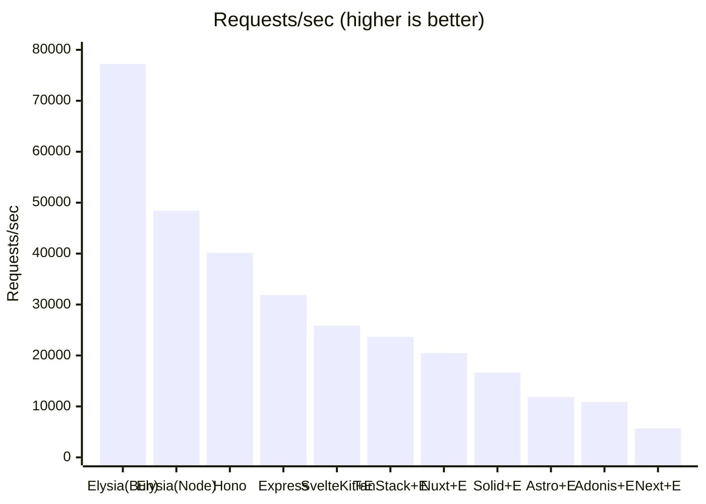
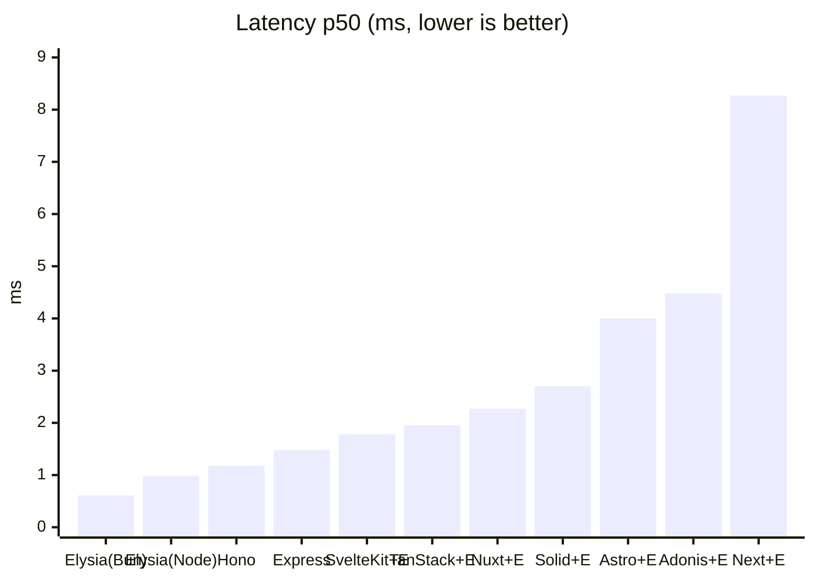
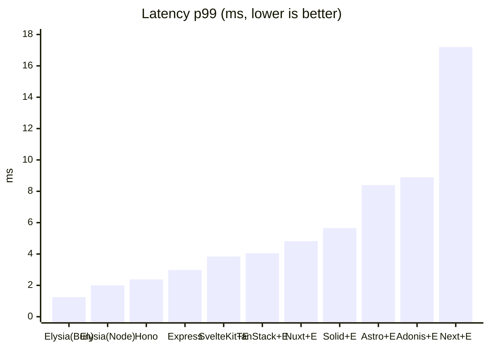

# elysia-bench

ElysiaJS のリクエスト性能を **「Elysia 単体（Node / Bun）」** と **「主要な Web フレームワーク（Next.js / TanStack Start / Astro / AdonisJS / SolidStart / SvelteKit / Nuxt）との連携」** で比較するベンチマーク。各フレームワークでは **素のネイティブ実装（Elysia なし）** と **Elysia 連携** の両方を用意し、Elysia を載せることによる差も測る。あわせて **Hono / Express の単体サーバ**（Node）も並べ、Elysia 単体との純粋なサーバ性能差も比較する。

## 比較の狙い

3 つの軸を分けて測定する。

1. **フレームワーク経由のオーバーヘッド** — 各フレームワークはいずれも Node で動かすため、公平性のために Elysia 単体も [`@elysiajs/node`](https://elysiajs.com/integrations/node.html) アダプタで **Node に揃え**、ランタイム差を排除したうえで「各フレームワークのサーバルートに API を載せることによる純粋なコスト」を測る。
2. **ランタイム差（Node vs Bun）** — 同じ Elysia 単体を Bun ネイティブでも動かし、Elysia 本来の推奨環境との差も見る。
3. **Elysia 連携のオーバーヘッド** — 各フレームワークで「素のネイティブ実装 `/native`」と「Elysia 連携 `/api`」を**同一サーバ・同一ランタイム**で公開し、Elysia を載せた差だけを切り出す。

全エンドポイントは同一の JSON オブジェクト（[`packages/payload`](packages/payload/index.ts)）を返す `GET` API で揃えてある。

| 構成 | URL | ランタイム | ポート | エントリ |
| --- | --- | --- | --- | --- |
| Elysia 単体 | `GET /` | Node | 3001 | [`src/node.ts`](apps/elysia-standalone/src/node.ts) |
| Elysia 単体 | `GET /` | Bun | 3002 | [`src/bun.ts`](apps/elysia-standalone/src/bun.ts) |
| Hono 単体 | `GET /` | Node | 3009 | [`src/node.ts`](apps/hono-standalone/src/node.ts) |
| Express 単体 | `GET /` | Node | 3010 | [`src/node.ts`](apps/express-standalone/src/node.ts) |
| Next.js native | `GET /native` | Node | 3000 | [`native/route.ts`](apps/next-elysia/app/native/route.ts) |
| Next.js + Elysia | `GET /api` | Node | 3000 | [`route.ts`](apps/next-elysia/app/api/[[...slugs]]/route.ts) |
| TanStack Start native | `GET /native` | Node | 3003 | [`native.ts`](apps/tanstack-elysia/src/routes/native.ts) |
| TanStack Start + Elysia | `GET /api` | Node | 3003 | [`api.$.ts`](apps/tanstack-elysia/src/routes/api.$.ts) |
| Astro native | `GET /native` | Node | 3004 | [`native.ts`](apps/astro-elysia/src/pages/native.ts) |
| Astro + Elysia | `GET /api` | Node | 3004 | [`[...slugs].ts`](apps/astro-elysia/src/pages/api/[...slugs].ts) |
| AdonisJS native | `GET /native` | Node | 3005 | [`routes.ts`](apps/adonis-elysia/start/routes.ts) |
| AdonisJS + Elysia | `GET /api` | Node | 3005 | [`routes.ts`](apps/adonis-elysia/start/routes.ts) |
| SolidStart native | `GET /native` | Node | 3006 | [`native.ts`](apps/solidstart-elysia/src/routes/native.ts) |
| SolidStart + Elysia | `GET /api` | Node | 3006 | [`api.ts`](apps/solidstart-elysia/src/routes/api.ts) |
| SvelteKit native | `GET /native` | Node | 3007 | [`+server.ts`](apps/sveltekit-elysia/src/routes/native/+server.ts) |
| SvelteKit + Elysia | `GET /api` | Node | 3007 | [`+server.ts`](apps/sveltekit-elysia/src/routes/api/+server.ts) |
| Nuxt native | `GET /native` | Node | 3008 | [`native.ts`](apps/nuxt-elysia/server/routes/native.ts) |
| Nuxt + Elysia | `GET /api` | Node | 3008 | [`api.ts`](apps/nuxt-elysia/server/routes/api.ts) |

Node 版と Bun 版はランタイムだけが異なり、ルート定義は [`src/routes.ts`](apps/elysia-standalone/src/routes.ts) に一本化している。

## 構成

```
apps/
  elysia-standalone/   Elysia 単体
    src/routes.ts      共通ルート定義（Node/Bun で共有）
    src/node.ts        Node エントリ（@elysiajs/node, port 3001）
    src/bun.ts         Bun エントリ（Bun ネイティブ, port 3002）
  hono-standalone/     Hono 単体（@hono/node-server, port 3009）
    src/node.ts        GET / で共通ペイロードを返すだけ（Elysia 組み込みなし）
  express-standalone/  Express 単体（Express 5, port 3010）
    src/node.ts        GET / で共通ペイロードを返すだけ（Elysia 組み込みなし）
  next-elysia/         Next.js App Router（port 3000）
    app/native/route.ts          素の Route Handler（Elysia なし）
    app/api/[[...slugs]]/route.ts  Elysia をマウント
  tanstack-elysia/     TanStack Start（port 3003）
    src/routes/native.ts  素の server route（Elysia なし）
    src/routes/api.$.ts   Elysia をマウント
    server/prod.mjs       本番ビルドの fetch ハンドラを srvx で待受
  astro-elysia/        Astro（port 3004）
    src/pages/native.ts           素の Astro Endpoint（Elysia なし）
    src/pages/api/[...slugs].ts   Elysia をマウント
    astro.config.mjs     output:server + @astrojs/node(standalone)
  adonis-elysia/       AdonisJS（api スターターキット, port 3005）
    start/routes.ts      /native（素）と /api（Elysia 連携）を定義
                         Node の req/res を Web Request に変換して elysia.handle() へ渡す
  solidstart-elysia/   SolidStart v1（Vinxi/Nitro, port 3006）
    src/routes/native.ts  素の API ルート（Elysia なし）
    src/routes/api.ts     Elysia をマウント（event.request を elysia.handle() へ）
  sveltekit-elysia/    SvelteKit（adapter-node, port 3007）
    src/routes/native/+server.ts  素の +server エンドポイント（Elysia なし）
    src/routes/api/+server.ts     Elysia をマウント（request を elysia.handle() へ）
  nuxt-elysia/         Nuxt（Nitro, port 3008）
    server/routes/native.ts  素の Nitro ルート（オブジェクトを返す）
    server/routes/api.ts     Elysia をマウント（toWebRequest→elysia.handle()）
packages/
  payload/             全エンドポイントが返す共通 JSON ペイロード
bench/
  run.sh               oha でウォームアップ→計測。計測前にレスポンスが期待ペイロードと
                       一致するか検証し、計測後に成功率 100% かも確認する
```

## セットアップ

```bash
pnpm install
```

## 実行手順

計測したい対象を起動する。`bench/run.sh` は **起動しているエンドポイントだけ**を自動で計測するので、全部でも一部だけでもよい。

```bash
# 1) Elysia 単体（Node）
pnpm start:elysia

# 2) Elysia 単体（Bun）
pnpm start:elysia:bun

# 2-2) Hono / Express 単体（ビルド不要、tsx でそのまま起動）
pnpm start:hono
pnpm start:express

# 3) Next.js を本番ビルドして起動（dev モードは非代表的なので必ず build → start）
pnpm build:next
pnpm start:next

# 4) TanStack Start を本番ビルドして起動（同上）
pnpm build:tanstack
pnpm start:tanstack

# 5) Astro を本番ビルドして起動（同上）
pnpm build:astro
pnpm start:astro

# 6) AdonisJS を本番ビルドして起動（同上）
pnpm build:adonis
pnpm start:adonis

# 7) SolidStart を本番ビルドして起動（同上）
pnpm build:solid
pnpm start:solid

# 8) SvelteKit を本番ビルドして起動（同上）
pnpm build:svelte
pnpm start:svelte

# 9) Nuxt を本番ビルドして起動（同上）
pnpm build:nuxt
pnpm start:nuxt

# 10) ベンチマーク実行
pnpm bench
```

動作確認（任意）:

```bash
curl http://localhost:3001/         # Elysia 単体 (Node)
curl http://localhost:3002/         # Elysia 単体 (Bun)
curl http://localhost:3009/         # Hono 単体 (Node)
curl http://localhost:3010/         # Express 単体 (Node)
curl http://localhost:3000/native   # Next.js native      / curl .../api    # + Elysia
curl http://localhost:3003/native   # TanStack native     / curl .../api    # + Elysia
curl http://localhost:3004/native   # Astro native        / curl .../api    # + Elysia
curl http://localhost:3005/native   # AdonisJS native     / curl .../api    # + Elysia
curl http://localhost:3006/native   # SolidStart native   / curl .../api    # + Elysia
curl http://localhost:3007/native   # SvelteKit native    / curl .../api    # + Elysia
curl http://localhost:3008/native   # Nuxt native         / curl .../api    # + Elysia
```

### パラメータ

`bench/run.sh` は環境変数で調整できる。

| 変数 | デフォルト | 説明 |
| --- | --- | --- |
| `DURATION` | `30s` | 計測時間 |
| `CONN` | `50` | 同時接続数 |
| `WARMUP` | `5s` | ウォームアップ時間 |

```bash
DURATION=60s CONN=100 pnpm bench
```

## 結果

計測環境: macOS (Darwin 25.5.0, Apple Silicon) / Node 26.3.0 / Bun 1.3.14 / `CONN=50` / `DURATION=30s` / oha 1.14.0。
18 個を**同時起動して同一 run で**計測したもの（負荷ツールも同一マシン）。全エンドポイントで成功率 100%・レスポンスが期待ペイロードと一致することを計測前後に検証済み。絶対値は環境依存なので**相対比較**として読むこと。

| 構成 | Requests/sec | 平均 ms | p50 ms | p99 ms |
| --- | --- | --- | --- | --- |
| Elysia 単体 (Bun) | **77,254** | 0.65 | 0.61 | 1.25 |
| Elysia 単体 (Node) | 48,401 | 1.03 | 0.98 | 2.00 |
| Hono 単体 (Node) | 40,159 | 1.24 | 1.18 | 2.38 |
| Nuxt native | 32,699 | 1.53 | 1.40 | 3.08 |
| Express 単体 (Node) | 31,863 | 1.57 | 1.48 | 2.98 |
| SvelteKit native | 26,129 | 1.91 | 1.77 | 3.75 |
| SvelteKit + Elysia | 25,879 | 1.93 | 1.78 | 3.84 |
| TanStack Start native | 24,121 | 2.07 | 1.90 | 4.00 |
| TanStack Start + Elysia | 23,662 | 2.11 | 1.95 | 4.05 |
| Nuxt + Elysia | 20,445 | 2.44 | 2.27 | 4.82 |
| SolidStart native | 17,019 | 2.94 | 2.64 | 5.41 |
| SolidStart + Elysia | 16,655 | 3.00 | 2.70 | 5.65 |
| Astro native | 12,336 | 4.05 | 3.84 | 7.95 |
| AdonisJS native | 12,169 | 4.11 | 3.98 | 8.02 |
| Astro + Elysia | 11,841 | 4.22 | 4.00 | 8.40 |
| AdonisJS + Elysia | 10,861 | 4.60 | 4.48 | 8.89 |
| Next.js native | 6,762 | 7.39 | 7.06 | 14.54 |
| Next.js + Elysia | 5,693 | 8.78 | 8.27 | 17.20 |

成功率はいずれも 100%（全レスポンス 200・ボディは共通ペイロードと一致）。

#### 単体サーバ比較（Node、Elysia なし・素のサーバ性能）

| 構成 | Requests/sec | Elysia(Node) 比 |
| --- | --- | --- |
| Elysia 単体 (Node) | 48,401 | 1.00 |
| Hono 単体 (Node) | 40,159 | **0.83** |
| Express 単体 (Node) | 31,863 | **0.66** |

→ 素の HTTP サーバとして見ると **Elysia(Node) > Hono > Express**。Elysia は Bun だけでなく `@elysiajs/node` 上でも Hono / Express を上回る。Express(5) は最も枯れているぶん相対的に重い。

#### Elysia 連携のオーバーヘッド（native → +Elysia、同一サーバ）

| フレームワーク | native RPS | +Elysia RPS | Elysia 維持率 |
| --- | --- | --- | --- |
| SvelteKit | 26,129 | 25,879 | **99.0%**（約 -1%） |
| SolidStart | 17,019 | 16,655 | **97.9%**（約 -2%） |
| TanStack Start | 24,121 | 23,662 | **98.1%**（約 -2%） |
| Astro | 12,336 | 11,841 | **96.0%**（約 -4%） |
| AdonisJS | 12,169 | 10,861 | **89.3%**（約 -11%） |
| Next.js | 6,762 | 5,693 | **84.2%**（約 -16%） |
| Nuxt | 32,699 | 20,445 | **62.5%**（約 -37%） |

→ Elysia 連携のオーバーヘッドはフレームワークの連携方式に強く依存する。受け取った Web `Request` をそのまま `elysia.handle()` に委譲できる **SvelteKit / SolidStart / TanStack（-1〜2%）** はほぼ無視できる。`Request`/`Response` 変換を挟む Astro（-4%）・Next.js（-16%）、Node の `req/res` から Web `Request` を毎回合成する AdonisJS（-11%）はやや大きい。**Nuxt の -37% は別格**で、これは native 側が Nitro の「オブジェクトをそのまま返す」最速経路（後述のとおり全 native 中で最速）なのに対し、Elysia 側は `toWebRequest()` で Web `Request` を組み立て、返ってきた Web `Response` を Nitro が再変換するためコスト差が際立つ（Elysia 自体ではなく橋渡し経路の差）。

#### スループット（Requests/sec、高いほど良い）



#### レイテンシ p50（ms、低いほど良い）



#### レイテンシ p99（ms、低いほど良い）



### 考察

- **Elysia 連携のオーバーヘッドは連携方式次第（今回の主目的）**: 受け取った Web `Request` をそのまま `elysia.handle()` に委譲できる **SvelteKit / SolidStart / TanStack（-1〜2%）** はほぼ無視できる。`Request`/`Response` 変換を挟む **Astro（-4%）/ Next.js（-16%）**、Node の `req/res` から Web `Request` を毎回合成する **AdonisJS（-11%）** はやや大きい。**Nuxt（-37%）** は native が Nitro のオブジェクト返却最速経路のため相対差が際立つ（Elysia 自体ではなく橋渡し経路のコスト）。総じて「Elysia を使うかどうか」より「どのフレームワークに載せるか」がスループットを支配する。
- **単体サーバ比較（Elysia なし）**: 素の HTTP サーバとしては Node 上で **Elysia(48,401) > Hono(40,159) > Express(31,863)**。Elysia は Bun 専用ではなく `@elysiajs/node` でも Hono を上回り、Express(5) より約 1.5 倍速い。Hono は Elysia(Node) の約 0.83 倍と健闘。
- **フレームワーク経由のコスト（同一 Node ランタイム比）**: Elysia 単体(Node) を基準に native のスループットを見ると、Nuxt ≒ 0.68 倍、SvelteKit ≒ 0.54 倍、TanStack ≒ 0.50 倍、SolidStart ≒ 0.35 倍、Astro ≒ 0.25 倍、AdonisJS ≒ 0.25 倍、Next.js ≒ 0.14 倍。**Nuxt（Nitro）の native が突出して速く**（オブジェクトをそのまま返す最速経路）、次いで SvelteKit ≒ TanStack、SolidStart が中位、Astro ≒ AdonisJS、最後に Next.js の Route Handler 層が最も重い。AdonisJS は api スターターキットの bodyparser / session / shield / 認証初期化を全リクエストで通過する分が乗る。
- **ランタイム差（Node vs Bun）**: 同じ Elysia 単体でも Bun は Node の **約 1.6 倍のスループット**。Elysia 本来の推奨環境である Bun が最速。
- **総合**: 最速の Elysia 単体(Bun) を 100% とすると、Node 単体 ≒ 63%、Hono ≒ 52%、Express ≒ 41%、（+Elysia 連携で）SvelteKit / TanStack ≒ 31%、Nuxt ≒ 26%、SolidStart ≒ 22%、Astro ≒ 15%、AdonisJS ≒ 14%、Next.js ≒ 7%。フルスタック連携しつつ API 性能も重視するなら **SvelteKit / TanStack Start / Nuxt** が有利（Nuxt は native を直接使えばさらに速い）。純粋な API スループットが最優先なら Elysia を独立プロセス（できれば Bun）で立てる構成が最良。

> 注: 上表は 18 エンドポイント同時起動・同一マシンでの相対比較のため、各 RPS は単独計測時より低めに出る可能性がある（リソース競合）。比較は同条件なので有効。RPS が近接する構成（SvelteKit / TanStack など）や native→+Elysia の維持率は、同一マシン同時計測のばらつき（±数 %）の影響を受けるので幅をもって読むこと。

## 留意点

- 計測は必ず各フレームワーク（Next.js / TanStack Start / Astro / AdonisJS / SolidStart / SvelteKit / Nuxt）を **本番ビルド**で行う（`build:*` → `start:*`）。dev モードは大幅に遅く非代表的。
- Next.js の Route Handler は `export const dynamic = "force-dynamic"` でキャッシュを無効化し、リクエストごとに Elysia を実行させている（単体側と条件を揃えるため）。
- TanStack Start の Vite ビルドは WinterTC 形式の `fetch` ハンドラを出力するだけなので、本番起動は TanStack が内部利用する [`srvx`](https://github.com/h3js/srvx) で待ち受ける（[`server/prod.mjs`](apps/tanstack-elysia/server/prod.mjs)）。
- Astro は `output: 'server'` + [`@astrojs/node`](https://docs.astro.build/en/guides/integrations-guide/node/)（standalone）で SSR エンドポイントを本番起動する。
- AdonisJS は Web Fetch ネイティブではなく Node の `req/res` ベースなので、Elysia 連携はルートハンドラ内で Web `Request` を合成して `elysia.handle()` に渡し、返ってきた Web `Response` を Adonis の `response` に書き戻している（[`start/routes.ts`](apps/adonis-elysia/start/routes.ts)）。api スターターキットの既定ミドルウェア（bodyparser / session / shield / 認証初期化）は `/native` と `/api` の両方を等しく通過するため、両者の比較は公平。`build:adonis` は本番ビルド後に `.env` を `build/` へコピーして本番起動する。
- SolidStart（[`api.ts`](apps/solidstart-elysia/src/routes/api.ts)）・SvelteKit（[`+server.ts`](apps/sveltekit-elysia/src/routes/api/+server.ts)）は Web Fetch ネイティブなので、受け取った `request` をそのまま `elysia.handle()` に渡すだけでよい。Nuxt（[`api.ts`](apps/nuxt-elysia/server/routes/api.ts)）は h3 の `toWebRequest()` で Web `Request` に変換して渡す。SolidStart は本番では Vinxi が出力する Nitro サーバ（`node .output/server/index.mjs`）を、SvelteKit は `@sveltejs/adapter-node`（`node build`）を起動する。
- Hono（[`src/node.ts`](apps/hono-standalone/src/node.ts)）と Express（[`src/node.ts`](apps/express-standalone/src/node.ts)）は **Elysia を組み込まない単体サーバ**。Elysia 単体と同じく `tsx` でそのまま起動するためビルド不要（`start:hono` / `start:express`）。`@hono/node-server` の `hostname` / Express の `listen(port, '::')` で `::`（デュアルスタック）に待ち受ける。
- **待受アドレスは IPv6 を含めること**: oha は `localhost` を `::1`（IPv6）に解決して接続し、IPv4 へフォールバックしない。SolidStart / SvelteKit / Nuxt / Hono / Express の `start` は `HOST=::`（または `hostname: "::"`）で起動し、`localhost` 経由でも到達できるようにしている。これを怠ると単発 `curl`（happy-eyeballs で IPv4 にフォールバック）は通るのに、負荷時だけ全失敗（成功率 0%）になる。`bench/run.sh` は計測前にレスポンスボディが共通ペイロードと一致するかを検証し、計測後にも oha の成功率が 100% かを確認して、**正常に動いたうえでの数値**だけを採用する。
- 負荷ツールとサーバを同一マシンで動かすため絶対値は環境依存。**相対比較**として読むこと。
