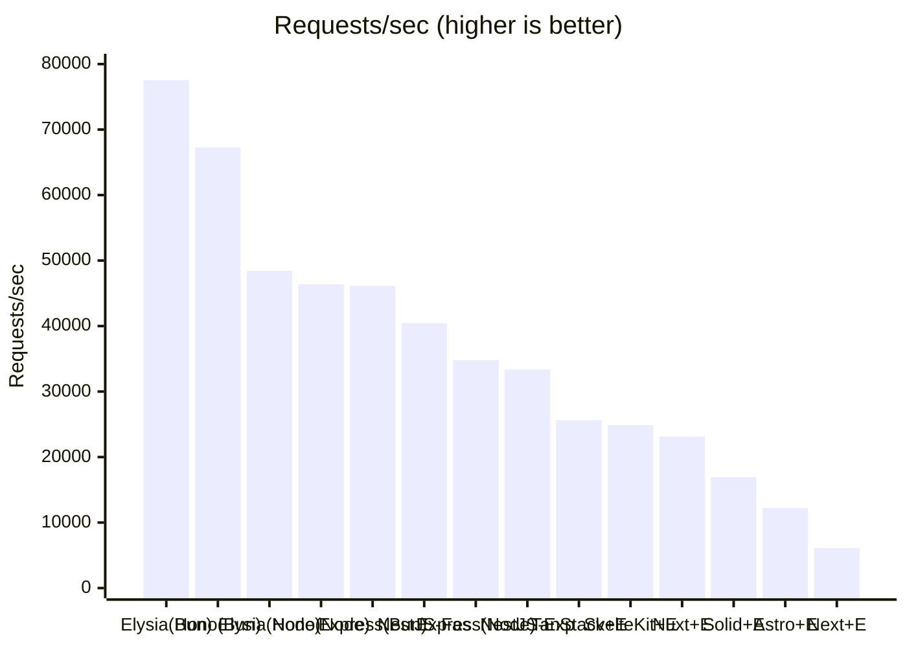
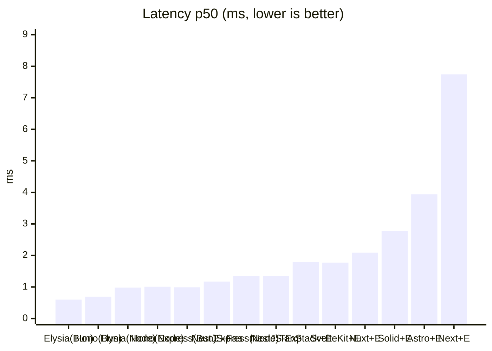
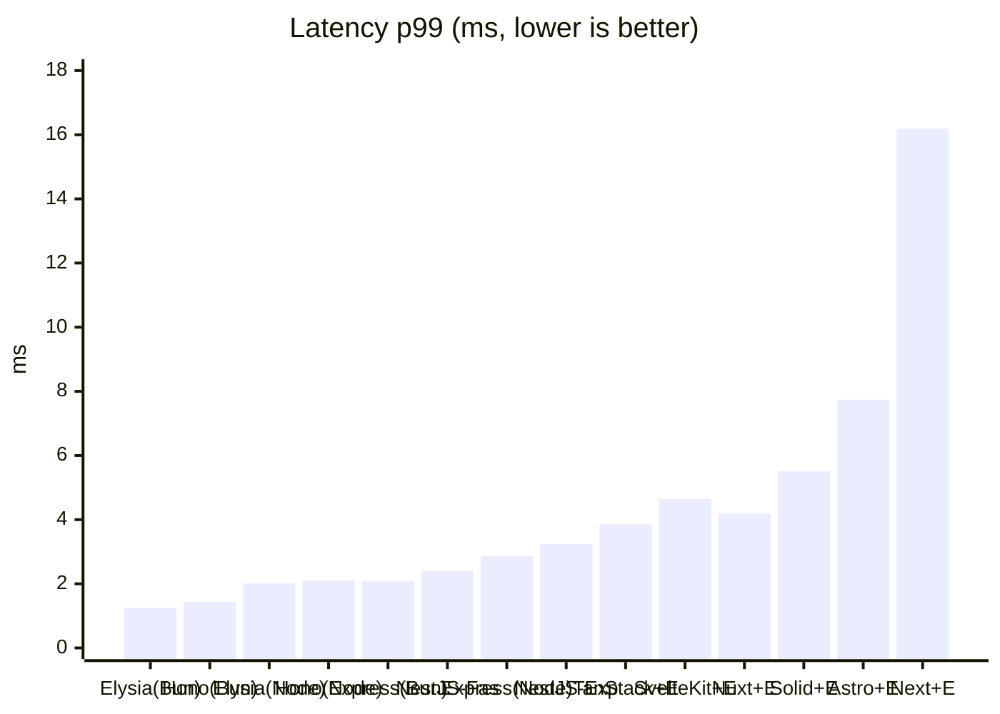
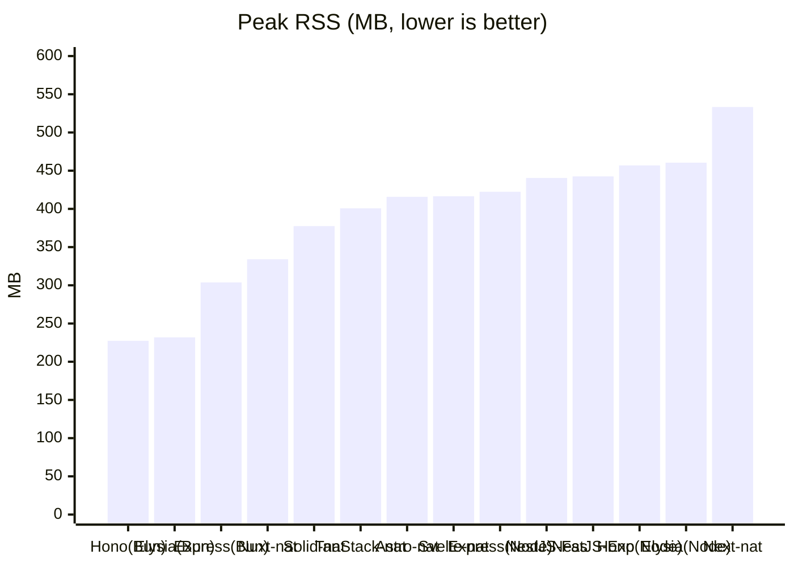
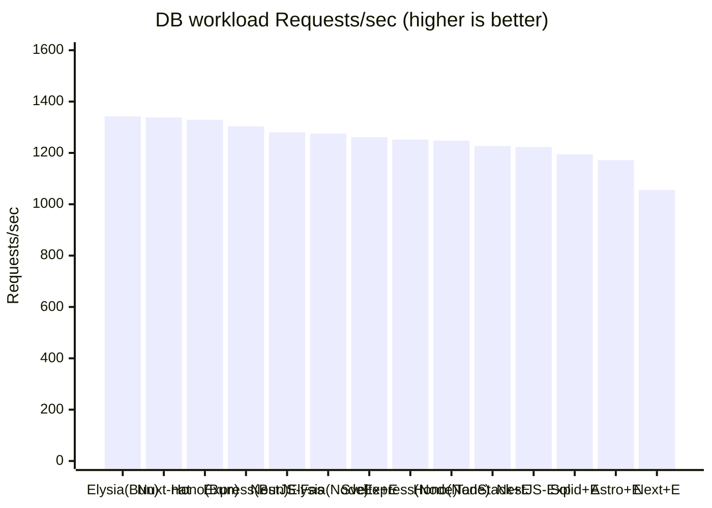
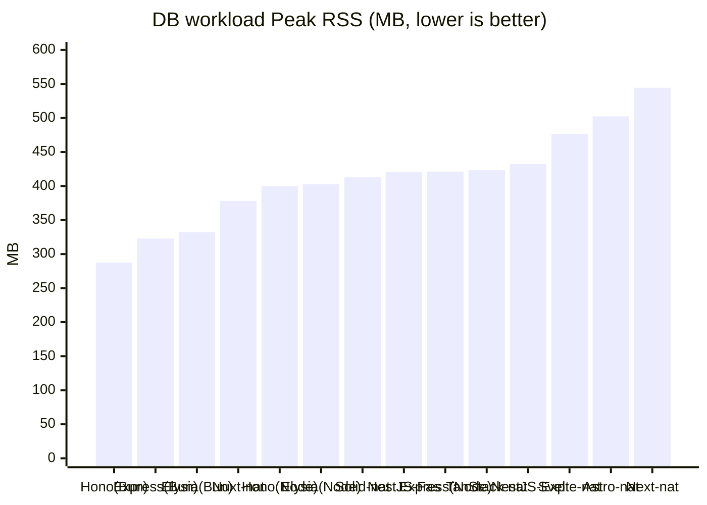

# elysia-bench

ElysiaJS のリクエスト性能を **「Elysia 単体（Node / Bun）」** と **「主要な Web フレームワーク（Next.js / TanStack Start / Astro / SolidStart / SvelteKit / Nuxt）との連携」** で比較するベンチマーク。各フレームワークでは **素のネイティブ実装（Elysia なし）** と **Elysia 連携** の両方を用意し、Elysia を載せることによる差も測る。あわせて **Hono / Express / NestJS / AdonisJS の単体サーバ**も並べ、Elysia 単体との純粋なサーバ性能差も比較する（NestJS は Node のみ・Express / Fastify の 2 アダプタ。AdonisJS は Node のみ・api スターターキット既定のミドルウェアを通す **full** とそれを外した **lean** の 2 モード）。

> English version: see [README_EN.md](README_EN.md).

## 比較の狙い

3 つの軸を分けて測定する。

1. **フレームワーク経由のオーバーヘッド** — 各フレームワークはいずれも Node で動かすため、公平性のために Elysia 単体も [`@elysiajs/node`](https://elysiajs.com/integrations/node.html) アダプタで **Node に揃え**、ランタイム差を排除したうえで「各フレームワークのサーバルートに API を載せることによる純粋なコスト」を測る。
2. **ランタイム差（Node vs Bun）** — 同じ Elysia 単体を Bun ネイティブでも動かし、Elysia 本来の推奨環境との差も見る。
3. **Elysia 連携のオーバーヘッド** — 各フレームワークで「素のネイティブ実装 `/native`」と「Elysia 連携 `/api`」を**同一サーバ・同一ランタイム**で公開し、Elysia を載せた差だけを切り出す。

全エンドポイントは同一の JSON オブジェクト（[`packages/payload`](packages/payload/index.ts)）を返す `GET` API で揃えてある。

| 構成 | URL | ランタイム | ポート | エントリ |
| --- | --- | --- | --- | --- |
| Elysia 単体 | `GET /` | Node | 3001 | [`src/node.ts`](apps/elysia-standalone/src/node.ts) |
| Elysia 単体 | `GET /` | Bun | 3002 | [`src/bun.ts`](apps/elysia-standalone/src/bun.ts) |
| Hono 単体 | `GET /` | Node | 3009 | [`src/node.ts`](apps/hono-standalone/src/node.ts) |
| Hono 単体 | `GET /` | Bun | 3011 | [`src/bun.ts`](apps/hono-standalone/src/bun.ts) |
| Express 単体 | `GET /` | Node | 3010 | [`src/node.ts`](apps/express-standalone/src/node.ts) |
| Express 単体 | `GET /` | Bun | 3012 | [`src/bun.ts`](apps/express-standalone/src/bun.ts) |
| NestJS 単体（Express アダプタ） | `GET /` | Node | 3013 | [`src/node.ts`](apps/nestjs-standalone/src/node.ts) |
| NestJS 単体（Fastify アダプタ） | `GET /` | Node | 3014 | [`src/fastify.ts`](apps/nestjs-standalone/src/fastify.ts) |
| AdonisJS 単体（full・既定ミドルウェアあり） | `GET /` | Node | 3005 | [`routes.ts`](apps/adonis-standalone/start/routes.ts) |
| AdonisJS 単体（lean・既定ミドルウェアなし） | `GET /` | Node | 3015 | [`kernel.ts`](apps/adonis-standalone/start/kernel.ts) |
| Next.js native | `GET /native` | Node | 3000 | [`native/route.ts`](apps/next-elysia/app/native/route.ts) |
| Next.js + Elysia | `GET /api` | Node | 3000 | [`route.ts`](apps/next-elysia/app/api/[[...slugs]]/route.ts) |
| TanStack Start native | `GET /native` | Node | 3003 | [`native.ts`](apps/tanstack-elysia/src/routes/native.ts) |
| TanStack Start + Elysia | `GET /api` | Node | 3003 | [`api.$.ts`](apps/tanstack-elysia/src/routes/api.$.ts) |
| Astro native | `GET /native` | Node | 3004 | [`native.ts`](apps/astro-elysia/src/pages/native.ts) |
| Astro + Elysia | `GET /api` | Node | 3004 | [`[...slugs].ts`](apps/astro-elysia/src/pages/api/[...slugs].ts) |
| SolidStart native | `GET /native` | Node | 3006 | [`native.ts`](apps/solidstart-elysia/src/routes/native.ts) |
| SolidStart + Elysia | `GET /api` | Node | 3006 | [`api.ts`](apps/solidstart-elysia/src/routes/api.ts) |
| SvelteKit native | `GET /native` | Node | 3007 | [`+server.ts`](apps/sveltekit-elysia/src/routes/native/+server.ts) |
| SvelteKit + Elysia | `GET /api` | Node | 3007 | [`+server.ts`](apps/sveltekit-elysia/src/routes/api/+server.ts) |
| Nuxt native | `GET /native` | Node | 3008 | [`native.ts`](apps/nuxt-elysia/server/routes/native.ts) |
| Nuxt + Elysia | `GET /api` | Node | 3008 | [`api.ts`](apps/nuxt-elysia/server/routes/api.ts) |

Node 版と Bun 版はランタイムだけが異なり、ルート定義は [`src/routes.ts`](apps/elysia-standalone/src/routes.ts) に一本化している。

### 複雑ワークロード（DB 集計）エンドポイント

上記の単純な静的 JSON に**加えて**、よりプロダクションに近い負荷として **SQLite を Drizzle で複数回クエリし、アプリ側で結合・集計・整形した結果を返す**エンドポイントを各アプリに用意している。静的 JSON では実質「ルーティング + シリアライズ」しか測れないが、こちらは DB アクセスとアプリ側整形が支配的な実 API に近い条件での比較ができる。

複雑ロジックと SQLite 本体は [`packages/workload`](packages/workload/) に共有し、各アプリのエンドポイントは [`runWorkload()`](packages/workload/index.ts) を 1 回呼ぶだけにしている（実装の冗長化を避け、全アプリが同一の決定的出力を返す）。ワークロードは `users / orders / order_items`（EC 風スキーマ）を 3 回クエリし、注文ごとの合計・国別売上・商品別数量ランキングをアプリ側で集計する。

| 種別 | 単純（静的 JSON） | 複雑（DB 集計） |
| --- | --- | --- |
| standalone（Elysia / Hono / Express / NestJS / AdonisJS） | `GET /` | `GET /db` |
| full-stack native（Elysia なし） | `GET /native` | `GET /native-db` |
| full-stack + Elysia | `GET /api` | `GET /api/db` |

ランタイムごとにネイティブな SQLite ドライバへ自動で切り替える（Node = `better-sqlite3` / Bun = `bun:sqlite`、いずれも Drizzle アダプタ経由）。切り替えは [`packages/workload/index.ts`](packages/workload/index.ts) に閉じており、各アプリのルート定義はランタイムを意識しない。

## 構成

```
apps/
  elysia-standalone/   Elysia 単体
    src/routes.ts      共通ルート定義（Node/Bun で共有）
    src/node.ts        Node エントリ（@elysiajs/node, port 3001）
    src/bun.ts         Bun エントリ（Bun ネイティブ, port 3002）
  hono-standalone/     Hono 単体（Elysia 組み込みなし）
    src/app.ts         共通アプリ定義（Node/Bun で共有）
    src/node.ts        Node エントリ（@hono/node-server, port 3009）
    src/bun.ts         Bun エントリ（Bun.serve, port 3011）
  express-standalone/  Express 単体（Express 5, Elysia 組み込みなし）
    src/app.ts         共通アプリ定義（Node/Bun で共有）
    src/node.ts        Node エントリ（app.listen, port 3010）
    src/bun.ts         Bun エントリ（Bun の Node 互換 API, port 3012）
  nestjs-standalone/   NestJS 単体（Node のみ, Elysia 組み込みなし）
    src/app.controller.ts  共通ルート定義（GET / と GET /db。DI なし）
    src/app.module.ts      AppModule（controllers のみ）
    src/node.ts        Express アダプタのエントリ（@nestjs/platform-express, port 3013）
    src/fastify.ts     Fastify アダプタのエントリ（@nestjs/platform-fastify, port 3014）
  next-elysia/         Next.js App Router（port 3000）
    app/native/route.ts          素の Route Handler（Elysia なし）
    app/api/[[...slugs]]/route.ts  Elysia をマウント
  tanstack-elysia/     TanStack Start（port 3003）
    src/routes/native.ts  素の server route（Elysia なし）
    src/routes/api.$.ts   Elysia をマウント
    server/prod.mjs       本番ビルドの fetch ハンドラを srvx で待受
  astro-elysia/        Astro（port 3004）
    src/pages/native.ts           素の Astro Endpoint（Elysia なし）
    src/pages/api/[...slugs].ts   Elysia をマウント
    astro.config.mjs     output:server + @astrojs/node(standalone)
  adonis-standalone/   AdonisJS 単体（api スターターキット, Elysia 連携なし, full=3005 / lean=3015）
    start/routes.ts      単純 GET / と複雑 GET /db を定義（他の単体サーバと同じパス）
    start/kernel.ts      既定ミドルウェアスタックを定義。ADONIS_BENCH_LEAN=1 で
                         lean（既定ミドルウェアを外し純粋ルーティングに揃える）に切替
  solidstart-elysia/   SolidStart v1（Vinxi/Nitro, port 3006）
    src/routes/native.ts  素の API ルート（Elysia なし）
    src/routes/api.ts     Elysia をマウント（event.request を elysia.handle() へ）
  sveltekit-elysia/    SvelteKit（adapter-node, port 3007）
    src/routes/native/+server.ts  素の +server エンドポイント（Elysia なし）
    src/routes/api/+server.ts     Elysia をマウント（request を elysia.handle() へ）
  nuxt-elysia/         Nuxt（Nitro, port 3008）
    server/routes/native.ts  素の Nitro ルート（オブジェクトを返す）
    server/routes/api.ts     Elysia をマウント（toWebRequest→elysia.handle()）
packages/
  payload/             単純エンドポイントが返す共通 JSON ペイロード
  workload/            複雑エンドポイント用の共有ロジックと SQLite 本体
    index.ts           スキーマ + ドライバ切替 + runWorkload()（自己完結の 1 ファイル）
    seed.ts            workload.sqlite を決定的に生成（pnpm seed）
    workload.sqlite    生成済み DB（コミット済み）
bench/
  run.sh               各アプリを「起動→疎通待ち→レスポンス検証→ウォームアップ→計測→停止」
                       の順に 1 つずつ駆動する。常に 1 アプリだけ起動するので RAM を無駄に
                       占有しない。計測前にレスポンスが期待ペイロードと一致するか検証し、
                       計測後に成功率 100% かも確認する
```

## セットアップ

```bash
pnpm install
```

複雑ワークロード用の SQLite（[`packages/workload/workload.sqlite`](packages/workload/)）はコミット済みなので通常は再生成不要。スキーマやシードを変えたときだけ再生成する。

```bash
pnpm seed   # packages/workload/workload.sqlite を決定的に再生成
```

> `better-sqlite3` はネイティブアドオンのため、`pnpm-workspace.yaml` の `onlyBuiltDependencies` でビルドを許可している。Node のバージョンを上げた直後などにバインディングが見つからない場合は `pnpm rebuild better-sqlite3` を実行する。

## 実行手順

各フレームワークを**本番ビルド**しておく（dev モードは非代表的なので必ず build する。単体サーバの Elysia / Hono / Express は `tsx` 起動なのでビルド不要）。サーバの**起動・停止は `pnpm bench`（`bench/run.sh`）が 1 アプリずつ自動で行う**ので、手動で起動しておく必要はない。

```bash
# 1) フレームワークを本番ビルド（一度だけ）
pnpm build:next
pnpm build:tanstack
pnpm build:astro
pnpm build:adonis
pnpm build:solid
pnpm build:svelte
pnpm build:nuxt

# 2) 計測（各アプリの 起動→検証→計測→停止 を run.sh が順に実行する）
pnpm bench
```

ビルドし忘れた／起動できないアプリは自動で `[skip]` され、残りの計測は継続する。計測対象を絞りたい場合は `bench/run.sh` の `APPS` 配列を編集する。

動作確認（任意）:

```bash
curl http://localhost:3001/         # Elysia 単体 (Node)
curl http://localhost:3002/         # Elysia 単体 (Bun)
curl http://localhost:3009/         # Hono 単体 (Node)
curl http://localhost:3011/         # Hono 単体 (Bun)
curl http://localhost:3010/         # Express 単体 (Node)
curl http://localhost:3012/         # Express 単体 (Bun)
curl http://localhost:3013/         # NestJS 単体 (Express アダプタ, Node)
curl http://localhost:3014/         # NestJS 単体 (Fastify アダプタ, Node)
curl http://localhost:3005/         # AdonisJS 単体 (full, Node)
curl http://localhost:3015/         # AdonisJS 単体 (lean, Node)
curl http://localhost:3000/native   # Next.js native      / curl .../api    # + Elysia
curl http://localhost:3003/native   # TanStack native     / curl .../api    # + Elysia
curl http://localhost:3004/native   # Astro native        / curl .../api    # + Elysia
curl http://localhost:3006/native   # SolidStart native   / curl .../api    # + Elysia
curl http://localhost:3007/native   # SvelteKit native    / curl .../api    # + Elysia
curl http://localhost:3008/native   # Nuxt native         / curl .../api    # + Elysia

# 複雑ワークロード（DB 集計）
curl http://localhost:3009/db        # Hono 単体 (Node)   ※standalone は /db
curl http://localhost:3005/db        # AdonisJS 単体 (full) / curl localhost:3015/db # lean
curl http://localhost:3000/native-db # Next.js native DB  / curl .../api/db  # + Elysia
```

### パラメータ

`bench/run.sh` は環境変数で調整できる。

| 変数 | デフォルト | 説明 |
| --- | --- | --- |
| `DURATION` | `30s` | 計測時間 |
| `CONN` | `50` | 同時接続数 |
| `WARMUP` | `5s` | ウォームアップ時間 |
| `READY_TIMEOUT` | `60` | 各サーバ起動の待機上限（秒）。超えたら `[skip]` |
| `MEM_INTERVAL` | `0.5` | 負荷時ピーク RSS のサンプリング間隔（秒） |

### メモリ計測（負荷時ピーク RSS）

計測中、`bench/run.sh` は起動中サーバ（`pnpm` プロセスツリー全体）の RSS を `MEM_INTERVAL` 秒ごとにサンプリングし、**ピーク値**を oha 出力の直後に `Peak RSS: XX.X MB` として出力する。逐次計測（常に 1 アプリだけ起動）なので、他のアイドルサーバに影響されずフレームワーク間で公平に比較できる。読むときの注意:

- **総フットプリント（共有メモリを重複計上しうる）**: プロセスツリーの各 RSS を単純合計するため、マルチプロセス系（Next.js の cluster worker 等）は共有ページを重複して数え、実メモリより過大に出ることがある。Node マルチプロセス系は Bun 単一プロセス系よりやや不利に出る点に留意し、相対比較の目安として読むこと。
- **フルスタックは累積ピーク**: フルスタック各構成は同一サーバを起動したまま `/native → /api → /native-db → /api/db` を連続計測する。メモリは計測間で縮まないため、後続エンドポイントの値は「そこまでの累積ピーク」になり、単調増加気味になる（そのエンドポイント単独の消費ではない）。
- **「負荷時」ピークの定義**: measure 中のみサンプリングするため、起動直後のモジュールロード時の一時スパイクは含まない。「最大消費メモリ」とは別物。

```bash
DURATION=60s CONN=100 pnpm bench
```

## 結果

計測環境: macOS (Darwin 25.5.0, Apple Silicon) / Node 26.3.0 / Bun 1.3.14 / `CONN=50` / `DURATION=30s` / oha 1.14.0。
**各アプリを 1 つずつ起動して計測**（常に計測対象 1 アプリだけが起動。native と +Elysia は同一サーバを起動したまま連続計測）。全エンドポイントで成功率 100%・レスポンスが期待ペイロードと一致することを計測前後に検証済み。絶対値は環境依存なので**相対比較**として読むこと。

| 構成 | Requests/sec | 平均 ms | p50 ms | p99 ms |
| --- | --- | --- | --- | --- |
| Elysia 単体 (Bun) | **77,556** | 0.64 | 0.60 | 1.25 |
| Hono 単体 (Bun) | 67,266 | 0.74 | 0.69 | 1.44 |
| Elysia 単体 (Node) | 48,444 | 1.03 | 0.98 | 2.02 |
| Hono 単体 (Node) | 46,367 | 1.08 | 1.01 | 2.11 |
| Express 単体 (Bun) | 46,129 | 1.08 | 0.99 | 2.09 |
| NestJS 単体 Fastify (Node) | 40,438 | 1.24 | 1.17 | 2.40 |
| Nuxt native | 38,038 | 1.31 | 1.21 | 2.57 |
| Express 単体 (Node) | 34,801 | 1.44 | 1.35 | 2.86 |
| NestJS 単体 Express (Node) | 33,351 | 1.50 | 1.35 | 3.24 |
| TanStack Start native | 26,156 | 1.91 | 1.75 | 3.81 |
| TanStack Start + Elysia | 25,622 | 1.95 | 1.79 | 3.85 |
| SvelteKit native | 24,962 | 2.00 | 1.82 | 4.61 |
| SvelteKit + Elysia | 24,872 | 2.01 | 1.77 | 4.64 |
| Nuxt + Elysia | 23,142 | 2.16 | 2.09 | 4.19 |
| SolidStart native | 17,065 | 2.93 | 2.76 | 5.49 |
| SolidStart + Elysia | 16,940 | 2.95 | 2.77 | 5.51 |
| Astro native | 12,815 | 3.90 | 3.76 | 7.35 |
| Astro + Elysia | 12,221 | 4.09 | 3.94 | 7.74 |
| Next.js native | 7,146 | 7.00 | 6.57 | 13.74 |
| Next.js + Elysia | 6,111 | 8.18 | 7.74 | 16.18 |

成功率はいずれも 100%（全レスポンス 200・ボディは共通ペイロードと一致）。

#### 単体サーバ比較（Elysia なし・素のサーバ性能）

各ランタイム内で Elysia 単体を基準に並べたもの。

| 構成 | Requests/sec | Elysia 比（同一ランタイム） |
| --- | --- | --- |
| Elysia 単体 (Node) | 48,444 | 1.00 |
| Hono 単体 (Node) | 46,367 | **0.96** |
| NestJS 単体 Fastify (Node) | 40,438 | **0.83** |
| Express 単体 (Node) | 34,801 | **0.72** |
| NestJS 単体 Express (Node) | 33,351 | **0.69** |
| Elysia 単体 (Bun) | 77,556 | 1.00 |
| Hono 単体 (Bun) | 67,266 | **0.87** |
| Express 単体 (Bun) | 46,129 | **0.59** |

→ 素の HTTP サーバとして見ると、Node・Bun いずれでも **Elysia ≥ Hono > Express** の序列は変わらない。Node では Elysia と Hono はほぼ互角（差 ~4%、ばらつき範囲）で、Elysia は Bun 専用ではなく `@elysiajs/node` でも Hono と肩を並べる。一方 Bun では Elysia が Hono を約 13% 引き離す（Elysia は Bun ネイティブが本来の土俵）。Express(5) は Node で約 0.72 倍、Bun では約 0.59 倍と、最も枯れているぶん速いランタイムでの伸びが鈍く相対的に重い。**NestJS**（Node のみ）は **Fastify アダプタが Elysia 比 0.83**（素の Express(0.72) を上回り、NestJS の層を載せても Fastify の速い HTTP 層が効く）、**Express アダプタは 0.69** で素の Express とほぼ同等（NestJS フレームワーク層のオーバーヘッドは小さい）。

#### ランタイム差（Node → Bun、同一フレームワーク）

| 構成 | Node RPS | Bun RPS | Bun 倍率 |
| --- | --- | --- | --- |
| Elysia 単体 | 48,444 | 77,556 | **×1.60** |
| Hono 単体 | 46,367 | 67,266 | **×1.45** |
| Express 単体 | 34,801 | 46,129 | **×1.33** |

→ どのフレームワークも Bun でスループットが伸びるが、伸び幅はフレームワーク次第。**Elysia (×1.60)** が最も Bun の恩恵を受け、Hono (×1.45)、Express (×1.33) と続く。Elysia は Bun ネイティブを前提に設計されているぶん、ランタイムを Bun に替えたときの伸びが最も大きい。なお NestJS は Node のみ計測のためこの比較からは除外している。

#### Elysia 連携のオーバーヘッド（native → +Elysia、同一サーバ）

| フレームワーク | native RPS | +Elysia RPS | Elysia 維持率 |
| --- | --- | --- | --- |
| SvelteKit | 24,962 | 24,872 | **99.6%**（約 -0%） |
| SolidStart | 17,065 | 16,940 | **99.3%**（約 -1%） |
| TanStack Start | 26,156 | 25,622 | **98.0%**（約 -2%） |
| Astro | 12,815 | 12,221 | **95.4%**（約 -5%） |
| Next.js | 7,146 | 6,111 | **85.5%**（約 -14%） |
| Nuxt | 38,038 | 23,142 | **60.8%**（約 -39%） |

→ Elysia 連携のオーバーヘッドはフレームワークの連携方式に強く依存する。受け取った Web `Request` をそのまま `elysia.handle()` に委譲できる **SvelteKit / SolidStart / TanStack（-0〜2%）** はほぼ無視できる。`Request`/`Response` 変換を挟む Astro（-5%）・Next.js（-14%）はやや大きい。**Nuxt の -39% は別格**で、これは native 側が Nitro の「オブジェクトをそのまま返す」最速経路（後述のとおり全 native 中で最速）なのに対し、Elysia 側は `toWebRequest()` で Web `Request` を組み立て、返ってきた Web `Response` を Nitro が再変換するためコスト差が際立つ（Elysia 自体ではなく橋渡し経路の差）。

#### スループット（Requests/sec、高いほど良い）



#### レイテンシ p50（ms、低いほど良い）



#### レイテンシ p99（ms、低いほど良い）



#### メモリ使用量（負荷時ピーク RSS、低いほど良い）

負荷時（measure 中）に計測した**ピーク RSS**（起動した `pnpm` プロセスツリー全体の合計）。上のスループット/レイテンシとは別ランで計測した値（同一環境・`CONN=50` / `DURATION=30s`）。**総フットプリント（共有メモリを重複計上しうる）**のため Node マルチプロセス系はやや過大に出る点に注意（読み方は[メモリ計測](#メモリ計測負荷時ピーク-rss)を参照）。Elysia 連携（+Elysia）は native との差が ±20MB 程度の誤差なので、ここでは native / 単体のみを掲載する。

| 構成 | Peak RSS |
| --- | --- |
| Hono 単体 (Bun) | **227.3 MB** |
| Elysia 単体 (Bun) | 231.9 MB |
| Express 単体 (Bun) | 303.7 MB |
| Nuxt native | 334.1 MB |
| SolidStart native | 377.5 MB |
| TanStack Start native | 400.8 MB |
| Astro native | 415.8 MB |
| SvelteKit native | 416.5 MB |
| Express 単体 (Node) | 422.4 MB |
| NestJS 単体 Fastify (Node) | 440.5 MB |
| NestJS 単体 Express (Node) | 442.5 MB |
| Hono 単体 (Node) | 456.9 MB |
| Elysia 単体 (Node) | 460.5 MB |
| Next.js native | 533.3 MB |



→ **Bun 単一プロセス系が圧倒的に省メモリ**で、Hono/Elysia(Bun) は約 230MB と Node 版（約 460MB）の半分。Node 単体系（tsx ローダ含む総フットプリント）は約 420〜460MB に収束する。フルスタックでは **Next.js が最大（533MB）**、Nuxt が最小（native 334MB）。

#### AdonisJS（単体・lean / full）

AdonisJS は単体サーバ（Elysia 連携なし）として計測し、api スターターキット既定のミドルウェアを通す **full**（port 3005）と、それを外して他の単体サーバと同条件に揃えた **lean**（port 3015）の 2 モードを比較する（[`start/kernel.ts`](apps/adonis-standalone/start/kernel.ts) を `ADONIS_BENCH_LEAN` で切替）。同一マシン・同一セッションで連続計測した値（上のクロスフレーム一括ランとは別ラン）:

| モード | Requests/sec | 平均 ms | p50 ms | p90 ms | p99 ms | lean/full |
| --- | --- | --- | --- | --- | --- | --- |
| AdonisJS 単体 (lean) | **39,511** | 1.26 | 1.21 | 1.41 | 2.50 | — |
| AdonisJS 単体 (full) | 12,731 | 3.93 | 3.78 | 4.36 | 7.65 | **×3.1** |

→ **api スターターキット既定のミドルウェアだけでスループットが約 1/3 に落ちる**（39,511 → 12,731 RPS、約 -68%）。「フレームワーク経由のコスト」として観測される AdonisJS の遅さの大半は、AdonisJS 本体のルーティングではなく**既定で積まれるミドルウェア（とくに session / shield / 認証初期化）**に由来する。lean にすると AdonisJS 単体は Elysia 単体(Node)（48,444 RPS）の約 0.82 倍まで上がり、全 native 中でも上位の Nuxt native（38,038）と同等。複雑ワークロード（DB 集計）では **full 1,026 / lean 1,122 RPS**（p99 95.1ms / 87.0ms）と差は ±10%（計測揺らぎ）に収まり、1 リクエストの実処理が SQLite アクセス支配になるとミドルウェアの上乗せは相対的に無視できる。負荷時ピーク RSS（`pnpm` プロセスツリー合計）は full / lean とも約 650〜660MB でほぼ同じ（ミドルウェアの有無は RSS にはほとんど効かない）。

### 考察

- **Elysia 連携のオーバーヘッドは連携方式次第（今回の主目的）**: 受け取った Web `Request` をそのまま `elysia.handle()` に委譲できる **SvelteKit / SolidStart / TanStack（-0〜2%）** はほぼ無視できる。`Request`/`Response` 変換を挟む **Astro（-5%）/ Next.js（-14%）** はやや大きい。**Nuxt（-39%）** は native が Nitro のオブジェクト返却最速経路のため相対差が際立つ（Elysia 自体ではなく橋渡し経路のコスト）。総じて「Elysia を使うかどうか」より「どのフレームワークに載せるか」がスループットを支配する。
- **単体サーバ比較（Elysia なし）**: 素の HTTP サーバとしては Node・Bun いずれでも **Elysia ≥ Hono > Express** の序列。Node では **Elysia(48,444) ≈ Hono(46,367) > Express(34,801)** で Elysia と Hono はほぼ互角（差 ~4%、ばらつき範囲）、Elysia は Bun 専用ではなく `@elysiajs/node` でも Hono と肩を並べる。Bun では **Elysia(77,556) > Hono(67,266) > Express(46,129)** となり、Elysia が Hono を約 13% 引き離す。Express(5) は Node で約 0.72 倍、Bun で約 0.59 倍。**NestJS**（Node のみ）は Fastify アダプタ(40,438)が素の Express(34,801)を上回り Elysia 比 0.83、Express アダプタ(33,351)は素の Express とほぼ同等（Elysia 比 0.69）で、NestJS フレームワーク層のオーバーヘッドは小さくアダプタの素性が支配的。
- **フレームワーク経由のコスト（同一 Node ランタイム比）**: Elysia 単体(Node) を基準に native のスループットを見ると、Nuxt ≒ 0.79 倍、TanStack ≒ 0.54 倍、SvelteKit ≒ 0.52 倍、SolidStart ≒ 0.35 倍、Astro ≒ 0.26 倍、Next.js ≒ 0.15 倍。**Nuxt（Nitro）の native が突出して速く**（オブジェクトをそのまま返す最速経路）、次いで TanStack ≒ SvelteKit、SolidStart が中位、Astro、最後に Next.js の Route Handler 層が最も重い。AdonisJS は単体サーバとして別枠で計測しており、既定ミドルウェアの有無で大きく変わる（[AdonisJS（単体・lean / full）](#adonisjs単体lean--full)を参照）。
- **ランタイム差（Node → Bun）**: Bun に替えるとスループットは伸びるが伸び幅はフレームワーク次第で、**Elysia ×1.60 > Hono ×1.45 > Express ×1.33**。Bun ネイティブを前提に設計された Elysia が最も恩恵を受け、Elysia 本来の推奨環境である Bun が全構成で最速。Hono も Bun で大きく伸び（67,266 RPS）、Node の Elysia すら上回って総合 2 位につける。
- **総合**: 最速の Elysia 単体(Bun) を 100% とすると、Hono(Bun) ≒ 87%、Elysia(Node) ≒ 63%、Hono(Node) ≒ 60%、Express(Bun) ≒ 59%、NestJS(Fastify) ≒ 52%、Express(Node) ≒ 45%、NestJS(Express) ≒ 43%、（+Elysia 連携で）TanStack ≒ 33%、SvelteKit ≒ 32%、Nuxt ≒ 30%、SolidStart ≒ 22%、Astro ≒ 16%、Next.js ≒ 8%。フルスタック連携しつつ API 性能も重視するなら **TanStack Start / SvelteKit / Nuxt** が有利（Nuxt は native を直接使えばさらに速い）。純粋な API スループットが最優先なら Elysia（できれば Bun）を独立プロセスで立てる構成が最良で、Bun が使えるなら Hono も僅差で続く。

> 注: 各アプリは 1 つずつ起動・停止して計測（常に対象 1 アプリのみ）。native と +Elysia は同一サーバを起動したまま連続で測るので、その差は同条件。一方アプリ間の比較は計測時刻がずれるため、CPU のターボ/サーマル状態など時刻依存の揺らぎ（±数 %）の影響を受ける。RPS が近接する構成（Elysia(Node)/Hono、TanStack/SvelteKit など）は幅をもって読むこと。

## 結果（複雑ワークロード / DB 集計エンドポイント）

[複雑ワークロード（DB 集計）エンドポイント](#複雑ワークロードdb-集計エンドポイント)（`/db`・`/native-db`・`/api/db`）の計測結果。同一計測条件（`CONN=50` / `DURATION=30s` / oha）・同一マシン・各アプリ 1 つずつ起動。全構成で成功率 100%・レスポンスが期待値（`runWorkload()` の決定的出力）と一致することを計測前後に検証済み。SQLite を 3 回クエリしてアプリ側で集計するため、1 リクエストあたり約 37〜47ms を要する。単体サーバ群（Elysia / Hono / Express の Node・Bun、NestJS の Express / Fastify）は同一ランでまとめて再計測したもの。AdonisJS（単体・full / lean）の DB 集計は別ランで計測しており、[AdonisJS（単体・lean / full）](#adonisjs単体lean--full)に併記している（full 1,026 / lean 1,122 RPS）。

| 構成 | Requests/sec | 平均 ms | p50 ms | p99 ms |
| --- | --- | --- | --- | --- |
| Elysia 単体 DB (Bun) | **1,342** | 37.3 | 36.8 | 62.0 |
| Nuxt native DB | 1,338 | 37.4 | 39.1 | 60.4 |
| Hono 単体 DB (Bun) | 1,329 | 37.6 | 37.0 | 71.0 |
| Nuxt + Elysia DB | 1,305 | 38.3 | 37.5 | 74.9 |
| Express 単体 DB (Bun) | 1,304 | 38.4 | 37.1 | 74.5 |
| NestJS 単体 Fastify DB (Node) | 1,280 | 39.1 | 38.2 | 76.4 |
| SvelteKit native DB | 1,276 | 39.2 | 37.4 | 74.9 |
| Elysia 単体 DB (Node) | 1,275 | 39.2 | 38.2 | 76.6 |
| SvelteKit + Elysia DB | 1,261 | 39.7 | 37.5 | 75.3 |
| Express 単体 DB (Node) | 1,252 | 40.0 | 39.0 | 78.0 |
| TanStack Start native DB | 1,250 | 40.0 | 38.4 | 76.5 |
| Hono 単体 DB (Node) | 1,248 | 40.1 | 39.0 | 78.0 |
| TanStack Start + Elysia DB | 1,227 | 40.8 | 39.0 | 77.2 |
| NestJS 単体 Express DB (Node) | 1,223 | 40.9 | 39.1 | 78.8 |
| SolidStart + Elysia DB | 1,195 | 41.9 | 40.0 | 80.6 |
| SolidStart native DB | 1,179 | 42.4 | 40.0 | 79.9 |
| Astro + Elysia DB | 1,172 | 42.7 | 43.9 | 67.8 |
| Astro native DB | 1,134 | 44.1 | 44.1 | 79.1 |
| Next.js native DB | 1,098 | 45.6 | 43.7 | 87.4 |
| Next.js + Elysia DB | 1,056 | 47.4 | 45.4 | 90.3 |

#### ランタイム差（Node → Bun、単体サーバ・DB 集計）

| 構成 | Node RPS | Bun RPS | Bun 倍率 |
| --- | --- | --- | --- |
| Elysia 単体 DB | 1,275 | 1,342 | **×1.05** |
| Hono 単体 DB | 1,248 | 1,329 | **×1.06** |
| Express 単体 DB | 1,252 | 1,304 | **×1.04** |

→ 単純エンドポイントでの Bun 倍率（Elysia ×1.60 / Hono ×1.45 / Express ×1.33）が、DB 集計では **×1.05 前後**まで縮む。レイテンシの大半を SQLite アクセスとアプリ側集計（CPU バウンド）が占めるため、ランタイムの HTTP 層の速さが効きにくくなる。

#### スループット（複雑ワークロード, Requests/sec, 高いほど良い）



#### メモリ使用量（複雑ワークロード, 負荷時ピーク RSS, 低いほど良い）

複雑ワークロード（`/db`・`/native-db`）の負荷時ピーク RSS。上のスループット/レイテンシとは別ランで計測した値（同一環境・`CONN=50` / `DURATION=30s`）。フルスタックの DB エンドポイントは同一サーバで標準エンドポイントの後に計測するため、値は**そこまでの累積ピーク**を含む（読み方は[メモリ計測](#メモリ計測負荷時ピーク-rss)を参照）。Elysia 連携（+Elysia）は native との差が誤差なので native / 単体のみを掲載する。

| 構成 | Peak RSS |
| --- | --- |
| Hono 単体 DB (Bun) | **287.7 MB** |
| Express 単体 DB (Bun) | 322.8 MB |
| Elysia 単体 DB (Bun) | 332.2 MB |
| Nuxt native DB | 378.2 MB |
| Hono 単体 DB (Node) | 399.8 MB |
| Elysia 単体 DB (Node) | 402.8 MB |
| SolidStart native DB | 412.8 MB |
| NestJS 単体 Fastify DB (Node) | 420.6 MB |
| Express 単体 DB (Node) | 421.3 MB |
| TanStack Start native DB | 423.4 MB |
| NestJS 単体 Express DB (Node) | 432.5 MB |
| SvelteKit native DB | 476.8 MB |
| Astro native DB | 502.4 MB |
| Next.js native DB | 544.4 MB |



→ 標準エンドポイントと傾向は同じで、**Bun 系（287〜332MB）が省メモリ**・**Next.js が最大（544MB）**。DB 集計のためのバッファや SQLite ドライバを確保しても、ランタイム/フレームワークによる序列はほぼ変わらない。

### 考察（複雑ワークロード）

- **DB 処理が支配的だとフレームワーク差はほぼ消える**: 単純エンドポイントでは最速〜最遅が約 **13 倍**（77,556 → 6,111 RPS）開いていたのが、複雑エンドポイントでは約 **1.3 倍**（1,342 → 1,056 RPS）まで圧縮される。約 37〜47ms の SQLite 集計がレイテンシの大半を占め、ルーティング/シリアライズ層の差が埋もれるため。実 API のように DB アクセスが主役の負荷では、「どのフレームワークか」より「DB とアプリ側ロジックをどう速くするか」が支配的になる。
- **Bun の優位も縮む**: 単体サーバの Bun 倍率は単純エンドポイントの ×1.60（Elysia）から **×1.05** へ低下（Hono ×1.45→×1.06、Express ×1.33→×1.04）。CPU バウンドな DB 処理では速いランタイムの伸びしろが効きにくい。
- **Elysia 連携オーバーヘッドも消失**: 単純エンドポイントで目立った Nuxt の −39% は DB 版では **−2.5%**（1,338→1,305）に縮小。他フレームワークも native と +Elysia が ±3%（計測揺らぎの範囲）に収まり、Astro / SolidStart では誤差で +Elysia の方が速い箇所すらある。Elysia を載せるコストは、1 リクエストの実処理が重くなるほど相対的に無視できる。
- **単体サーバ内の序列は維持・NestJS も横並び**: それでも僅差ながら Bun 系（Elysia/Hono/Express）が上位を占め、Bun では DB 込みでも Node 系を上回る。Node 内では Elysia ≒ Express ≒ Hono ≒ NestJS（差 ~2%、ばらつき範囲）でほぼ横並びで、NestJS は Fastify(1,280)が僅差で上・Express アダプタ(1,223)が僅差で下に収まる。アダプタ差・フレームワーク差は DB 集計が支配的になると埋もれる。

> 注: 単体サーバ群（Elysia / Hono / Express / NestJS）の単純・複雑エンドポイントは **同一ランの値で相互に直接比較できる**。フルスタック各構成は以前のラン（同一環境）の値を掲載しているため、単体サーバ群との比較は計測時刻のずれ（±数 %）を含む。`p99` が Bun 系で Node 系より低い（62〜71ms vs 76〜78ms）のは、oha のデッドライン到達時の打ち切り挙動とテール分布の差によるもので、相対比較として読むこと。

## 留意点

- 計測は必ず各フレームワーク（Next.js / TanStack Start / Astro / AdonisJS / SolidStart / SvelteKit / Nuxt）を **本番ビルド**しておく（`build:*` を実行。起動は `pnpm bench` が自動で行う）。dev モードは大幅に遅く非代表的。未ビルドのアプリは自動で `[skip]` される。
- Next.js の Route Handler は `export const dynamic = "force-dynamic"` でキャッシュを無効化し、リクエストごとに Elysia を実行させている（単体側と条件を揃えるため）。
- TanStack Start の Vite ビルドは WinterTC 形式の `fetch` ハンドラを出力するだけなので、本番起動は TanStack が内部利用する [`srvx`](https://github.com/h3js/srvx) で待ち受ける（[`server/prod.mjs`](apps/tanstack-elysia/server/prod.mjs)）。
- Astro は `output: 'server'` + [`@astrojs/node`](https://docs.astro.build/en/guides/integrations-guide/node/)（standalone）で SSR エンドポイントを本番起動する。
- **AdonisJS は単体サーバ（Elysia 連携なし）として計測する**。HTTP アダプタを差し替えられず（常に Node 標準 `http`）公式ランタイムも Node のみなので、性能比較で意味のある「モード」はミドルウェアスタックの厚みだけ。そこで [`start/kernel.ts`](apps/adonis-standalone/start/kernel.ts) を `ADONIS_BENCH_LEAN` で 2 モードに切り替える。**full**（`start:adonis`, port 3005）は api スターターキット既定の `bodyparser / session / shield / 認証初期化 / CORS / force_json` を全リクエストで通す実運用相当の構成、**lean**（`start:adonis:lean`, port 3015）はそれらを外し他の単体サーバと同条件（純粋なルーティング + シリアライズ）に揃えた構成で、`PORT=3015 ADONIS_BENCH_LEAN=1` で同一ビルドを起動するだけ。ルート定義はモード非依存で `GET /`（単純）と `GET /db`（複雑）を共有する（[`start/routes.ts`](apps/adonis-standalone/start/routes.ts)）。両者の差は[AdonisJS（単体・lean / full）](#adonisjs単体lean--full)のとおり単純エンドポイントで約 3 倍。lean では認証系ルート（`/api/v1/*`）は動かなくなるが、ベンチが叩くのは `/` と `/db` だけなので計測には影響しない。`build:adonis` は本番ビルド後に `.env` を `build/` へコピーして本番起動する。
- SolidStart（[`api.ts`](apps/solidstart-elysia/src/routes/api.ts)）・SvelteKit（[`+server.ts`](apps/sveltekit-elysia/src/routes/api/+server.ts)）は Web Fetch ネイティブなので、受け取った `request` をそのまま `elysia.handle()` に渡すだけでよい。Nuxt（[`api.ts`](apps/nuxt-elysia/server/routes/api.ts)）は h3 の `toWebRequest()` で Web `Request` に変換して渡す。SolidStart は本番では Vinxi が出力する Nitro サーバ（`node .output/server/index.mjs`）を、SvelteKit は `@sveltejs/adapter-node`（`node build`）を起動する。
- Hono（[`src/app.ts`](apps/hono-standalone/src/app.ts)）と Express（[`src/app.ts`](apps/express-standalone/src/app.ts)）は **Elysia を組み込まない単体サーバ**で、Elysia 単体と同じく Node 版・Bun 版を用意し、アプリ定義（ルート）を `src/app.ts` に一本化してランタイムだけを差し替える。Node 版は `tsx`（`start:hono` / `start:express`）、Bun 版は `bun`（`start:hono:bun` / `start:express:bun`）でそのまま起動するためビルド不要。Hono は Node では `@hono/node-server`、Bun では `Bun.serve` で同じ `app.fetch` を待ち受ける。Express(5) は Bun の Node 互換 API でそのまま `app.listen` が動く。いずれも `hostname` / `listen(port, '::')` で `::`（デュアルスタック）に待ち受ける。
- NestJS（[`src/app.controller.ts`](apps/nestjs-standalone/src/app.controller.ts)）も **Elysia を組み込まない単体サーバ**。ランタイムは **Node のみ**で、**Express アダプタ**（[`src/node.ts`](apps/nestjs-standalone/src/node.ts), port 3013）と **Fastify アダプタ**（[`src/fastify.ts`](apps/nestjs-standalone/src/fastify.ts), port 3014）の 2 構成を用意し、フレームワーク層オーバーヘッド（Express 単体比）とアダプタ差を測る。ルート定義（Controller / Module）はアダプタ非依存で共有し、ブートストラップだけ差し替える。他の単体サーバと同様 `tsx` 起動でビルド不要。`tsx`（esbuild）は `emitDecoratorMetadata` を出力しないため、**コンストラクタ注入（DI）を使わず** Controller のハンドラ内で `payload` / `runWorkload()` を直接返す（ルーティング系デコレータはメタデータを明示登録するため tsx でも動く）。`app.listen(port, '::')` で `::`（デュアルスタック）に待ち受ける。
- **待受アドレスは IPv6 を含めること**: oha は `localhost` を `::1`（IPv6）に解決して接続し、IPv4 へフォールバックしない。SolidStart / SvelteKit / Nuxt / Hono / Express の `start` は `HOST=::`（または `hostname: "::"`）で起動し、`localhost` 経由でも到達できるようにしている。これを怠ると単発 `curl`（happy-eyeballs で IPv4 にフォールバック）は通るのに、負荷時だけ全失敗（成功率 0%）になる。`bench/run.sh` は計測前にレスポンスボディが共通ペイロードと一致するかを検証し、計測後にも oha の成功率が 100% かを確認して、**正常に動いたうえでの数値**だけを採用する。
- **複雑ワークロード（`/db` 系）** は [`packages/workload`](packages/workload/) に共有した [`runWorkload()`](packages/workload/index.ts) を全アプリが呼ぶ。SQLite ドライバはランタイムごとにネイティブを使い（Node = `better-sqlite3` / Bun = `bun:sqlite`）、動的 import で切り替える。DB 接続は最初のリクエスト時に一度だけ確立する遅延初期化で、読み取り専用で開く。シードは固定（時刻・乱数に依存しない）なので出力は決定的で、全アプリ・全ランタイムで同一バイト列になる。`bench/run.sh` はこの出力を `runWorkload()` から動的生成した期待値と突き合わせて検証する。バンドルされる full-stack アプリでも同じ DB を読めるよう、`run.sh` は `WORKLOAD_DB_PATH` に絶対パスを渡す。
- 負荷ツールとサーバを同一マシンで動かすため絶対値は環境依存。**相対比較**として読むこと。
