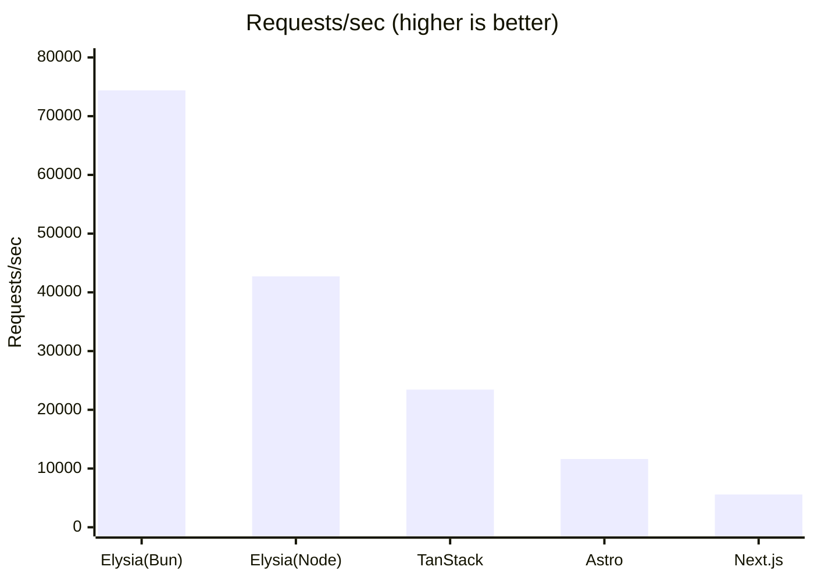
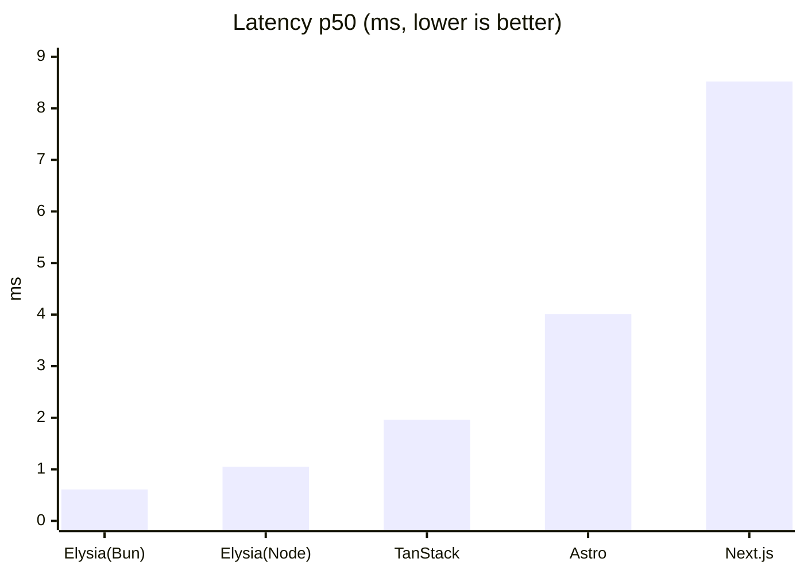
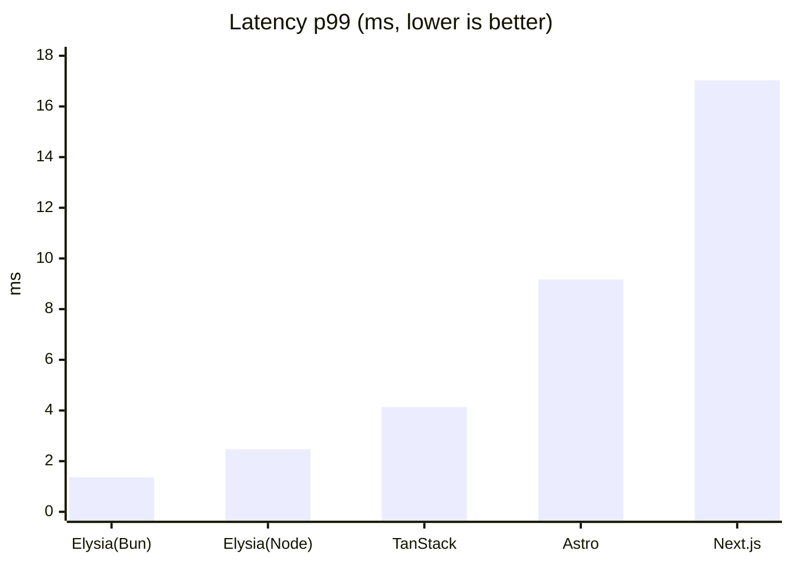

# elysia-bench

ElysiaJS のリクエスト性能を **「Elysia 単体（Node / Bun）」**・**「Next.js 連携」**・**「TanStack Start 連携」**・**「Astro 連携」** で比較するベンチマーク。

## 比較の狙い

2 つの軸を分けて測定する。

1. **フレームワーク経由のオーバーヘッド** — Next.js / TanStack Start / Astro はいずれも Node で動かすため、公平性のために Elysia 単体も [`@elysiajs/node`](https://elysiajs.com/integrations/node.html) アダプタで **Node に揃え**、ランタイム差を排除したうえで「各フレームワークのサーバルートに Elysia を載せることによる純粋なコスト」を測る。
2. **ランタイム差（Node vs Bun）** — 同じ Elysia 単体を Bun ネイティブでも動かし、Elysia 本来の推奨環境との差も見る。

全エンドポイントは同一の JSON オブジェクト（[`packages/payload`](packages/payload/index.ts)）を返す `GET` API で揃えてある。

| 構成 | URL | ランタイム | ポート | エントリ |
| --- | --- | --- | --- | --- |
| Elysia 単体 | `GET /` | Node | 3001 | [`src/node.ts`](apps/elysia-standalone/src/node.ts) |
| Elysia 単体 | `GET /` | Bun | 3002 | [`src/bun.ts`](apps/elysia-standalone/src/bun.ts) |
| Next.js + Elysia | `GET /api` | Node | 3000 | [`route.ts`](apps/next-elysia/app/api/[[...slugs]]/route.ts) |
| TanStack Start + Elysia | `GET /api` | Node | 3003 | [`api.$.ts`](apps/tanstack-elysia/src/routes/api.$.ts) |
| Astro + Elysia | `GET /api` | Node | 3004 | [`[...slugs].ts`](apps/astro-elysia/src/pages/api/[...slugs].ts) |

Node 版と Bun 版はランタイムだけが異なり、ルート定義は [`src/routes.ts`](apps/elysia-standalone/src/routes.ts) に一本化している。

## 構成

```
apps/
  elysia-standalone/   Elysia 単体
    src/routes.ts      共通ルート定義（Node/Bun で共有）
    src/node.ts        Node エントリ（@elysiajs/node, port 3001）
    src/bun.ts         Bun エントリ（Bun ネイティブ, port 3002）
  next-elysia/         Next.js App Router + Elysia（port 3000）
  tanstack-elysia/     TanStack Start + Elysia（port 3003）
    src/routes/api.$.ts  server route に Elysia をマウント
    server/prod.mjs      本番ビルドの fetch ハンドラを srvx で待受
  astro-elysia/        Astro + Elysia（port 3004）
    src/pages/api/[...slugs].ts  Astro Endpoint に Elysia をマウント
    astro.config.mjs     output:server + @astrojs/node(standalone)
packages/
  payload/             全エンドポイントが返す共通 JSON ペイロード
bench/
  run.sh               oha でウォームアップ→計測（起動中の対象だけ自動計測）
```

## セットアップ

```bash
pnpm install
```

## 実行手順

計測したい対象を起動する。`bench/run.sh` は **起動しているエンドポイントだけ**を自動で計測するので、全部でも一部だけでもよい。

```bash
# 1) Elysia 単体（Node）
pnpm start:elysia

# 2) Elysia 単体（Bun）
pnpm start:elysia:bun

# 3) Next.js を本番ビルドして起動（dev モードは非代表的なので必ず build → start）
pnpm build:next
pnpm start:next

# 4) TanStack Start を本番ビルドして起動（同上）
pnpm build:tanstack
pnpm start:tanstack

# 5) Astro を本番ビルドして起動（同上）
pnpm build:astro
pnpm start:astro

# 6) ベンチマーク実行
pnpm bench
```

動作確認（任意）:

```bash
curl http://localhost:3001/      # Elysia 単体 (Node)
curl http://localhost:3002/      # Elysia 単体 (Bun)
curl http://localhost:3000/api   # Next.js + Elysia
curl http://localhost:3003/api   # TanStack Start + Elysia
curl http://localhost:3004/api   # Astro + Elysia
```

### パラメータ

`bench/run.sh` は環境変数で調整できる。

| 変数 | デフォルト | 説明 |
| --- | --- | --- |
| `DURATION` | `30s` | 計測時間 |
| `CONN` | `50` | 同時接続数 |
| `WARMUP` | `5s` | ウォームアップ時間 |

```bash
DURATION=60s CONN=100 pnpm bench
```

## 結果

計測環境: macOS (Darwin 25.5.0, Apple Silicon) / Node 24.2.0 / Bun 1.3.14 / `CONN=50` / `DURATION=30s` / oha 1.14.0。
5 つを**同時起動して同一 run で**計測したもの（負荷ツールも同一マシン）。絶対値は環境依存なので**相対比較**として読むこと。

| 指標 | Elysia (Bun) | Elysia (Node) | TanStack + Elysia | Astro + Elysia | Next.js + Elysia |
| --- | --- | --- | --- | --- | --- |
| Requests/sec | **74,394** | 42,730 | 23,441 | 11,626 | 5,577 |
| Latency 平均 | 0.67 ms | 1.17 ms | 2.13 ms | 4.30 ms | 8.97 ms |
| Latency p50 | 0.61 ms | 1.05 ms | 1.96 ms | 4.01 ms | 8.52 ms |
| Latency p95 | 1.17 ms | 1.86 ms | 3.04 ms | 6.89 ms | 11.38 ms |
| Latency p99 | 1.37 ms | 2.47 ms | 4.14 ms | 9.17 ms | 17.03 ms |

成功率はいずれも 100%（全レスポンス 200）。RPS を Bun=1.00 とした相対比は **Bun 1.00 : Node 0.57 : TanStack 0.31 : Astro 0.16 : Next.js 0.075**。

#### スループット（Requests/sec、高いほど良い）



#### レイテンシ p50（ms、低いほど良い）



#### レイテンシ p99（ms、低いほど良い）



### 考察

- **フレームワーク経由のコスト（同一 Node ランタイム比）**: Elysia 単体(Node) を基準にスループットを見ると、
  - **TanStack Start 経由**: 約 0.55 倍（≒ 1.8 倍遅い）。最もオーバーヘッドが小さい。
  - **Astro 経由**: 約 0.27 倍（≒ 3.7 倍遅い）。
  - **Next.js 経由**: 約 0.13 倍（≒ 7.6 倍遅い）。
  - 同じ「Elysia をサーバルートに載せる」連携でも、フレームワークのリクエストパイプラインの重さで **TanStack > Astro > Next.js** と明確に差が出る。Astro はちょうど中間で、**Next.js の約 2 倍・TanStack の約半分**のスループット。Next.js の Route Handler 層（`Request`/`Response` 変換・各種ミドルウェア・キャッシュ判定など）が相対的に最も重い。
- **ランタイム差（Node vs Bun）**: 同じ Elysia 単体でも Bun は Node の **約 1.7 倍のスループット**。Elysia 本来の推奨環境である Bun が最速。
- **総合**: 最速の Elysia 単体(Bun) を 100% とすると Node 単体 ≒ 57%、TanStack 連携 ≒ 31%、Astro 連携 ≒ 16%、Next.js 連携 ≒ 7.5%。フロントと API を 1 リポジトリに同居させたい（Eden での型安全な連携を含む）開発体験上のメリットと性能はトレードオフ。**フルスタック連携しつつ API 性能も重視するなら TanStack Start が最有利**。純粋な API スループットが最優先なら Elysia を独立プロセス（できれば Bun）で立てる構成が最良。

> 注: 上表は 5 サーバ同時起動・同一マシンでの相対比較のため、各 RPS は単独計測時より低めに出る可能性がある（リソース競合）。フレームワーク間の比較は同条件なので有効。

## 留意点

- 計測は必ず Next.js / TanStack Start / Astro を **本番ビルド**で行う（`build:*` → `start:*`）。dev モードは大幅に遅く非代表的。
- Next.js の Route Handler は `export const dynamic = "force-dynamic"` でキャッシュを無効化し、リクエストごとに Elysia を実行させている（単体側と条件を揃えるため）。
- TanStack Start の Vite ビルドは WinterTC 形式の `fetch` ハンドラを出力するだけなので、本番起動は TanStack が内部利用する [`srvx`](https://github.com/h3js/srvx) で待ち受ける（[`server/prod.mjs`](apps/tanstack-elysia/server/prod.mjs)）。
- Astro は `output: 'server'` + [`@astrojs/node`](https://docs.astro.build/en/guides/integrations-guide/node/)（standalone）で SSR エンドポイントを本番起動する。
- 負荷ツールとサーバを同一マシンで動かすため絶対値は環境依存。**相対比較**として読むこと。
