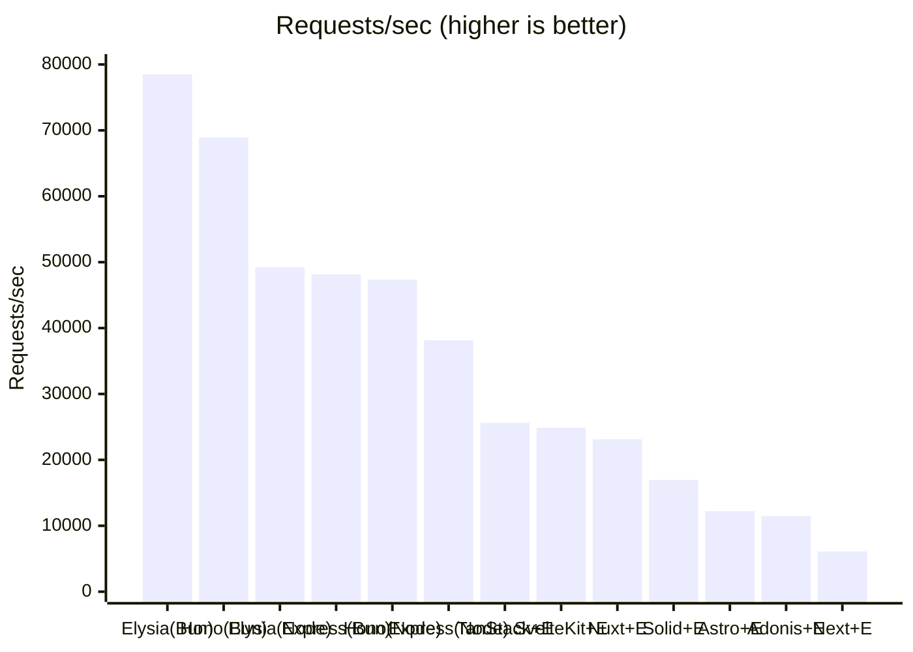
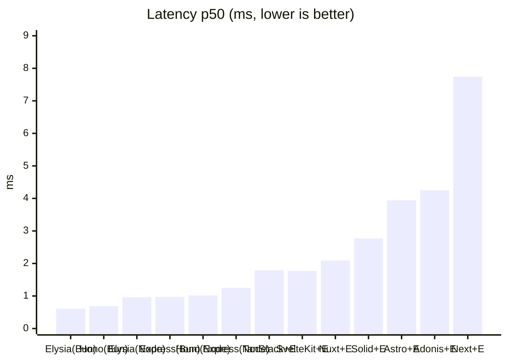
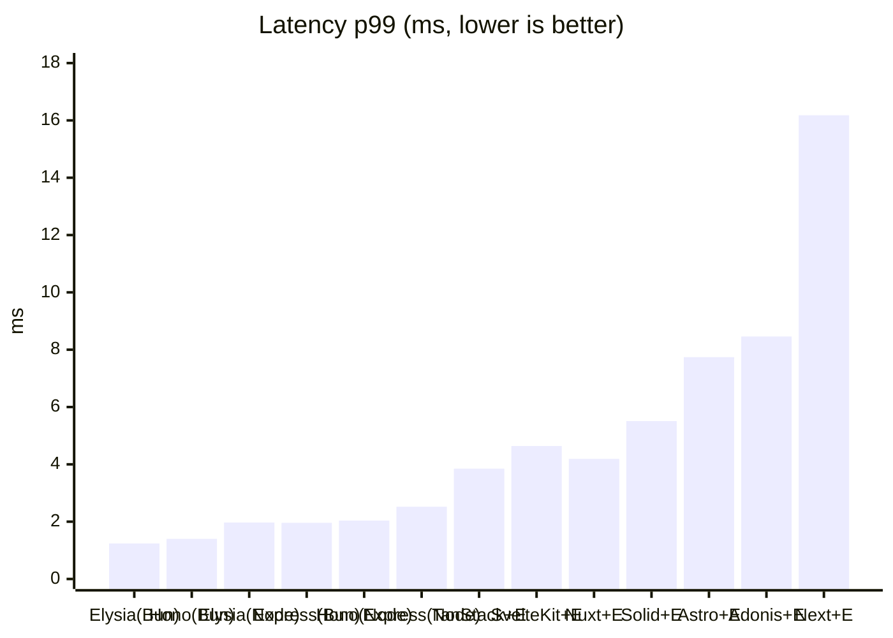
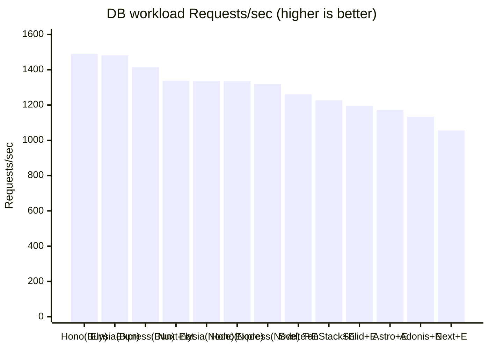

# elysia-bench

ElysiaJS のリクエスト性能を **「Elysia 単体（Node / Bun）」** と **「主要な Web フレームワーク（Next.js / TanStack Start / Astro / AdonisJS / SolidStart / SvelteKit / Nuxt）との連携」** で比較するベンチマーク。各フレームワークでは **素のネイティブ実装（Elysia なし）** と **Elysia 連携** の両方を用意し、Elysia を載せることによる差も測る。あわせて **Hono / Express / NestJS の単体サーバ**も並べ、Elysia 単体との純粋なサーバ性能差も比較する（NestJS は Node のみ・Express / Fastify の 2 アダプタ）。

> English version: see [README_EN.md](README_EN.md).

## 比較の狙い

3 つの軸を分けて測定する。

1. **フレームワーク経由のオーバーヘッド** — 各フレームワークはいずれも Node で動かすため、公平性のために Elysia 単体も [`@elysiajs/node`](https://elysiajs.com/integrations/node.html) アダプタで **Node に揃え**、ランタイム差を排除したうえで「各フレームワークのサーバルートに API を載せることによる純粋なコスト」を測る。
2. **ランタイム差（Node vs Bun）** — 同じ Elysia 単体を Bun ネイティブでも動かし、Elysia 本来の推奨環境との差も見る。
3. **Elysia 連携のオーバーヘッド** — 各フレームワークで「素のネイティブ実装 `/native`」と「Elysia 連携 `/api`」を**同一サーバ・同一ランタイム**で公開し、Elysia を載せた差だけを切り出す。

全エンドポイントは同一の JSON オブジェクト（[`packages/payload`](packages/payload/index.ts)）を返す `GET` API で揃えてある。

| 構成 | URL | ランタイム | ポート | エントリ |
| --- | --- | --- | --- | --- |
| Elysia 単体 | `GET /` | Node | 3001 | [`src/node.ts`](apps/elysia-standalone/src/node.ts) |
| Elysia 単体 | `GET /` | Bun | 3002 | [`src/bun.ts`](apps/elysia-standalone/src/bun.ts) |
| Hono 単体 | `GET /` | Node | 3009 | [`src/node.ts`](apps/hono-standalone/src/node.ts) |
| Hono 単体 | `GET /` | Bun | 3011 | [`src/bun.ts`](apps/hono-standalone/src/bun.ts) |
| Express 単体 | `GET /` | Node | 3010 | [`src/node.ts`](apps/express-standalone/src/node.ts) |
| Express 単体 | `GET /` | Bun | 3012 | [`src/bun.ts`](apps/express-standalone/src/bun.ts) |
| NestJS 単体（Express アダプタ） | `GET /` | Node | 3013 | [`src/node.ts`](apps/nestjs-standalone/src/node.ts) |
| NestJS 単体（Fastify アダプタ） | `GET /` | Node | 3014 | [`src/fastify.ts`](apps/nestjs-standalone/src/fastify.ts) |
| Next.js native | `GET /native` | Node | 3000 | [`native/route.ts`](apps/next-elysia/app/native/route.ts) |
| Next.js + Elysia | `GET /api` | Node | 3000 | [`route.ts`](apps/next-elysia/app/api/[[...slugs]]/route.ts) |
| TanStack Start native | `GET /native` | Node | 3003 | [`native.ts`](apps/tanstack-elysia/src/routes/native.ts) |
| TanStack Start + Elysia | `GET /api` | Node | 3003 | [`api.$.ts`](apps/tanstack-elysia/src/routes/api.$.ts) |
| Astro native | `GET /native` | Node | 3004 | [`native.ts`](apps/astro-elysia/src/pages/native.ts) |
| Astro + Elysia | `GET /api` | Node | 3004 | [`[...slugs].ts`](apps/astro-elysia/src/pages/api/[...slugs].ts) |
| AdonisJS native | `GET /native` | Node | 3005 | [`routes.ts`](apps/adonis-elysia/start/routes.ts) |
| AdonisJS + Elysia | `GET /api` | Node | 3005 | [`routes.ts`](apps/adonis-elysia/start/routes.ts) |
| SolidStart native | `GET /native` | Node | 3006 | [`native.ts`](apps/solidstart-elysia/src/routes/native.ts) |
| SolidStart + Elysia | `GET /api` | Node | 3006 | [`api.ts`](apps/solidstart-elysia/src/routes/api.ts) |
| SvelteKit native | `GET /native` | Node | 3007 | [`+server.ts`](apps/sveltekit-elysia/src/routes/native/+server.ts) |
| SvelteKit + Elysia | `GET /api` | Node | 3007 | [`+server.ts`](apps/sveltekit-elysia/src/routes/api/+server.ts) |
| Nuxt native | `GET /native` | Node | 3008 | [`native.ts`](apps/nuxt-elysia/server/routes/native.ts) |
| Nuxt + Elysia | `GET /api` | Node | 3008 | [`api.ts`](apps/nuxt-elysia/server/routes/api.ts) |

Node 版と Bun 版はランタイムだけが異なり、ルート定義は [`src/routes.ts`](apps/elysia-standalone/src/routes.ts) に一本化している。

### 複雑ワークロード（DB 集計）エンドポイント

上記の単純な静的 JSON に**加えて**、よりプロダクションに近い負荷として **SQLite を Drizzle で複数回クエリし、アプリ側で結合・集計・整形した結果を返す**エンドポイントを各アプリに用意している。静的 JSON では実質「ルーティング + シリアライズ」しか測れないが、こちらは DB アクセスとアプリ側整形が支配的な実 API に近い条件での比較ができる。

複雑ロジックと SQLite 本体は [`packages/workload`](packages/workload/) に共有し、各アプリのエンドポイントは [`runWorkload()`](packages/workload/index.ts) を 1 回呼ぶだけにしている（実装の冗長化を避け、全アプリが同一の決定的出力を返す）。ワークロードは `users / orders / order_items`（EC 風スキーマ）を 3 回クエリし、注文ごとの合計・国別売上・商品別数量ランキングをアプリ側で集計する。

| 種別 | 単純（静的 JSON） | 複雑（DB 集計） |
| --- | --- | --- |
| standalone（Elysia / Hono / Express / NestJS） | `GET /` | `GET /db` |
| full-stack native（Elysia なし） | `GET /native` | `GET /native-db` |
| full-stack + Elysia | `GET /api` | `GET /api/db` |

ランタイムごとにネイティブな SQLite ドライバへ自動で切り替える（Node = `better-sqlite3` / Bun = `bun:sqlite`、いずれも Drizzle アダプタ経由）。切り替えは [`packages/workload/index.ts`](packages/workload/index.ts) に閉じており、各アプリのルート定義はランタイムを意識しない。

## 構成

```
apps/
  elysia-standalone/   Elysia 単体
    src/routes.ts      共通ルート定義（Node/Bun で共有）
    src/node.ts        Node エントリ（@elysiajs/node, port 3001）
    src/bun.ts         Bun エントリ（Bun ネイティブ, port 3002）
  hono-standalone/     Hono 単体（Elysia 組み込みなし）
    src/app.ts         共通アプリ定義（Node/Bun で共有）
    src/node.ts        Node エントリ（@hono/node-server, port 3009）
    src/bun.ts         Bun エントリ（Bun.serve, port 3011）
  express-standalone/  Express 単体（Express 5, Elysia 組み込みなし）
    src/app.ts         共通アプリ定義（Node/Bun で共有）
    src/node.ts        Node エントリ（app.listen, port 3010）
    src/bun.ts         Bun エントリ（Bun の Node 互換 API, port 3012）
  nestjs-standalone/   NestJS 単体（Node のみ, Elysia 組み込みなし）
    src/app.controller.ts  共通ルート定義（GET / と GET /db。DI なし）
    src/app.module.ts      AppModule（controllers のみ）
    src/node.ts        Express アダプタのエントリ（@nestjs/platform-express, port 3013）
    src/fastify.ts     Fastify アダプタのエントリ（@nestjs/platform-fastify, port 3014）
  next-elysia/         Next.js App Router（port 3000）
    app/native/route.ts          素の Route Handler（Elysia なし）
    app/api/[[...slugs]]/route.ts  Elysia をマウント
  tanstack-elysia/     TanStack Start（port 3003）
    src/routes/native.ts  素の server route（Elysia なし）
    src/routes/api.$.ts   Elysia をマウント
    server/prod.mjs       本番ビルドの fetch ハンドラを srvx で待受
  astro-elysia/        Astro（port 3004）
    src/pages/native.ts           素の Astro Endpoint（Elysia なし）
    src/pages/api/[...slugs].ts   Elysia をマウント
    astro.config.mjs     output:server + @astrojs/node(standalone)
  adonis-elysia/       AdonisJS（api スターターキット, port 3005）
    start/routes.ts      /native（素）と /api（Elysia 連携）を定義
                         Node の req/res を Web Request に変換して elysia.handle() へ渡す
  solidstart-elysia/   SolidStart v1（Vinxi/Nitro, port 3006）
    src/routes/native.ts  素の API ルート（Elysia なし）
    src/routes/api.ts     Elysia をマウント（event.request を elysia.handle() へ）
  sveltekit-elysia/    SvelteKit（adapter-node, port 3007）
    src/routes/native/+server.ts  素の +server エンドポイント（Elysia なし）
    src/routes/api/+server.ts     Elysia をマウント（request を elysia.handle() へ）
  nuxt-elysia/         Nuxt（Nitro, port 3008）
    server/routes/native.ts  素の Nitro ルート（オブジェクトを返す）
    server/routes/api.ts     Elysia をマウント（toWebRequest→elysia.handle()）
packages/
  payload/             単純エンドポイントが返す共通 JSON ペイロード
  workload/            複雑エンドポイント用の共有ロジックと SQLite 本体
    index.ts           スキーマ + ドライバ切替 + runWorkload()（自己完結の 1 ファイル）
    seed.ts            workload.sqlite を決定的に生成（pnpm seed）
    workload.sqlite    生成済み DB（コミット済み）
bench/
  run.sh               各アプリを「起動→疎通待ち→レスポンス検証→ウォームアップ→計測→停止」
                       の順に 1 つずつ駆動する。常に 1 アプリだけ起動するので RAM を無駄に
                       占有しない。計測前にレスポンスが期待ペイロードと一致するか検証し、
                       計測後に成功率 100% かも確認する
```

## セットアップ

```bash
pnpm install
```

複雑ワークロード用の SQLite（[`packages/workload/workload.sqlite`](packages/workload/)）はコミット済みなので通常は再生成不要。スキーマやシードを変えたときだけ再生成する。

```bash
pnpm seed   # packages/workload/workload.sqlite を決定的に再生成
```

> `better-sqlite3` はネイティブアドオンのため、`pnpm-workspace.yaml` の `onlyBuiltDependencies` でビルドを許可している。Node のバージョンを上げた直後などにバインディングが見つからない場合は `pnpm rebuild better-sqlite3` を実行する。

## 実行手順

各フレームワークを**本番ビルド**しておく（dev モードは非代表的なので必ず build する。単体サーバの Elysia / Hono / Express は `tsx` 起動なのでビルド不要）。サーバの**起動・停止は `pnpm bench`（`bench/run.sh`）が 1 アプリずつ自動で行う**ので、手動で起動しておく必要はない。

```bash
# 1) フレームワークを本番ビルド（一度だけ）
pnpm build:next
pnpm build:tanstack
pnpm build:astro
pnpm build:adonis
pnpm build:solid
pnpm build:svelte
pnpm build:nuxt

# 2) 計測（各アプリの 起動→検証→計測→停止 を run.sh が順に実行する）
pnpm bench
```

ビルドし忘れた／起動できないアプリは自動で `[skip]` され、残りの計測は継続する。計測対象を絞りたい場合は `bench/run.sh` の `APPS` 配列を編集する。

動作確認（任意）:

```bash
curl http://localhost:3001/         # Elysia 単体 (Node)
curl http://localhost:3002/         # Elysia 単体 (Bun)
curl http://localhost:3009/         # Hono 単体 (Node)
curl http://localhost:3011/         # Hono 単体 (Bun)
curl http://localhost:3010/         # Express 単体 (Node)
curl http://localhost:3012/         # Express 単体 (Bun)
curl http://localhost:3013/         # NestJS 単体 (Express アダプタ, Node)
curl http://localhost:3014/         # NestJS 単体 (Fastify アダプタ, Node)
curl http://localhost:3000/native   # Next.js native      / curl .../api    # + Elysia
curl http://localhost:3003/native   # TanStack native     / curl .../api    # + Elysia
curl http://localhost:3004/native   # Astro native        / curl .../api    # + Elysia
curl http://localhost:3005/native   # AdonisJS native     / curl .../api    # + Elysia
curl http://localhost:3006/native   # SolidStart native   / curl .../api    # + Elysia
curl http://localhost:3007/native   # SvelteKit native    / curl .../api    # + Elysia
curl http://localhost:3008/native   # Nuxt native         / curl .../api    # + Elysia

# 複雑ワークロード（DB 集計）
curl http://localhost:3009/db        # Hono 単体 (Node)   ※standalone は /db
curl http://localhost:3000/native-db # Next.js native DB  / curl .../api/db  # + Elysia
```

### パラメータ

`bench/run.sh` は環境変数で調整できる。

| 変数 | デフォルト | 説明 |
| --- | --- | --- |
| `DURATION` | `30s` | 計測時間 |
| `CONN` | `50` | 同時接続数 |
| `WARMUP` | `5s` | ウォームアップ時間 |
| `READY_TIMEOUT` | `60` | 各サーバ起動の待機上限（秒）。超えたら `[skip]` |

```bash
DURATION=60s CONN=100 pnpm bench
```

## 結果

計測環境: macOS (Darwin 25.5.0, Apple Silicon) / Node 26.3.0 / Bun 1.3.14 / `CONN=50` / `DURATION=30s` / oha 1.14.0。
**各アプリを 1 つずつ起動して計測**（常に計測対象 1 アプリだけが起動。native と +Elysia は同一サーバを起動したまま連続計測）。全エンドポイントで成功率 100%・レスポンスが期待ペイロードと一致することを計測前後に検証済み。絶対値は環境依存なので**相対比較**として読むこと。

| 構成 | Requests/sec | 平均 ms | p50 ms | p99 ms |
| --- | --- | --- | --- | --- |
| Elysia 単体 (Bun) | **78,496** | 0.64 | 0.61 | 1.24 |
| Hono 単体 (Bun) | 68,898 | 0.72 | 0.69 | 1.40 |
| Elysia 単体 (Node) | 49,225 | 1.01 | 0.96 | 1.97 |
| Express 単体 (Bun) | 48,130 | 1.04 | 0.97 | 1.96 |
| Hono 単体 (Node) | 47,366 | 1.05 | 1.02 | 2.04 |
| Express 単体 (Node) | 38,144 | 1.31 | 1.25 | 2.52 |
| Nuxt native | 38,038 | 1.31 | 1.21 | 2.57 |
| TanStack Start native | 26,156 | 1.91 | 1.75 | 3.81 |
| TanStack Start + Elysia | 25,622 | 1.95 | 1.79 | 3.85 |
| SvelteKit native | 24,962 | 2.00 | 1.82 | 4.61 |
| SvelteKit + Elysia | 24,872 | 2.01 | 1.77 | 4.64 |
| Nuxt + Elysia | 23,142 | 2.16 | 2.09 | 4.19 |
| SolidStart native | 17,065 | 2.93 | 2.76 | 5.49 |
| SolidStart + Elysia | 16,940 | 2.95 | 2.77 | 5.51 |
| AdonisJS native | 13,131 | 3.81 | 3.71 | 7.39 |
| Astro native | 12,815 | 3.90 | 3.76 | 7.35 |
| Astro + Elysia | 12,221 | 4.09 | 3.94 | 7.74 |
| AdonisJS + Elysia | 11,464 | 4.36 | 4.25 | 8.46 |
| Next.js native | 7,146 | 7.00 | 6.57 | 13.74 |
| Next.js + Elysia | 6,111 | 8.18 | 7.74 | 16.18 |

成功率はいずれも 100%（全レスポンス 200・ボディは共通ペイロードと一致）。

#### 単体サーバ比較（Elysia なし・素のサーバ性能）

各ランタイム内で Elysia 単体を基準に並べたもの。

| 構成 | Requests/sec | Elysia 比（同一ランタイム） |
| --- | --- | --- |
| Elysia 単体 (Node) | 49,225 | 1.00 |
| Hono 単体 (Node) | 47,366 | **0.96** |
| Express 単体 (Node) | 38,144 | **0.77** |
| Elysia 単体 (Bun) | 78,496 | 1.00 |
| Hono 単体 (Bun) | 68,898 | **0.88** |
| Express 単体 (Bun) | 48,130 | **0.61** |

→ 素の HTTP サーバとして見ると、Node・Bun いずれでも **Elysia ≥ Hono > Express** の序列は変わらない。Node では Elysia と Hono はほぼ互角（差 ~4%、ばらつき範囲）で、Elysia は Bun 専用ではなく `@elysiajs/node` でも Hono と肩を並べる。一方 Bun では Elysia が Hono を約 12% 引き離す（Elysia は Bun ネイティブが本来の土俵）。Express(5) は Node で約 0.77 倍、Bun では約 0.61 倍と、最も枯れているぶん速いランタイムでの伸びが鈍く相対的に重い。

#### ランタイム差（Node → Bun、同一フレームワーク）

| 構成 | Node RPS | Bun RPS | Bun 倍率 |
| --- | --- | --- | --- |
| Elysia 単体 | 49,225 | 78,496 | **×1.59** |
| Hono 単体 | 47,366 | 68,898 | **×1.45** |
| Express 単体 | 38,144 | 48,130 | **×1.26** |

→ どのフレームワークも Bun でスループットが伸びるが、伸び幅はフレームワーク次第。**Elysia (×1.59)** が最も Bun の恩恵を受け、Hono (×1.45)、Express (×1.26) と続く。Elysia は Bun ネイティブを前提に設計されているぶん、ランタイムを Bun に替えたときの伸びが最も大きい。Express は Node 互換 API 経由で動く分、Bun でも伸びが最小。

#### Elysia 連携のオーバーヘッド（native → +Elysia、同一サーバ）

| フレームワーク | native RPS | +Elysia RPS | Elysia 維持率 |
| --- | --- | --- | --- |
| SvelteKit | 24,962 | 24,872 | **99.6%**（約 -0%） |
| SolidStart | 17,065 | 16,940 | **99.3%**（約 -1%） |
| TanStack Start | 26,156 | 25,622 | **98.0%**（約 -2%） |
| Astro | 12,815 | 12,221 | **95.4%**（約 -5%） |
| AdonisJS | 13,131 | 11,464 | **87.3%**（約 -13%） |
| Next.js | 7,146 | 6,111 | **85.5%**（約 -14%） |
| Nuxt | 38,038 | 23,142 | **60.8%**（約 -39%） |

→ Elysia 連携のオーバーヘッドはフレームワークの連携方式に強く依存する。受け取った Web `Request` をそのまま `elysia.handle()` に委譲できる **SvelteKit / SolidStart / TanStack（-0〜2%）** はほぼ無視できる。`Request`/`Response` 変換を挟む Astro（-5%）・Next.js（-14%）、Node の `req/res` から Web `Request` を毎回合成する AdonisJS（-13%）はやや大きい。**Nuxt の -39% は別格**で、これは native 側が Nitro の「オブジェクトをそのまま返す」最速経路（後述のとおり全 native 中で最速）なのに対し、Elysia 側は `toWebRequest()` で Web `Request` を組み立て、返ってきた Web `Response` を Nitro が再変換するためコスト差が際立つ（Elysia 自体ではなく橋渡し経路の差）。

#### スループット（Requests/sec、高いほど良い）



#### レイテンシ p50（ms、低いほど良い）



#### レイテンシ p99（ms、低いほど良い）



### 考察

- **Elysia 連携のオーバーヘッドは連携方式次第（今回の主目的）**: 受け取った Web `Request` をそのまま `elysia.handle()` に委譲できる **SvelteKit / SolidStart / TanStack（-0〜2%）** はほぼ無視できる。`Request`/`Response` 変換を挟む **Astro（-5%）/ Next.js（-14%）**、Node の `req/res` から Web `Request` を毎回合成する **AdonisJS（-13%）** はやや大きい。**Nuxt（-39%）** は native が Nitro のオブジェクト返却最速経路のため相対差が際立つ（Elysia 自体ではなく橋渡し経路のコスト）。総じて「Elysia を使うかどうか」より「どのフレームワークに載せるか」がスループットを支配する。
- **単体サーバ比較（Elysia なし）**: 素の HTTP サーバとしては Node・Bun いずれでも **Elysia ≥ Hono > Express** の序列。Node では **Elysia(49,225) ≈ Hono(47,366) > Express(38,144)** で Elysia と Hono はほぼ互角（差 ~4%、ばらつき範囲）、Elysia は Bun 専用ではなく `@elysiajs/node` でも Hono と肩を並べる。Bun では **Elysia(78,496) > Hono(68,898) > Express(48,130)** となり、Elysia が Hono を約 12% 引き離す。Express(5) は Node で約 0.77 倍、Bun で約 0.61 倍。
- **フレームワーク経由のコスト（同一 Node ランタイム比）**: Elysia 単体(Node) を基準に native のスループットを見ると、Nuxt ≒ 0.77 倍、TanStack ≒ 0.53 倍、SvelteKit ≒ 0.51 倍、SolidStart ≒ 0.35 倍、AdonisJS ≒ 0.27 倍、Astro ≒ 0.26 倍、Next.js ≒ 0.15 倍。**Nuxt（Nitro）の native が突出して速く**（オブジェクトをそのまま返す最速経路）、次いで TanStack ≒ SvelteKit、SolidStart が中位、AdonisJS ≒ Astro、最後に Next.js の Route Handler 層が最も重い。AdonisJS は api スターターキットの bodyparser / session / shield / 認証初期化を全リクエストで通過する分が乗る。
- **ランタイム差（Node → Bun）**: Bun に替えるとスループットは伸びるが伸び幅はフレームワーク次第で、**Elysia ×1.59 > Hono ×1.45 > Express ×1.26**。Bun ネイティブを前提に設計された Elysia が最も恩恵を受け、Elysia 本来の推奨環境である Bun が全構成で最速。Hono も Bun で大きく伸び（68,898 RPS）、Node の Elysia すら上回って総合 2 位につける。
- **総合**: 最速の Elysia 単体(Bun) を 100% とすると、Hono(Bun) ≒ 88%、Elysia(Node) ≒ 63%、Express(Bun) ≒ 61%、Hono(Node) ≒ 60%、Express(Node) ≒ 49%、（+Elysia 連携で）TanStack ≒ 33%、SvelteKit ≒ 32%、Nuxt ≒ 29%、SolidStart ≒ 22%、Astro ≒ 16%、AdonisJS ≒ 15%、Next.js ≒ 8%。フルスタック連携しつつ API 性能も重視するなら **TanStack Start / SvelteKit / Nuxt** が有利（Nuxt は native を直接使えばさらに速い）。純粋な API スループットが最優先なら Elysia（できれば Bun）を独立プロセスで立てる構成が最良で、Bun が使えるなら Hono も僅差で続く。

> 注: 各アプリは 1 つずつ起動・停止して計測（常に対象 1 アプリのみ）。native と +Elysia は同一サーバを起動したまま連続で測るので、その差は同条件。一方アプリ間の比較は計測時刻がずれるため、CPU のターボ/サーマル状態など時刻依存の揺らぎ（±数 %）の影響を受ける。RPS が近接する構成（Elysia(Node)/Hono、TanStack/SvelteKit など）は幅をもって読むこと。

## 結果（複雑ワークロード / DB 集計エンドポイント）

[複雑ワークロード（DB 集計）エンドポイント](#複雑ワークロードdb-集計エンドポイント)（`/db`・`/native-db`・`/api/db`）の計測結果。同一計測条件（`CONN=50` / `DURATION=30s` / oha）・同一マシン・各アプリ 1 つずつ起動。全 20 構成で成功率 100%・レスポンスが期待値（`runWorkload()` の決定的出力）と一致することを計測前後に検証済み。SQLite を 3 回クエリしてアプリ側で集計するため、1 リクエストあたり約 33〜47ms を要する。

| 構成 | Requests/sec | 平均 ms | p50 ms | p99 ms |
| --- | --- | --- | --- | --- |
| Hono 単体 DB (Bun) | **1,490** | 33.6 | 33.2 | 45.4 |
| Elysia 単体 DB (Bun) | 1,482 | 33.7 | 33.4 | 44.1 |
| Express 単体 DB (Bun) | 1,415 | 35.3 | 34.8 | 44.6 |
| Nuxt native DB | 1,338 | 37.4 | 39.1 | 60.4 |
| Elysia 単体 DB (Node) | 1,336 | 37.4 | 36.4 | 72.8 |
| Hono 単体 DB (Node) | 1,335 | 37.5 | 36.5 | 73.0 |
| Express 単体 DB (Node) | 1,319 | 37.9 | 36.9 | 73.9 |
| Nuxt + Elysia DB | 1,305 | 38.3 | 37.5 | 74.9 |
| SvelteKit native DB | 1,276 | 39.2 | 37.4 | 74.9 |
| SvelteKit + Elysia DB | 1,261 | 39.7 | 37.5 | 75.3 |
| TanStack Start native DB | 1,250 | 40.0 | 38.4 | 76.5 |
| TanStack Start + Elysia DB | 1,227 | 40.8 | 39.0 | 77.2 |
| SolidStart + Elysia DB | 1,195 | 41.9 | 40.0 | 80.6 |
| SolidStart native DB | 1,179 | 42.4 | 40.0 | 79.9 |
| Astro + Elysia DB | 1,172 | 42.7 | 43.9 | 67.8 |
| Astro native DB | 1,134 | 44.1 | 44.1 | 79.1 |
| AdonisJS + Elysia DB | 1,133 | 44.2 | 42.2 | 84.2 |
| AdonisJS native DB | 1,098 | 45.6 | 44.6 | 89.1 |
| Next.js native DB | 1,098 | 45.6 | 43.7 | 87.4 |
| Next.js + Elysia DB | 1,056 | 47.4 | 45.4 | 90.3 |

#### ランタイム差（Node → Bun、単体サーバ・DB 集計）

| 構成 | Node RPS | Bun RPS | Bun 倍率 |
| --- | --- | --- | --- |
| Elysia 単体 DB | 1,336 | 1,482 | **×1.11** |
| Hono 単体 DB | 1,335 | 1,490 | **×1.12** |
| Express 単体 DB | 1,319 | 1,415 | **×1.07** |

→ 単純エンドポイントでの Bun 倍率（Elysia ×1.59 / Hono ×1.45 / Express ×1.26）が、DB 集計では **×1.1 前後**まで縮む。レイテンシの大半を SQLite アクセスとアプリ側集計（CPU バウンド）が占めるため、ランタイムの HTTP 層の速さが効きにくくなる。

#### スループット（複雑ワークロード, Requests/sec, 高いほど良い）



### 考察（複雑ワークロード）

- **DB 処理が支配的だとフレームワーク差はほぼ消える**: 単純エンドポイントでは最速〜最遅が約 **12 倍**（79,590 → 6,324 RPS）開いていたのが、複雑エンドポイントでは約 **1.4 倍**（1,490 → 1,056 RPS）まで圧縮される。約 33〜47ms の SQLite 集計がレイテンシの大半を占め、ルーティング/シリアライズ層の差が埋もれるため。実 API のように DB アクセスが主役の負荷では、「どのフレームワークか」より「DB とアプリ側ロジックをどう速くするか」が支配的になる。
- **Bun の優位も縮む**: 単体サーバの Bun 倍率は単純エンドポイントの ×1.59（Elysia）から **×1.11** へ低下（Hono ×1.45→×1.12、Express ×1.26→×1.07）。CPU バウンドな DB 処理では速いランタイムの伸びしろが効きにくい。
- **Elysia 連携オーバーヘッドも消失**: 単純エンドポイントで目立った Nuxt の −39% は DB 版では **−2.5%**（1,338→1,305）に縮小。他フレームワークも native と +Elysia が ±3%（計測揺らぎの範囲）に収まり、Astro / SolidStart / AdonisJS では誤差で +Elysia の方が速い箇所すらある。Elysia を載せるコストは、1 リクエストの実処理が重くなるほど相対的に無視できる。
- **単体サーバ内の序列は維持**: それでも僅差ながら Bun 系（Hono/Elysia/Express）が上位を占め、Bun では DB 込みでも Node 系を上回る。Node 内では Elysia ≒ Hono ≒ Express（差 ~1%、ばらつき範囲）でほぼ横並び。

> 注: 上表は単純エンドポイントとは別の計測ラン（同一環境）の値。同ランの単純エンドポイントは Elysia(Node) 50,836 / Elysia(Bun) 79,590 など上の表（49,225 / 78,496）と ±数 % で一致しており、環境は安定している。`p99` が Bun 系で Node 系より低い（44ms 前後 vs 73ms 前後）のは、oha のデッドライン到達時の打ち切り挙動とテール分布の差によるもので、相対比較として読むこと。

## 留意点

- 計測は必ず各フレームワーク（Next.js / TanStack Start / Astro / AdonisJS / SolidStart / SvelteKit / Nuxt）を **本番ビルド**しておく（`build:*` を実行。起動は `pnpm bench` が自動で行う）。dev モードは大幅に遅く非代表的。未ビルドのアプリは自動で `[skip]` される。
- Next.js の Route Handler は `export const dynamic = "force-dynamic"` でキャッシュを無効化し、リクエストごとに Elysia を実行させている（単体側と条件を揃えるため）。
- TanStack Start の Vite ビルドは WinterTC 形式の `fetch` ハンドラを出力するだけなので、本番起動は TanStack が内部利用する [`srvx`](https://github.com/h3js/srvx) で待ち受ける（[`server/prod.mjs`](apps/tanstack-elysia/server/prod.mjs)）。
- Astro は `output: 'server'` + [`@astrojs/node`](https://docs.astro.build/en/guides/integrations-guide/node/)（standalone）で SSR エンドポイントを本番起動する。
- AdonisJS は Web Fetch ネイティブではなく Node の `req/res` ベースなので、Elysia 連携はルートハンドラ内で Web `Request` を合成して `elysia.handle()` に渡し、返ってきた Web `Response` を Adonis の `response` に書き戻している（[`start/routes.ts`](apps/adonis-elysia/start/routes.ts)）。api スターターキットの既定ミドルウェア（bodyparser / session / shield / 認証初期化）は `/native` と `/api` の両方を等しく通過するため、両者の比較は公平。`build:adonis` は本番ビルド後に `.env` を `build/` へコピーして本番起動する。
- SolidStart（[`api.ts`](apps/solidstart-elysia/src/routes/api.ts)）・SvelteKit（[`+server.ts`](apps/sveltekit-elysia/src/routes/api/+server.ts)）は Web Fetch ネイティブなので、受け取った `request` をそのまま `elysia.handle()` に渡すだけでよい。Nuxt（[`api.ts`](apps/nuxt-elysia/server/routes/api.ts)）は h3 の `toWebRequest()` で Web `Request` に変換して渡す。SolidStart は本番では Vinxi が出力する Nitro サーバ（`node .output/server/index.mjs`）を、SvelteKit は `@sveltejs/adapter-node`（`node build`）を起動する。
- Hono（[`src/app.ts`](apps/hono-standalone/src/app.ts)）と Express（[`src/app.ts`](apps/express-standalone/src/app.ts)）は **Elysia を組み込まない単体サーバ**で、Elysia 単体と同じく Node 版・Bun 版を用意し、アプリ定義（ルート）を `src/app.ts` に一本化してランタイムだけを差し替える。Node 版は `tsx`（`start:hono` / `start:express`）、Bun 版は `bun`（`start:hono:bun` / `start:express:bun`）でそのまま起動するためビルド不要。Hono は Node では `@hono/node-server`、Bun では `Bun.serve` で同じ `app.fetch` を待ち受ける。Express(5) は Bun の Node 互換 API でそのまま `app.listen` が動く。いずれも `hostname` / `listen(port, '::')` で `::`（デュアルスタック）に待ち受ける。
- NestJS（[`src/app.controller.ts`](apps/nestjs-standalone/src/app.controller.ts)）も **Elysia を組み込まない単体サーバ**。ランタイムは **Node のみ**で、**Express アダプタ**（[`src/node.ts`](apps/nestjs-standalone/src/node.ts), port 3013）と **Fastify アダプタ**（[`src/fastify.ts`](apps/nestjs-standalone/src/fastify.ts), port 3014）の 2 構成を用意し、フレームワーク層オーバーヘッド（Express 単体比）とアダプタ差を測る。ルート定義（Controller / Module）はアダプタ非依存で共有し、ブートストラップだけ差し替える。他の単体サーバと同様 `tsx` 起動でビルド不要。`tsx`（esbuild）は `emitDecoratorMetadata` を出力しないため、**コンストラクタ注入（DI）を使わず** Controller のハンドラ内で `payload` / `runWorkload()` を直接返す（ルーティング系デコレータはメタデータを明示登録するため tsx でも動く）。`app.listen(port, '::')` で `::`（デュアルスタック）に待ち受ける。
- **待受アドレスは IPv6 を含めること**: oha は `localhost` を `::1`（IPv6）に解決して接続し、IPv4 へフォールバックしない。SolidStart / SvelteKit / Nuxt / Hono / Express の `start` は `HOST=::`（または `hostname: "::"`）で起動し、`localhost` 経由でも到達できるようにしている。これを怠ると単発 `curl`（happy-eyeballs で IPv4 にフォールバック）は通るのに、負荷時だけ全失敗（成功率 0%）になる。`bench/run.sh` は計測前にレスポンスボディが共通ペイロードと一致するかを検証し、計測後にも oha の成功率が 100% かを確認して、**正常に動いたうえでの数値**だけを採用する。
- **複雑ワークロード（`/db` 系）** は [`packages/workload`](packages/workload/) に共有した [`runWorkload()`](packages/workload/index.ts) を全アプリが呼ぶ。SQLite ドライバはランタイムごとにネイティブを使い（Node = `better-sqlite3` / Bun = `bun:sqlite`）、動的 import で切り替える。DB 接続は最初のリクエスト時に一度だけ確立する遅延初期化で、読み取り専用で開く。シードは固定（時刻・乱数に依存しない）なので出力は決定的で、全アプリ・全ランタイムで同一バイト列になる。`bench/run.sh` はこの出力を `runWorkload()` から動的生成した期待値と突き合わせて検証する。バンドルされる full-stack アプリでも同じ DB を読めるよう、`run.sh` は `WORKLOAD_DB_PATH` に絶対パスを渡す。
- 負荷ツールとサーバを同一マシンで動かすため絶対値は環境依存。**相対比較**として読むこと。
