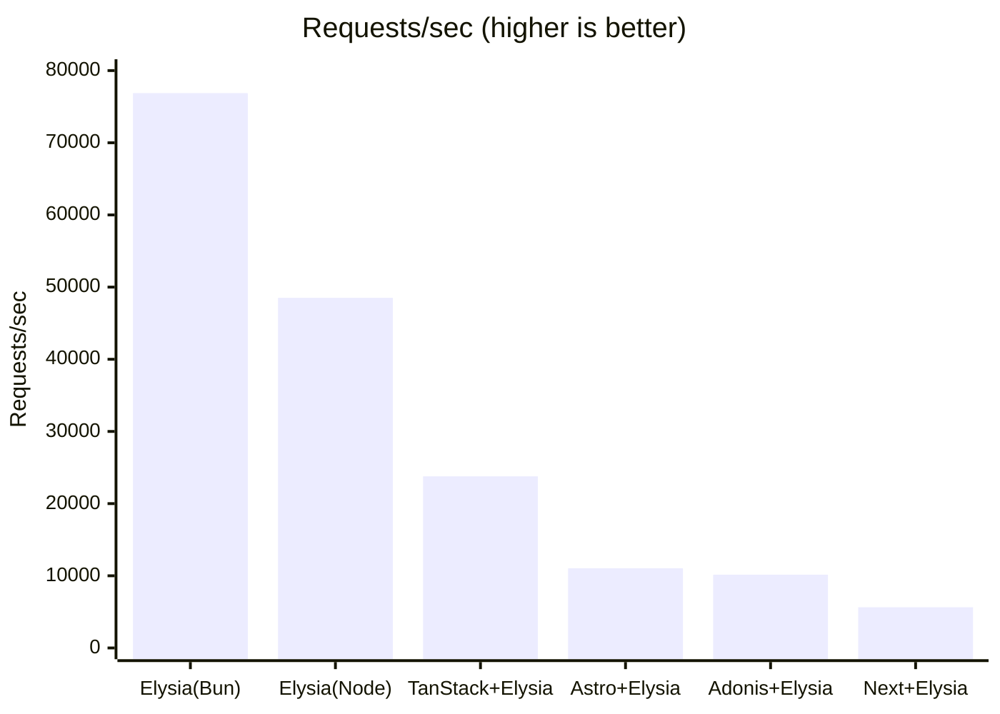
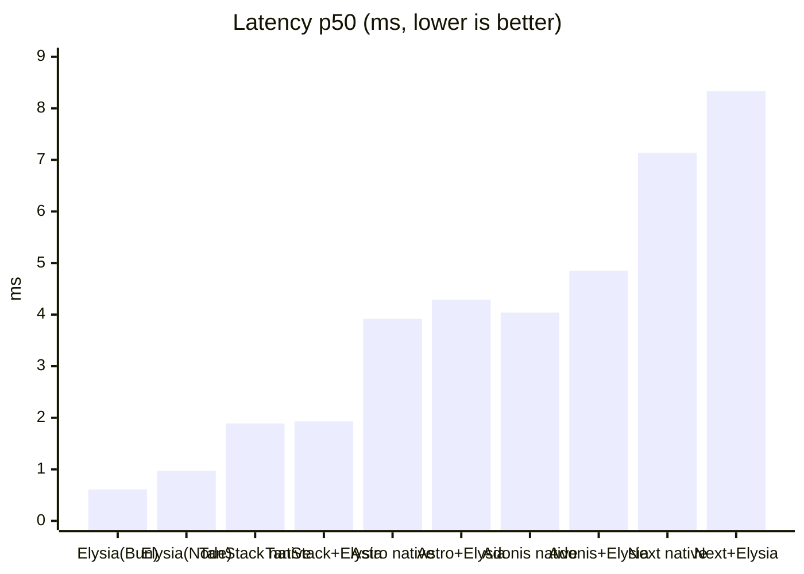
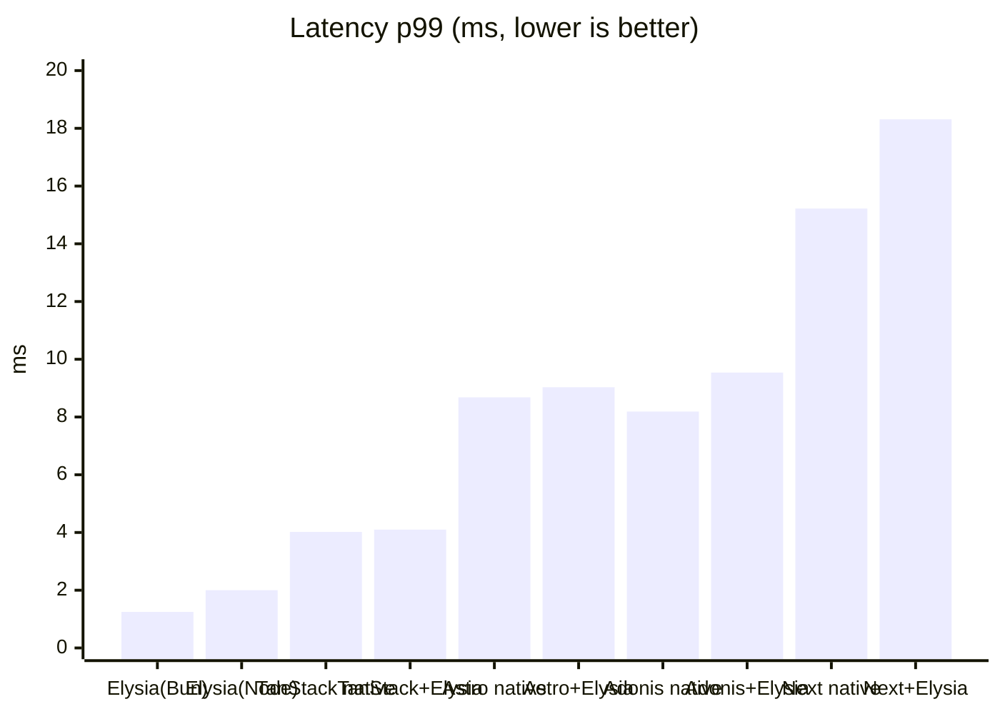

# elysia-bench

ElysiaJS のリクエスト性能を **「Elysia 単体（Node / Bun）」** と **「Next.js / TanStack Start / Astro との連携」** で比較するベンチマーク。各フレームワークでは **素のネイティブ実装（Elysia なし）** と **Elysia 連携** の両方を用意し、Elysia を載せることによる差も測る。

## 比較の狙い

3 つの軸を分けて測定する。

1. **フレームワーク経由のオーバーヘッド** — Next.js / TanStack Start / Astro はいずれも Node で動かすため、公平性のために Elysia 単体も [`@elysiajs/node`](https://elysiajs.com/integrations/node.html) アダプタで **Node に揃え**、ランタイム差を排除したうえで「各フレームワークのサーバルートに API を載せることによる純粋なコスト」を測る。
2. **ランタイム差（Node vs Bun）** — 同じ Elysia 単体を Bun ネイティブでも動かし、Elysia 本来の推奨環境との差も見る。
3. **Elysia 連携のオーバーヘッド** — 各フレームワークで「素のネイティブ実装 `/native`」と「Elysia 連携 `/api`」を**同一サーバ・同一ランタイム**で公開し、Elysia を載せた差だけを切り出す。

全エンドポイントは同一の JSON オブジェクト（[`packages/payload`](packages/payload/index.ts)）を返す `GET` API で揃えてある。

| 構成 | URL | ランタイム | ポート | エントリ |
| --- | --- | --- | --- | --- |
| Elysia 単体 | `GET /` | Node | 3001 | [`src/node.ts`](apps/elysia-standalone/src/node.ts) |
| Elysia 単体 | `GET /` | Bun | 3002 | [`src/bun.ts`](apps/elysia-standalone/src/bun.ts) |
| Next.js native | `GET /native` | Node | 3000 | [`native/route.ts`](apps/next-elysia/app/native/route.ts) |
| Next.js + Elysia | `GET /api` | Node | 3000 | [`route.ts`](apps/next-elysia/app/api/[[...slugs]]/route.ts) |
| TanStack Start native | `GET /native` | Node | 3003 | [`native.ts`](apps/tanstack-elysia/src/routes/native.ts) |
| TanStack Start + Elysia | `GET /api` | Node | 3003 | [`api.$.ts`](apps/tanstack-elysia/src/routes/api.$.ts) |
| Astro native | `GET /native` | Node | 3004 | [`native.ts`](apps/astro-elysia/src/pages/native.ts) |
| Astro + Elysia | `GET /api` | Node | 3004 | [`[...slugs].ts`](apps/astro-elysia/src/pages/api/[...slugs].ts) |
| AdonisJS native | `GET /native` | Node | 3005 | [`routes.ts`](apps/adonis-elysia/start/routes.ts) |
| AdonisJS + Elysia | `GET /api` | Node | 3005 | [`routes.ts`](apps/adonis-elysia/start/routes.ts) |

Node 版と Bun 版はランタイムだけが異なり、ルート定義は [`src/routes.ts`](apps/elysia-standalone/src/routes.ts) に一本化している。

## 構成

```
apps/
  elysia-standalone/   Elysia 単体
    src/routes.ts      共通ルート定義（Node/Bun で共有）
    src/node.ts        Node エントリ（@elysiajs/node, port 3001）
    src/bun.ts         Bun エントリ（Bun ネイティブ, port 3002）
  next-elysia/         Next.js App Router（port 3000）
    app/native/route.ts          素の Route Handler（Elysia なし）
    app/api/[[...slugs]]/route.ts  Elysia をマウント
  tanstack-elysia/     TanStack Start（port 3003）
    src/routes/native.ts  素の server route（Elysia なし）
    src/routes/api.$.ts   Elysia をマウント
    server/prod.mjs       本番ビルドの fetch ハンドラを srvx で待受
  astro-elysia/        Astro（port 3004）
    src/pages/native.ts           素の Astro Endpoint（Elysia なし）
    src/pages/api/[...slugs].ts   Elysia をマウント
    astro.config.mjs     output:server + @astrojs/node(standalone)
  adonis-elysia/       AdonisJS（api スターターキット, port 3005）
    start/routes.ts      /native（素）と /api（Elysia 連携）を定義
                         Node の req/res を Web Request に変換して elysia.handle() へ渡す
packages/
  payload/             全エンドポイントが返す共通 JSON ペイロード
bench/
  run.sh               oha でウォームアップ→計測（起動中の対象だけ自動計測）
```

## セットアップ

```bash
pnpm install
```

## 実行手順

計測したい対象を起動する。`bench/run.sh` は **起動しているエンドポイントだけ**を自動で計測するので、全部でも一部だけでもよい。

```bash
# 1) Elysia 単体（Node）
pnpm start:elysia

# 2) Elysia 単体（Bun）
pnpm start:elysia:bun

# 3) Next.js を本番ビルドして起動（dev モードは非代表的なので必ず build → start）
pnpm build:next
pnpm start:next

# 4) TanStack Start を本番ビルドして起動（同上）
pnpm build:tanstack
pnpm start:tanstack

# 5) Astro を本番ビルドして起動（同上）
pnpm build:astro
pnpm start:astro

# 6) AdonisJS を本番ビルドして起動（同上）
pnpm build:adonis
pnpm start:adonis

# 7) ベンチマーク実行
pnpm bench
```

動作確認（任意）:

```bash
curl http://localhost:3001/         # Elysia 単体 (Node)
curl http://localhost:3002/         # Elysia 単体 (Bun)
curl http://localhost:3000/native   # Next.js native      / curl .../api    # + Elysia
curl http://localhost:3003/native   # TanStack native     / curl .../api    # + Elysia
curl http://localhost:3004/native   # Astro native        / curl .../api    # + Elysia
curl http://localhost:3005/native   # AdonisJS native     / curl .../api    # + Elysia
```

### パラメータ

`bench/run.sh` は環境変数で調整できる。

| 変数 | デフォルト | 説明 |
| --- | --- | --- |
| `DURATION` | `30s` | 計測時間 |
| `CONN` | `50` | 同時接続数 |
| `WARMUP` | `5s` | ウォームアップ時間 |

```bash
DURATION=60s CONN=100 pnpm bench
```

## 結果

計測環境: macOS (Darwin 25.5.0, Apple Silicon) / Node 26.3.0 / Bun 1.3.14 / `CONN=50` / `DURATION=30s` / oha 1.14.0。
10 個を**同時起動して同一 run で**計測したもの（負荷ツールも同一マシン）。絶対値は環境依存なので**相対比較**として読むこと。

| 構成 | Requests/sec | 平均 ms | p50 ms | p99 ms |
| --- | --- | --- | --- | --- |
| Elysia 単体 (Bun) | **76,874** | 0.65 | 0.61 | 1.25 |
| Elysia 単体 (Node) | 48,511 | 1.03 | 0.97 | 2.00 |
| TanStack Start native | 24,323 | 2.05 | 1.89 | 4.02 |
| TanStack Start + Elysia | 23,780 | 2.10 | 1.93 | 4.10 |
| Astro native | 12,018 | 4.16 | 3.92 | 8.68 |
| AdonisJS native | 11,959 | 4.18 | 4.04 | 8.19 |
| Astro + Elysia | 11,050 | 4.52 | 4.29 | 9.03 |
| AdonisJS + Elysia | 10,154 | 4.92 | 4.85 | 9.54 |
| Next.js native | 6,609 | 7.56 | 7.14 | 15.22 |
| Next.js + Elysia | 5,637 | 8.87 | 8.33 | 18.31 |

成功率はいずれも 100%（全レスポンス 200）。

#### Elysia 連携のオーバーヘッド（native → +Elysia、同一サーバ）

| フレームワーク | native RPS | +Elysia RPS | Elysia 維持率 |
| --- | --- | --- | --- |
| TanStack Start | 24,323 | 23,780 | **97.8%**（約 -2%） |
| Astro | 12,018 | 11,050 | **91.9%**（約 -8%） |
| Next.js | 6,609 | 5,637 | **85.3%**（約 -15%） |
| AdonisJS | 11,959 | 10,154 | **84.9%**（約 -15%） |

→ Elysia 連携のオーバーヘッドはフレームワークの連携方式に依る。`fetch` ハンドラをそのまま委譲できる TanStack は **-2%** とごく小さい。Astro（-8%）も比較的軽い。一方、Route Handler 層で `Request`/`Response` 変換を挟む Next.js（-15%）と、Node の `req/res` から Web `Request` を毎回合成して `elysia.handle()` へ橋渡しする AdonisJS（-15%）はやや大きい。いずれにせよスループットの大きな差はフレームワーク側が支配的（最小の Next.js でも維持率 85%）。

#### スループット（Requests/sec、高いほど良い）



#### レイテンシ p50（ms、低いほど良い）



#### レイテンシ p99（ms、低いほど良い）



### 考察

- **Elysia 連携のオーバーヘッドは連携方式次第（今回の主目的）**: 素のネイティブ実装に Elysia を載せたときのスループット低下は、`fetch` ハンドラをそのまま委譲できる **TanStack -2%** はごく小さく、**Astro -8%** も比較的軽い。一方、Route Handler 層で `Request`/`Response` 変換を挟む **Next.js -15%**、Node の `req/res` から Web `Request` を毎回合成して橋渡しする **AdonisJS -15%** はやや大きい。それでも「Elysia を使うかどうか」より「どのフレームワークに載せるか」がスループットを支配する点は変わらない（最小の Next.js でも維持率 85%）。
- **フレームワーク経由のコスト（同一 Node ランタイム比）**: Elysia 単体(Node) を基準に +Elysia のスループットを見ると、TanStack ≒ 0.49 倍、Astro ≒ 0.23 倍、AdonisJS ≒ 0.21 倍、Next.js ≒ 0.12 倍。同じ Node 上でも **TanStack > Astro ≒ AdonisJS > Next.js** とリクエストパイプラインの重さで差が出る。素のネイティブ実装どうしでは Astro（12,018）と AdonisJS（11,959。api スターターキットの bodyparser / session / shield / 認証初期化などを全リクエストで通過）がほぼ同水準。Next.js の Route Handler 層が相対的に最も重い。
- **ランタイム差（Node vs Bun）**: 同じ Elysia 単体でも Bun は Node の **約 1.6 倍のスループット**。Elysia 本来の推奨環境である Bun が最速。
- **総合**: 最速の Elysia 単体(Bun) を 100% とすると Node 単体 ≒ 63%、TanStack 連携 ≒ 31%、Astro 連携 ≒ 14%、AdonisJS 連携 ≒ 13%、Next.js 連携 ≒ 7%。フルスタック連携しつつ API 性能も重視するなら **TanStack Start が最有利**。純粋な API スループットが最優先なら Elysia を独立プロセス（できれば Bun）で立てる構成が最良。

> 注: 上表は 10 エンドポイント同時起動・同一マシンでの相対比較のため、各 RPS は単独計測時より低めに出る可能性がある（リソース競合）。比較は同条件なので有効。Astro / AdonisJS のように RPS が近接する構成や native→+Elysia の維持率は、同一マシン同時計測のばらつき（±数 %）の影響を受けるので幅をもって読むこと。

## 留意点

- 計測は必ず Next.js / TanStack Start / Astro / AdonisJS を **本番ビルド**で行う（`build:*` → `start:*`）。dev モードは大幅に遅く非代表的。
- Next.js の Route Handler は `export const dynamic = "force-dynamic"` でキャッシュを無効化し、リクエストごとに Elysia を実行させている（単体側と条件を揃えるため）。
- TanStack Start の Vite ビルドは WinterTC 形式の `fetch` ハンドラを出力するだけなので、本番起動は TanStack が内部利用する [`srvx`](https://github.com/h3js/srvx) で待ち受ける（[`server/prod.mjs`](apps/tanstack-elysia/server/prod.mjs)）。
- Astro は `output: 'server'` + [`@astrojs/node`](https://docs.astro.build/en/guides/integrations-guide/node/)（standalone）で SSR エンドポイントを本番起動する。
- AdonisJS は Web Fetch ネイティブではなく Node の `req/res` ベースなので、Elysia 連携はルートハンドラ内で Web `Request` を合成して `elysia.handle()` に渡し、返ってきた Web `Response` を Adonis の `response` に書き戻している（[`start/routes.ts`](apps/adonis-elysia/start/routes.ts)）。api スターターキットの既定ミドルウェア（bodyparser / session / shield / 認証初期化）は `/native` と `/api` の両方を等しく通過するため、両者の比較は公平。`build:adonis` は本番ビルド後に `.env` を `build/` へコピーして本番起動する。
- 負荷ツールとサーバを同一マシンで動かすため絶対値は環境依存。**相対比較**として読むこと。
