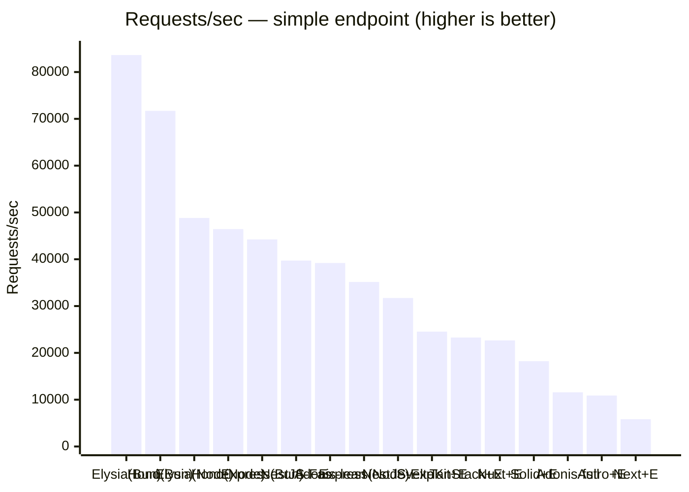
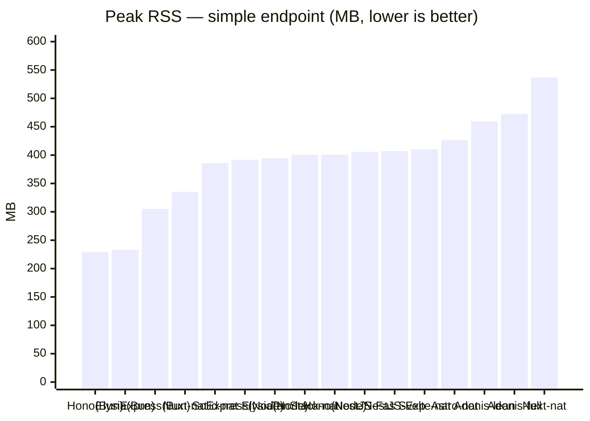

# elysia-bench

ElysiaJS のリクエスト性能を **「Elysia 単体（Node / Bun）」** と **「主要な Web フレームワーク（Next.js / TanStack Start / Astro / SolidStart / SvelteKit / Nuxt）との連携」** で比較するベンチマーク。各フレームワークでは **素のネイティブ実装（Elysia なし）** と **Elysia 連携** の両方を用意し、Elysia を載せることによる差も測る。あわせて **Hono / Express / NestJS / AdonisJS の単体サーバ**も並べ、Elysia 単体との純粋なサーバ性能差も比較する（NestJS は Node のみ・Express / Fastify の 2 アダプタ。AdonisJS は Node のみ・api スターターキット既定のミドルウェアを通す **full** とそれを外した **lean** の 2 モード）。

> English version: see [README_EN.md](README_EN.md).

## 比較の狙い

3 つの軸を分けて測定する。

1. **フレームワーク経由のオーバーヘッド** — 各フレームワークはいずれも Node で動かすため、公平性のために Elysia 単体も [`@elysiajs/node`](https://elysiajs.com/integrations/node.html) アダプタで **Node に揃え**、ランタイム差を排除したうえで「各フレームワークのサーバルートに API を載せることによる純粋なコスト」を測る。
2. **ランタイム差（Node vs Bun）** — 同じ Elysia 単体を Bun ネイティブでも動かし、Elysia 本来の推奨環境との差も見る。
3. **Elysia 連携のオーバーヘッド** — 各フレームワークで「素のネイティブ実装 `/native`」と「Elysia 連携 `/api`」を**同一サーバ・同一ランタイム**で公開し、Elysia を載せた差だけを切り出す。

全エンドポイントは同一の JSON オブジェクト（[`packages/payload`](packages/payload/index.ts)）を返す `GET` API で揃えてある。

| 構成 | URL | ランタイム | ポート | エントリ |
| --- | --- | --- | --- | --- |
| Elysia 単体 | `GET /` | Node | 3001 | [`src/node.ts`](apps/elysia-standalone/src/node.ts) |
| Elysia 単体 | `GET /` | Bun | 3002 | [`src/bun.ts`](apps/elysia-standalone/src/bun.ts) |
| Hono 単体 | `GET /` | Node | 3009 | [`src/node.ts`](apps/hono-standalone/src/node.ts) |
| Hono 単体 | `GET /` | Bun | 3011 | [`src/bun.ts`](apps/hono-standalone/src/bun.ts) |
| Express 単体 | `GET /` | Node | 3010 | [`src/node.ts`](apps/express-standalone/src/node.ts) |
| Express 単体 | `GET /` | Bun | 3012 | [`src/bun.ts`](apps/express-standalone/src/bun.ts) |
| NestJS 単体（Express アダプタ） | `GET /` | Node | 3013 | [`src/node.ts`](apps/nestjs-standalone/src/node.ts) |
| NestJS 単体（Fastify アダプタ） | `GET /` | Node | 3014 | [`src/fastify.ts`](apps/nestjs-standalone/src/fastify.ts) |
| AdonisJS 単体（full・既定ミドルウェアあり） | `GET /` | Node | 3005 | [`routes.ts`](apps/adonis-standalone/start/routes.ts) |
| AdonisJS 単体（lean・既定ミドルウェアなし） | `GET /` | Node | 3015 | [`kernel.ts`](apps/adonis-standalone/start/kernel.ts) |
| Next.js native | `GET /native` | Node | 3000 | [`native/route.ts`](apps/next-elysia/app/native/route.ts) |
| Next.js + Elysia | `GET /api` | Node | 3000 | [`route.ts`](apps/next-elysia/app/api/[[...slugs]]/route.ts) |
| TanStack Start native | `GET /native` | Node | 3003 | [`native.ts`](apps/tanstack-elysia/src/routes/native.ts) |
| TanStack Start + Elysia | `GET /api` | Node | 3003 | [`api.$.ts`](apps/tanstack-elysia/src/routes/api.$.ts) |
| Astro native | `GET /native` | Node | 3004 | [`native.ts`](apps/astro-elysia/src/pages/native.ts) |
| Astro + Elysia | `GET /api` | Node | 3004 | [`[...slugs].ts`](apps/astro-elysia/src/pages/api/[...slugs].ts) |
| SolidStart native | `GET /native` | Node | 3006 | [`native.ts`](apps/solidstart-elysia/src/routes/native.ts) |
| SolidStart + Elysia | `GET /api` | Node | 3006 | [`api.ts`](apps/solidstart-elysia/src/routes/api.ts) |
| SvelteKit native | `GET /native` | Node | 3007 | [`+server.ts`](apps/sveltekit-elysia/src/routes/native/+server.ts) |
| SvelteKit + Elysia | `GET /api` | Node | 3007 | [`+server.ts`](apps/sveltekit-elysia/src/routes/api/+server.ts) |
| Nuxt native | `GET /native` | Node | 3008 | [`native.ts`](apps/nuxt-elysia/server/routes/native.ts) |
| Nuxt + Elysia | `GET /api` | Node | 3008 | [`api.ts`](apps/nuxt-elysia/server/routes/api.ts) |

Node 版と Bun 版はランタイムだけが異なり、ルート定義は [`src/routes.ts`](apps/elysia-standalone/src/routes.ts) に一本化している。

### 複雑ワークロード（DB 集計）エンドポイント

上記の単純な静的 JSON に**加えて**、よりプロダクションに近い負荷として **SQLite を Drizzle で複数回クエリし、アプリ側で結合・集計・整形した結果を返す**エンドポイントを各アプリに用意している。静的 JSON では実質「ルーティング + シリアライズ」しか測れないが、こちらは DB アクセスとアプリ側整形が支配的な実 API に近い条件での比較ができる。

複雑ロジックと SQLite 本体は [`packages/workload`](packages/workload/) に共有し、各アプリのエンドポイントは [`runWorkload()`](packages/workload/index.ts) を 1 回呼ぶだけにしている（実装の冗長化を避け、全アプリが同一の決定的出力を返す）。ワークロードは `users / orders / order_items`（EC 風スキーマ）を 3 回クエリし、注文ごとの合計・国別売上・商品別数量ランキングをアプリ側で集計する。

| 種別 | 単純（静的 JSON） | 複雑（DB 集計） |
| --- | --- | --- |
| standalone（Elysia / Hono / Express / NestJS / AdonisJS） | `GET /` | `GET /db` |
| full-stack native（Elysia なし） | `GET /native` | `GET /native-db` |
| full-stack + Elysia | `GET /api` | `GET /api/db` |

ランタイムごとにネイティブな SQLite ドライバへ自動で切り替える（Node = `better-sqlite3` / Bun = `bun:sqlite`、いずれも Drizzle アダプタ経由）。切り替えは [`packages/workload/index.ts`](packages/workload/index.ts) に閉じており、各アプリのルート定義はランタイムを意識しない。

## 構成

```
apps/
  elysia-standalone/   Elysia 単体
    src/routes.ts      共通ルート定義（Node/Bun で共有）
    src/node.ts        Node エントリ（@elysiajs/node, port 3001）
    src/bun.ts         Bun エントリ（Bun ネイティブ, port 3002）
  hono-standalone/     Hono 単体（Elysia 組み込みなし）
    src/app.ts         共通アプリ定義（Node/Bun で共有）
    src/node.ts        Node エントリ（@hono/node-server, port 3009）
    src/bun.ts         Bun エントリ（Bun.serve, port 3011）
  express-standalone/  Express 単体（Express 5, Elysia 組み込みなし）
    src/app.ts         共通アプリ定義（Node/Bun で共有）
    src/node.ts        Node エントリ（app.listen, port 3010）
    src/bun.ts         Bun エントリ（Bun の Node 互換 API, port 3012）
  nestjs-standalone/   NestJS 単体（Node のみ, Elysia 組み込みなし）
    src/app.controller.ts  共通ルート定義（GET / と GET /db。DI なし）
    src/app.module.ts      AppModule（controllers のみ）
    src/node.ts        Express アダプタのエントリ（@nestjs/platform-express, port 3013）
    src/fastify.ts     Fastify アダプタのエントリ（@nestjs/platform-fastify, port 3014）
  next-elysia/         Next.js App Router（port 3000）
    app/native/route.ts          素の Route Handler（Elysia なし）
    app/api/[[...slugs]]/route.ts  Elysia をマウント
  tanstack-elysia/     TanStack Start（port 3003）
    src/routes/native.ts  素の server route（Elysia なし）
    src/routes/api.$.ts   Elysia をマウント
    server/prod.mjs       本番ビルドの fetch ハンドラを srvx で待受
  astro-elysia/        Astro（port 3004）
    src/pages/native.ts           素の Astro Endpoint（Elysia なし）
    src/pages/api/[...slugs].ts   Elysia をマウント
    astro.config.mjs     output:server + @astrojs/node(standalone)
  adonis-standalone/   AdonisJS 単体（api スターターキット, Elysia 連携なし, full=3005 / lean=3015）
    start/routes.ts      単純 GET / と複雑 GET /db を定義（他の単体サーバと同じパス）
    start/kernel.ts      既定ミドルウェアスタックを定義。ADONIS_BENCH_LEAN=1 で
                         lean（既定ミドルウェアを外し純粋ルーティングに揃える）に切替
  solidstart-elysia/   SolidStart v1（Vinxi/Nitro, port 3006）
    src/routes/native.ts  素の API ルート（Elysia なし）
    src/routes/api.ts     Elysia をマウント（event.request を elysia.handle() へ）
  sveltekit-elysia/    SvelteKit（adapter-node, port 3007）
    src/routes/native/+server.ts  素の +server エンドポイント（Elysia なし）
    src/routes/api/+server.ts     Elysia をマウント（request を elysia.handle() へ）
  nuxt-elysia/         Nuxt（Nitro, port 3008）
    server/routes/native.ts  素の Nitro ルート（オブジェクトを返す）
    server/routes/api.ts     Elysia をマウント（toWebRequest→elysia.handle()）
packages/
  payload/             単純エンドポイントが返す共通 JSON ペイロード
  workload/            複雑エンドポイント用の共有ロジックと SQLite 本体
    index.ts           スキーマ + ドライバ切替 + runWorkload()（自己完結の 1 ファイル）
    seed.ts            workload.sqlite を決定的に生成（pnpm seed）
    workload.sqlite    生成済み DB（コミット済み）
bench/
  run.sh               各アプリを「起動→疎通待ち→レスポンス検証→ウォームアップ→計測→停止」
                       の順に 1 つずつ駆動する。常に 1 アプリだけ起動するので RAM を無駄に
                       占有しない。計測前にレスポンスが期待ペイロードと一致するか検証し、
                       計測後に成功率 100% かも確認する
```

## セットアップ

```bash
pnpm install
```

複雑ワークロード用の SQLite（[`packages/workload/workload.sqlite`](packages/workload/)）はコミット済みなので通常は再生成不要。スキーマやシードを変えたときだけ再生成する。

```bash
pnpm seed   # packages/workload/workload.sqlite を決定的に再生成
```

> `better-sqlite3` はネイティブアドオンのため、`pnpm-workspace.yaml` の `onlyBuiltDependencies` でビルドを許可している。Node のバージョンを上げた直後などにバインディングが見つからない場合は `pnpm rebuild better-sqlite3` を実行する。

## 実行手順

各フレームワークを**本番ビルド**しておく（dev モードは非代表的なので必ず build する。単体サーバの Elysia / Hono / Express は `tsx` 起動なのでビルド不要）。サーバの**起動・停止は `pnpm bench`（`bench/run.sh`）が 1 アプリずつ自動で行う**ので、手動で起動しておく必要はない。

```bash
# 1) フレームワークを本番ビルド（一度だけ）
pnpm build:next
pnpm build:tanstack
pnpm build:astro
pnpm build:adonis
pnpm build:solid
pnpm build:svelte
pnpm build:nuxt

# 2) 計測（各アプリの 起動→検証→計測→停止 を run.sh が順に実行する）
pnpm bench
```

ビルドし忘れた／起動できないアプリは自動で `[skip]` され、残りの計測は継続する。計測対象を絞りたい場合は `bench/run.sh` の `APPS` 配列を編集する。

動作確認（任意）:

```bash
curl http://localhost:3001/         # Elysia 単体 (Node)
curl http://localhost:3002/         # Elysia 単体 (Bun)
curl http://localhost:3009/         # Hono 単体 (Node)
curl http://localhost:3011/         # Hono 単体 (Bun)
curl http://localhost:3010/         # Express 単体 (Node)
curl http://localhost:3012/         # Express 単体 (Bun)
curl http://localhost:3013/         # NestJS 単体 (Express アダプタ, Node)
curl http://localhost:3014/         # NestJS 単体 (Fastify アダプタ, Node)
curl http://localhost:3005/         # AdonisJS 単体 (full, Node)
curl http://localhost:3015/         # AdonisJS 単体 (lean, Node)
curl http://localhost:3000/native   # Next.js native      / curl .../api    # + Elysia
curl http://localhost:3003/native   # TanStack native     / curl .../api    # + Elysia
curl http://localhost:3004/native   # Astro native        / curl .../api    # + Elysia
curl http://localhost:3006/native   # SolidStart native   / curl .../api    # + Elysia
curl http://localhost:3007/native   # SvelteKit native    / curl .../api    # + Elysia
curl http://localhost:3008/native   # Nuxt native         / curl .../api    # + Elysia

# 複雑ワークロード（DB 集計）
curl http://localhost:3009/db        # Hono 単体 (Node)   ※standalone は /db
curl http://localhost:3005/db        # AdonisJS 単体 (full) / curl localhost:3015/db # lean
curl http://localhost:3000/native-db # Next.js native DB  / curl .../api/db  # + Elysia
```

### パラメータ

`bench/run.sh` は環境変数で調整できる。

| 変数 | デフォルト | 説明 |
| --- | --- | --- |
| `DURATION` | `30s` | 計測時間 |
| `CONN` | `50` | 同時接続数 |
| `WARMUP` | `5s` | ウォームアップ時間 |
| `READY_TIMEOUT` | `60` | 各サーバ起動の待機上限（秒）。超えたら `[skip]` |
| `MEM_INTERVAL` | `0.5` | 負荷時ピーク RSS のサンプリング間隔（秒） |

### メモリ計測（負荷時ピーク RSS）

計測中、`bench/run.sh` は起動中サーバ（`pnpm` プロセスツリー全体）の RSS を `MEM_INTERVAL` 秒ごとにサンプリングし、**ピーク値**を oha 出力の直後に `Peak RSS: XX.X MB` として出力する。逐次計測（常に 1 アプリだけ起動）なので、他のアイドルサーバに影響されずフレームワーク間で公平に比較できる。読むときの注意:

- **総フットプリント（共有メモリを重複計上しうる）**: プロセスツリーの各 RSS を単純合計するため、マルチプロセス系（Next.js の cluster worker 等）は共有ページを重複して数え、実メモリより過大に出ることがある。Node マルチプロセス系は Bun 単一プロセス系よりやや不利に出る点に留意し、相対比較の目安として読むこと。
- **フルスタックは累積ピーク**: フルスタック各構成は同一サーバを起動したまま `/native → /api → /native-db → /api/db` を連続計測する。メモリは計測間で縮まないため、後続エンドポイントの値は「そこまでの累積ピーク」になり、単調増加気味になる（そのエンドポイント単独の消費ではない）。
- **「負荷時」ピークの定義**: measure 中のみサンプリングするため、起動直後のモジュールロード時の一時スパイクは含まない。「最大消費メモリ」とは別物。

```bash
DURATION=60s CONN=100 pnpm bench
```

## 結果（レスポンス性能）

計測環境: macOS (Darwin 25.5.0, Apple Silicon) / Node 26.3.0 / Bun 1.3.14 / `CONN=50` / `DURATION=30s` / oha 1.14.0。**全 44 エンドポイントを 1 回の連続ラン（`pnpm bench`）で計測**した。各アプリを 1 つずつ起動し（常に計測対象 1 アプリだけが起動）、native と +Elysia・単純と DB は同一サーバを起動したまま連続計測する。全エンドポイントで成功率 100%・レスポンスが期待ペイロードと一致することを計測前後に検証済み。絶対値は環境依存なので**相対比較**として読むこと。

全ベンチマーク対象を 1 表にまとめた。**単純（静的 JSON）** エンドポイント（`GET /`・`/native`・`/api`）と **複雑（DB 集計）** エンドポイント（`GET /db`・`/native-db`・`/api/db`）を横並びにし、単純の Requests/sec 降順で並べる。

| 構成 | 単純 RPS | DB RPS |
| --- | --- | --- |
| Elysia 単体 (Bun) | **83,625** | 1,357 |
| Hono 単体 (Bun) | 71,707 | 1,396 |
| Elysia 単体 (Node) | 48,817 | 1,275 |
| Hono 単体 (Node) | 46,439 | 1,274 |
| Express 単体 (Bun) | 44,240 | 1,376 |
| NestJS 単体 Fastify (Node) | 39,717 | 1,214 |
| AdonisJS 単体 (lean) | 39,205 | 1,137 |
| Nuxt native | 37,223 | 1,335 |
| Express 単体 (Node) | 35,148 | 1,256 |
| NestJS 単体 Express (Node) | 31,724 | 1,230 |
| SvelteKit native | 24,772 | 1,266 |
| SvelteKit + Elysia | 24,529 | 1,278 |
| TanStack Start + Elysia | 23,282 | 1,202 |
| TanStack Start native | 22,818 | 1,198 |
| Nuxt + Elysia | 22,672 | 1,300 |
| SolidStart native | 18,321 | 1,220 |
| SolidStart + Elysia | 18,219 | 1,222 |
| AdonisJS 単体 (full) | 11,575 | 1,048 |
| Astro native | 11,417 | 1,088 |
| Astro + Elysia | 10,885 | 1,090 |
| Next.js native | 6,578 | 1,041 |
| Next.js + Elysia | 5,830 | 995 |

成功率はいずれも 100%（全レスポンス 200・ボディは共通ペイロードと一致）。レイテンシは単純が約 0.5〜8.6ms、DB 集計は SQLite を 3 回クエリしてアプリ側で集計するため約 36〜50ms/リクエスト。

代表として単純エンドポイントの Requests/sec（フルスタックは +Elysia、AdonisJS は lean / full）:



### 考察（レスポンス性能）

- **単純エンドポイントはフレームワーク差が大きい**: 最速 Elysia 単体(Bun) 83,625 〜 最遅 Next.js+Elysia 5,830 RPS で約 14 倍開く。素の HTTP サーバとしては Node・Bun いずれでも **Elysia ≥ Hono > Express** の序列（Node では Elysia ≈ Hono、Bun では Elysia が Hono を約 14% 引き離す）。Bun が全構成で最速で、Bun への乗せ替えで伸びるのは Elysia ×1.71 > Hono ×1.54 > Express ×1.26 と Elysia が最大。NestJS（Node のみ）は Fastify アダプタが素の Express を上回り、フレームワーク層自体のオーバーヘッドは小さい。
- **Elysia 連携のオーバーヘッドは連携方式次第**: 受け取った Web `Request` をそのまま `elysia.handle()` に委譲できる TanStack / SolidStart / SvelteKit は ±1〜2%（誤差）。`Request`/`Response` 変換を挟む Astro −5% / Next.js −11% はやや大きく、Nuxt −39% は native が Nitro の最速経路（オブジェクト直返し）のため相対差が際立つ（Elysia 自体ではなく橋渡し経路のコスト）。「Elysia を使うか」より「どのフレームワークに載せるか」がスループットを支配する。
- **DB 処理が支配的だとフレームワーク差はほぼ消える**: 単純で約 14 倍開いた差が、DB 集計では約 1.4 倍（1,396 → 995 RPS）に圧縮される。約 36〜50ms の SQLite 集計がレイテンシの大半を占めるため、Bun の優位（単体で ×1.06〜1.10 に低下）も Elysia 連携のオーバーヘッド（Nuxt −39% → −2.6%）もほぼ消える。実 API のように DB が主役の負荷では「どのフレームワークか」より「DB とアプリ側ロジックをどう速くするか」が支配的。
- **AdonisJS は既定ミドルウェアで大きく変わる**: lean（既定ミドルウェアなし）39,205 RPS に対し full（session / shield / 認証初期化などを通す実運用相当）は 11,575 RPS と約 1/3（×3.4）。AdonisJS の遅さの大半は本体ルーティングではなく既定ミドルウェアに由来する。DB 集計では lean 1,137 / full 1,048 と差が縮む。

> 注: 各アプリは 1 つずつ起動・停止するため計測時刻はずれ、アプリ間比較は CPU のターボ/サーマル状態など時刻依存の揺らぎ（±数 %）を含む。native と +Elysia は同一サーバを起動したまま連続で測るのでその差は同条件。RPS が近接する構成は幅をもって読むこと。

## 結果（メモリ使用量）

負荷時（measure 中）に計測した**ピーク RSS**（起動した `pnpm` プロセスツリー全体の合計）。スループット/レイテンシと同一ランで同時に記録（同一環境・`CONN=50` / `DURATION=30s`）。**総フットプリント（共有メモリを重複計上しうる）**のため Node マルチプロセス系はやや過大に出る点に注意（読み方は[メモリ計測](#メモリ計測負荷時ピーク-rss)を参照）。Elysia 連携（+Elysia）は native との差が ±20MB 程度の誤差なのでフルスタックは native のみ掲載する。**単純（静的 JSON）** と **複雑（DB 集計）** のピーク RSS を横並びにし、単純の昇順で並べる。

| 構成 | 単純 Peak RSS | DB Peak RSS |
| --- | --- | --- |
| Hono 単体 (Bun) | **229.1 MB** | 288.8 MB |
| Elysia 単体 (Bun) | 233.3 MB | 302.8 MB |
| Express 単体 (Bun) | 305.5 MB | 328.7 MB |
| Nuxt native | 335.3 MB | 372.8 MB |
| SolidStart native | 386.0 MB | 418.8 MB |
| Express 単体 (Node) | 391.7 MB | 371.8 MB |
| Elysia 単体 (Node) | 394.3 MB | 378.9 MB |
| TanStack Start native | 400.7 MB | 430.8 MB |
| Hono 単体 (Node) | 401.0 MB | 344.5 MB |
| NestJS 単体 Fastify (Node) | 405.8 MB | 417.7 MB |
| NestJS 単体 Express (Node) | 407.0 MB | 377.1 MB |
| SvelteKit native | 410.4 MB | 478.7 MB |
| Astro native | 426.6 MB | 480.0 MB |
| AdonisJS 単体 (lean) | 459.1 MB | 387.5 MB |
| AdonisJS 単体 (full) | 472.6 MB | 461.7 MB |
| Next.js native | 536.7 MB | 535.5 MB |

DB 集計のフルスタック値は同一サーバで単純の後に計測するため**そこまでの累積ピーク**を含む（読み方は[メモリ計測](#メモリ計測負荷時ピーク-rss)を参照）。代表として単純エンドポイントのピーク RSS:



### 考察（メモリ使用量）

- **Bun 単一プロセス系が圧倒的に省メモリ**: Hono/Elysia(Bun) は単純で約 230MB と Node 版（約 390〜400MB）の 6 割弱。Node 単体系（tsx ローダ含む総フットプリント）は約 390〜410MB に収束する。
- **フルスタックは Next.js が最大・Nuxt が最小**: 単純で Next.js 536.7MB（最大）、Nuxt native 335.3MB（最小）。DB 集計でも傾向は同じ（Next.js 535.5 / Bun 系 289〜329MB）。
- **AdonisJS はミドルウェアの有無が RSS にほぼ効かない**: full 472.6 / lean 459.1MB（単純）で、スループットほどの差（×3.4）は出ない。
- **DB 集計でも序列はほぼ不変**: DB 用バッファや SQLite ドライバを確保しても、ランタイム/フレームワークによる序列は単純エンドポイントと変わらない。

## 留意点

- 計測は必ず各フレームワーク（Next.js / TanStack Start / Astro / AdonisJS / SolidStart / SvelteKit / Nuxt）を **本番ビルド**しておく（`build:*` を実行。起動は `pnpm bench` が自動で行う）。dev モードは大幅に遅く非代表的。未ビルドのアプリは自動で `[skip]` される。
- **全 44 エンドポイントは 1 回の連続ラン（`pnpm bench`）で計測している**。単体サーバ群・フルスタック・AdonisJS の単純/複雑エンドポイントはすべて同一ランの値で、相互に直接比較できる。ただし各アプリは 1 つずつ起動・停止するため計測時刻はずれ、アプリ間比較は時刻依存の揺らぎ（±数 %）を含む。
- Next.js の Route Handler は `export const dynamic = "force-dynamic"` でキャッシュを無効化し、リクエストごとに Elysia を実行させている（単体側と条件を揃えるため）。
- TanStack Start の Vite ビルドは WinterTC 形式の `fetch` ハンドラを出力するだけなので、本番起動は TanStack が内部利用する [`srvx`](https://github.com/h3js/srvx) で待ち受ける（[`server/prod.mjs`](apps/tanstack-elysia/server/prod.mjs)）。
- Astro は `output: 'server'` + [`@astrojs/node`](https://docs.astro.build/en/guides/integrations-guide/node/)（standalone）で SSR エンドポイントを本番起動する。
- **AdonisJS は単体サーバ（Elysia 連携なし）として計測する**。HTTP アダプタを差し替えられず（常に Node 標準 `http`）公式ランタイムも Node のみなので、性能比較で意味のある「モード」はミドルウェアスタックの厚みだけ。そこで [`start/kernel.ts`](apps/adonis-standalone/start/kernel.ts) を `ADONIS_BENCH_LEAN` で 2 モードに切り替える。**full**（`start:adonis`, port 3005）は api スターターキット既定の `bodyparser / session / shield / 認証初期化 / CORS / force_json` を全リクエストで通す実運用相当の構成、**lean**（`start:adonis:lean`, port 3015）はそれらを外し他の単体サーバと同条件（純粋なルーティング + シリアライズ）に揃えた構成で、`PORT=3015 ADONIS_BENCH_LEAN=1` で同一ビルドを起動するだけ。ルート定義はモード非依存で `GET /`（単純）と `GET /db`（複雑）を共有する（[`start/routes.ts`](apps/adonis-standalone/start/routes.ts)）。両者の差は単純エンドポイントで約 3.4 倍（[結果（レスポンス性能）](#結果レスポンス性能)を参照）。lean では認証系ルート（`/api/v1/*`）は動かなくなるが、ベンチが叩くのは `/` と `/db` だけなので計測には影響しない。`build:adonis` は本番ビルド後に `.env` を `build/` へコピーして本番起動する。
- SolidStart（[`api.ts`](apps/solidstart-elysia/src/routes/api.ts)）・SvelteKit（[`+server.ts`](apps/sveltekit-elysia/src/routes/api/+server.ts)）は Web Fetch ネイティブなので、受け取った `request` をそのまま `elysia.handle()` に渡すだけでよい。Nuxt（[`api.ts`](apps/nuxt-elysia/server/routes/api.ts)）は h3 の `toWebRequest()` で Web `Request` に変換して渡す。SolidStart は本番では Vinxi が出力する Nitro サーバ（`node .output/server/index.mjs`）を、SvelteKit は `@sveltejs/adapter-node`（`node build`）を起動する。
- Hono（[`src/app.ts`](apps/hono-standalone/src/app.ts)）と Express（[`src/app.ts`](apps/express-standalone/src/app.ts)）は **Elysia を組み込まない単体サーバ**で、Elysia 単体と同じく Node 版・Bun 版を用意し、アプリ定義（ルート）を `src/app.ts` に一本化してランタイムだけを差し替える。Node 版は `tsx`（`start:hono` / `start:express`）、Bun 版は `bun`（`start:hono:bun` / `start:express:bun`）でそのまま起動するためビルド不要。Hono は Node では `@hono/node-server`、Bun では `Bun.serve` で同じ `app.fetch` を待ち受ける。Express(5) は Bun の Node 互換 API でそのまま `app.listen` が動く。いずれも `hostname` / `listen(port, '::')` で `::`（デュアルスタック）に待ち受ける。
- NestJS（[`src/app.controller.ts`](apps/nestjs-standalone/src/app.controller.ts)）も **Elysia を組み込まない単体サーバ**。ランタイムは **Node のみ**で、**Express アダプタ**（[`src/node.ts`](apps/nestjs-standalone/src/node.ts), port 3013）と **Fastify アダプタ**（[`src/fastify.ts`](apps/nestjs-standalone/src/fastify.ts), port 3014）の 2 構成を用意し、フレームワーク層オーバーヘッド（Express 単体比）とアダプタ差を測る。ルート定義（Controller / Module）はアダプタ非依存で共有し、ブートストラップだけ差し替える。他の単体サーバと同様 `tsx` 起動でビルド不要。`tsx`（esbuild）は `emitDecoratorMetadata` を出力しないため、**コンストラクタ注入（DI）を使わず** Controller のハンドラ内で `payload` / `runWorkload()` を直接返す（ルーティング系デコレータはメタデータを明示登録するため tsx でも動く）。`app.listen(port, '::')` で `::`（デュアルスタック）に待ち受ける。
- **待受アドレスは IPv6 を含めること**: oha は `localhost` を `::1`（IPv6）に解決して接続し、IPv4 へフォールバックしない。SolidStart / SvelteKit / Nuxt / Hono / Express の `start` は `HOST=::`（または `hostname: "::"`）で起動し、`localhost` 経由でも到達できるようにしている。これを怠ると単発 `curl`（happy-eyeballs で IPv4 にフォールバック）は通るのに、負荷時だけ全失敗（成功率 0%）になる。`bench/run.sh` は計測前にレスポンスボディが共通ペイロードと一致するかを検証し、計測後にも oha の成功率が 100% かを確認して、**正常に動いたうえでの数値**だけを採用する。
- **複雑ワークロード（`/db` 系）** は [`packages/workload`](packages/workload/) に共有した [`runWorkload()`](packages/workload/index.ts) を全アプリが呼ぶ。SQLite ドライバはランタイムごとにネイティブを使い（Node = `better-sqlite3` / Bun = `bun:sqlite`）、動的 import で切り替える。DB 接続は最初のリクエスト時に一度だけ確立する遅延初期化で、読み取り専用で開く。シードは固定（時刻・乱数に依存しない）なので出力は決定的で、全アプリ・全ランタイムで同一バイト列になる。`bench/run.sh` はこの出力を `runWorkload()` から動的生成した期待値と突き合わせて検証する。バンドルされる full-stack アプリでも同じ DB を読めるよう、`run.sh` は `WORKLOAD_DB_PATH` に絶対パスを渡す。
- 負荷ツールとサーバを同一マシンで動かすため絶対値は環境依存。**相対比較**として読むこと。
