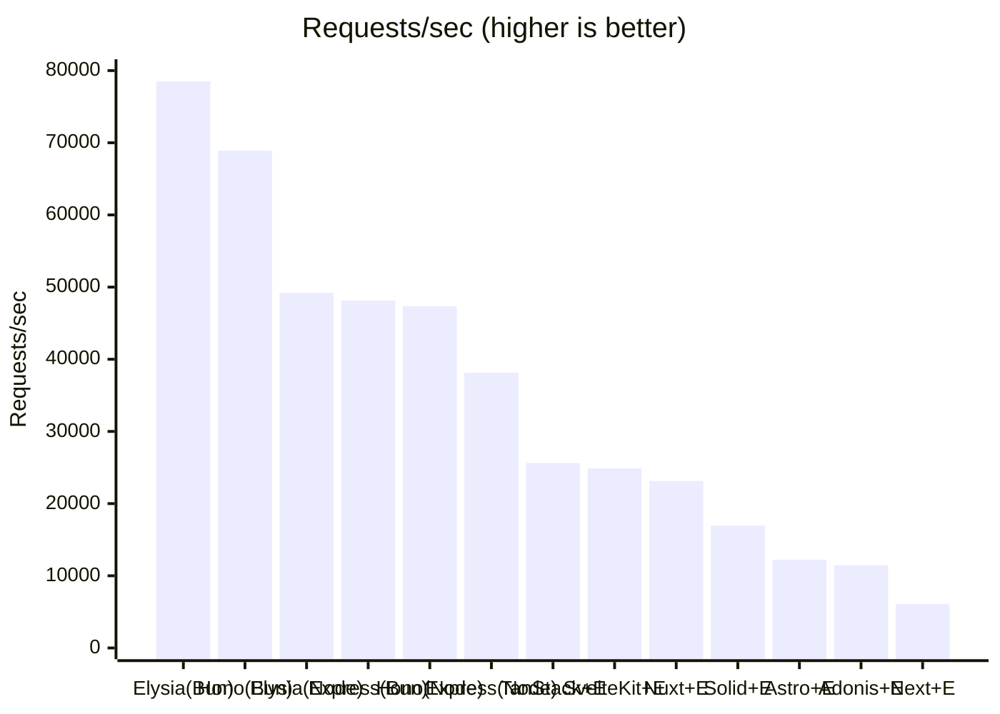
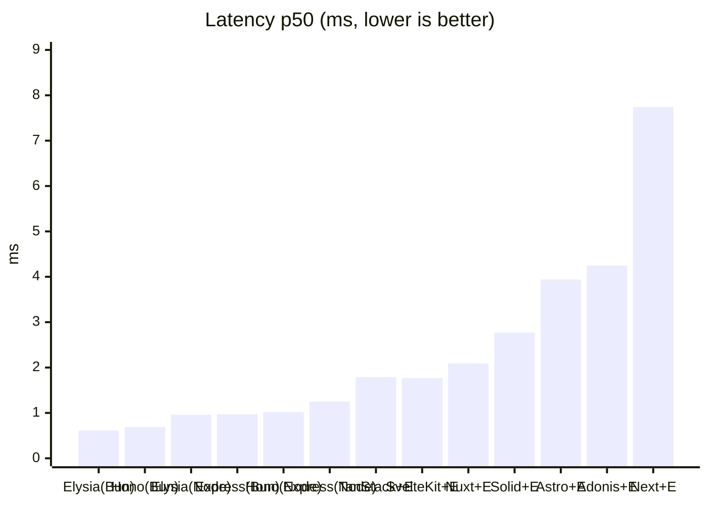
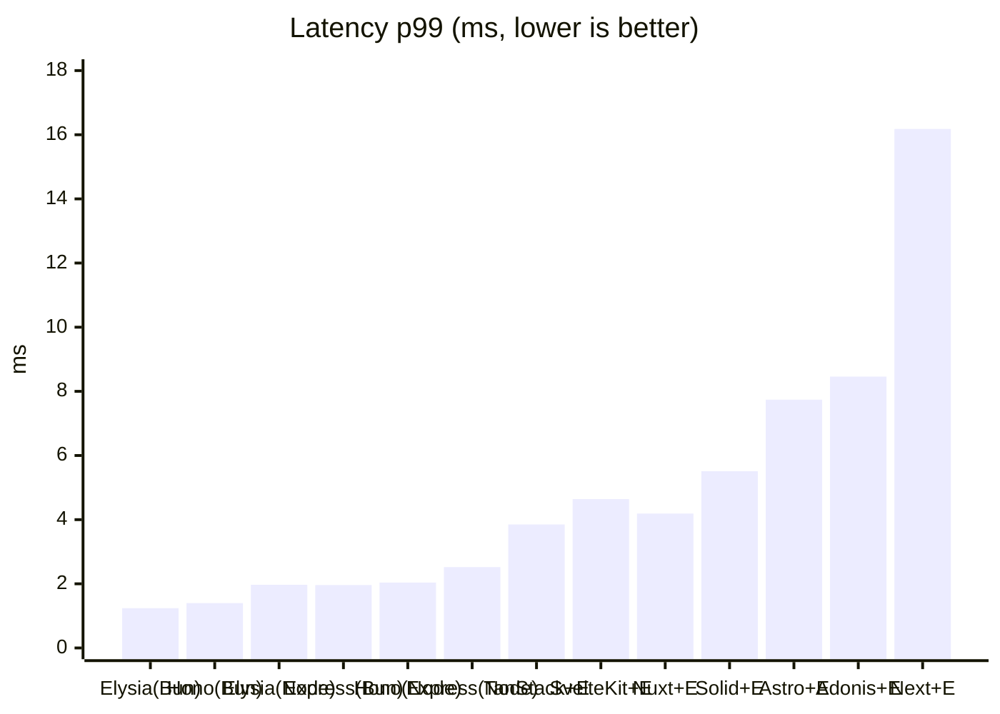
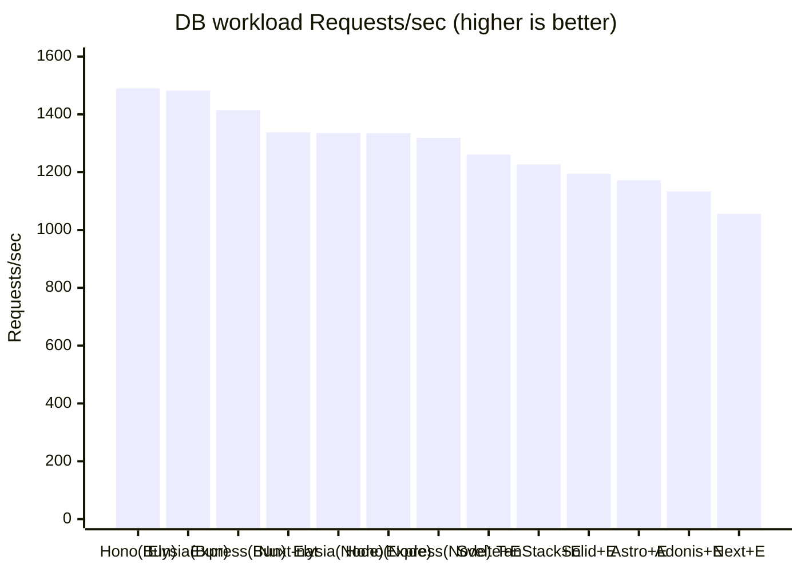

# elysia-bench

A benchmark comparing ElysiaJS request performance across **"Elysia standalone (Node / Bun)"** and **"integration with major web frameworks (Next.js / TanStack Start / Astro / AdonisJS / SolidStart / SvelteKit / Nuxt)"**. For each framework we provide both a **plain native implementation (without Elysia)** and an **Elysia integration**, so we can measure the difference caused by mounting Elysia. We also line up **standalone Hono / Express servers** (Node / Bun) to compare raw server performance against Elysia standalone.

> 日本語版は [README.md](README.md) を参照してください。

## Goals of the comparison

We measure along three separate axes.

1. **Per-framework overhead** — Every framework runs on Node, so for fairness we also run Elysia standalone on Node via the [`@elysiajs/node`](https://elysiajs.com/integrations/node.html) adapter to eliminate runtime differences, and measure "the pure cost of mounting an API on each framework's server route".
2. **Runtime difference (Node vs Bun)** — We also run the same Elysia standalone on Bun natively to see the difference against Elysia's originally recommended environment.
3. **Elysia integration overhead** — For each framework we expose a "plain native implementation `/native`" and an "Elysia integration `/api`" on the **same server and same runtime**, isolating only the difference caused by mounting Elysia.

All endpoints are aligned as `GET` APIs returning the same JSON object ([`packages/payload`](packages/payload/index.ts)).

| Configuration | URL | Runtime | Port | Entry |
| --- | --- | --- | --- | --- |
| Elysia standalone | `GET /` | Node | 3001 | [`src/node.ts`](apps/elysia-standalone/src/node.ts) |
| Elysia standalone | `GET /` | Bun | 3002 | [`src/bun.ts`](apps/elysia-standalone/src/bun.ts) |
| Hono standalone | `GET /` | Node | 3009 | [`src/node.ts`](apps/hono-standalone/src/node.ts) |
| Hono standalone | `GET /` | Bun | 3011 | [`src/bun.ts`](apps/hono-standalone/src/bun.ts) |
| Express standalone | `GET /` | Node | 3010 | [`src/node.ts`](apps/express-standalone/src/node.ts) |
| Express standalone | `GET /` | Bun | 3012 | [`src/bun.ts`](apps/express-standalone/src/bun.ts) |
| Next.js native | `GET /native` | Node | 3000 | [`native/route.ts`](apps/next-elysia/app/native/route.ts) |
| Next.js + Elysia | `GET /api` | Node | 3000 | [`route.ts`](apps/next-elysia/app/api/[[...slugs]]/route.ts) |
| TanStack Start native | `GET /native` | Node | 3003 | [`native.ts`](apps/tanstack-elysia/src/routes/native.ts) |
| TanStack Start + Elysia | `GET /api` | Node | 3003 | [`api.$.ts`](apps/tanstack-elysia/src/routes/api.$.ts) |
| Astro native | `GET /native` | Node | 3004 | [`native.ts`](apps/astro-elysia/src/pages/native.ts) |
| Astro + Elysia | `GET /api` | Node | 3004 | [`[...slugs].ts`](apps/astro-elysia/src/pages/api/[...slugs].ts) |
| AdonisJS native | `GET /native` | Node | 3005 | [`routes.ts`](apps/adonis-elysia/start/routes.ts) |
| AdonisJS + Elysia | `GET /api` | Node | 3005 | [`routes.ts`](apps/adonis-elysia/start/routes.ts) |
| SolidStart native | `GET /native` | Node | 3006 | [`native.ts`](apps/solidstart-elysia/src/routes/native.ts) |
| SolidStart + Elysia | `GET /api` | Node | 3006 | [`api.ts`](apps/solidstart-elysia/src/routes/api.ts) |
| SvelteKit native | `GET /native` | Node | 3007 | [`+server.ts`](apps/sveltekit-elysia/src/routes/native/+server.ts) |
| SvelteKit + Elysia | `GET /api` | Node | 3007 | [`+server.ts`](apps/sveltekit-elysia/src/routes/api/+server.ts) |
| Nuxt native | `GET /native` | Node | 3008 | [`native.ts`](apps/nuxt-elysia/server/routes/native.ts) |
| Nuxt + Elysia | `GET /api` | Node | 3008 | [`api.ts`](apps/nuxt-elysia/server/routes/api.ts) |

The Node and Bun versions differ only in runtime; route definitions are unified in [`src/routes.ts`](apps/elysia-standalone/src/routes.ts).

### Complex workload (DB aggregation) endpoints

**In addition to** the simple static JSON above, each app provides an endpoint that represents a more production-like load: it **queries SQLite multiple times via Drizzle, then joins, aggregates, and formats the result on the application side**. The static JSON essentially only measures "routing + serialization", whereas this lets us compare under conditions closer to a real API where DB access and application-side formatting dominate.

The complex logic and the SQLite database itself are shared in [`packages/workload`](packages/workload/), and each app's endpoint simply calls [`runWorkload()`](packages/workload/index.ts) once (to avoid duplicating the implementation, so every app returns the same deterministic output). The workload queries `users / orders / order_items` (an e-commerce-like schema) three times and aggregates per-order totals, sales by country, and a product quantity ranking on the application side.

| Type | Simple (static JSON) | Complex (DB aggregation) |
| --- | --- | --- |
| standalone (Elysia / Hono / Express) | `GET /` | `GET /db` |
| full-stack native (without Elysia) | `GET /native` | `GET /native-db` |
| full-stack + Elysia | `GET /api` | `GET /api/db` |

The native SQLite driver is switched automatically per runtime (Node = `better-sqlite3` / Bun = `bun:sqlite`, both via the Drizzle adapter). The switching is contained in [`packages/workload/index.ts`](packages/workload/index.ts), so each app's route definitions are runtime-agnostic.

## Structure

```
apps/
  elysia-standalone/   Elysia standalone
    src/routes.ts      Shared route definitions (shared by Node/Bun)
    src/node.ts        Node entry (@elysiajs/node, port 3001)
    src/bun.ts         Bun entry (Bun native, port 3002)
  hono-standalone/     Hono standalone (no Elysia)
    src/app.ts         Shared app definition (shared by Node/Bun)
    src/node.ts        Node entry (@hono/node-server, port 3009)
    src/bun.ts         Bun entry (Bun.serve, port 3011)
  express-standalone/  Express standalone (Express 5, no Elysia)
    src/app.ts         Shared app definition (shared by Node/Bun)
    src/node.ts        Node entry (app.listen, port 3010)
    src/bun.ts         Bun entry (Bun's Node compat API, port 3012)
  next-elysia/         Next.js App Router (port 3000)
    app/native/route.ts          Plain Route Handler (no Elysia)
    app/api/[[...slugs]]/route.ts  Mounts Elysia
  tanstack-elysia/     TanStack Start (port 3003)
    src/routes/native.ts  Plain server route (no Elysia)
    src/routes/api.$.ts   Mounts Elysia
    server/prod.mjs       Serves the production build's fetch handler via srvx
  astro-elysia/        Astro (port 3004)
    src/pages/native.ts           Plain Astro Endpoint (no Elysia)
    src/pages/api/[...slugs].ts   Mounts Elysia
    astro.config.mjs     output:server + @astrojs/node(standalone)
  adonis-elysia/       AdonisJS (api starter kit, port 3005)
    start/routes.ts      Defines /native (plain) and /api (Elysia integration)
                         Converts Node req/res to a Web Request and passes it to elysia.handle()
  solidstart-elysia/   SolidStart v1 (Vinxi/Nitro, port 3006)
    src/routes/native.ts  Plain API route (no Elysia)
    src/routes/api.ts     Mounts Elysia (passes event.request to elysia.handle())
  sveltekit-elysia/    SvelteKit (adapter-node, port 3007)
    src/routes/native/+server.ts  Plain +server endpoint (no Elysia)
    src/routes/api/+server.ts     Mounts Elysia (passes request to elysia.handle())
  nuxt-elysia/         Nuxt (Nitro, port 3008)
    server/routes/native.ts  Plain Nitro route (returns an object)
    server/routes/api.ts     Mounts Elysia (toWebRequest -> elysia.handle())
packages/
  payload/             Shared JSON payload returned by the simple endpoints
  workload/            Shared logic and the SQLite database for the complex endpoints
    index.ts           Schema + driver switching + runWorkload() (self-contained single file)
    seed.ts            Deterministically generates workload.sqlite (pnpm seed)
    workload.sqlite    Generated DB (committed)
bench/
  run.sh               Drives each app one at a time in the order:
                       "start -> wait for readiness -> validate response -> warmup -> measure -> stop".
                       Only one app is ever running, so it doesn't waste RAM. Before measuring it
                       validates that the response matches the expected payload, and after measuring
                       it confirms a 100% success rate.
```

## Setup

```bash
pnpm install
```

The SQLite database for the complex workload ([`packages/workload/workload.sqlite`](packages/workload/)) is committed, so normally there's no need to regenerate it. Regenerate only when you change the schema or the seed.

```bash
pnpm seed   # Deterministically regenerate packages/workload/workload.sqlite
```

> `better-sqlite3` is a native addon, so its build is allowed via `onlyBuiltDependencies` in `pnpm-workspace.yaml`. If the binding can't be found (e.g. right after bumping the Node version), run `pnpm rebuild better-sqlite3`.

## How to run

Build each framework for **production** (dev mode is non-representative, so you must build; the standalone Elysia / Hono / Express servers run via `tsx` and need no build). The servers are **started and stopped one app at a time automatically by `pnpm bench` (`bench/run.sh`)**, so you don't need to start them manually.

```bash
# 1) Build the frameworks for production (once)
pnpm build:next
pnpm build:tanstack
pnpm build:astro
pnpm build:adonis
pnpm build:solid
pnpm build:svelte
pnpm build:nuxt

# 2) Measure (run.sh runs start -> validate -> measure -> stop for each app in order)
pnpm bench
```

Apps you forgot to build / that fail to start are automatically `[skip]`ped, and the rest of the measurements continue. To narrow down the measurement targets, edit the `APPS` array in `bench/run.sh`.

Smoke test (optional):

```bash
curl http://localhost:3001/         # Elysia standalone (Node)
curl http://localhost:3002/         # Elysia standalone (Bun)
curl http://localhost:3009/         # Hono standalone (Node)
curl http://localhost:3011/         # Hono standalone (Bun)
curl http://localhost:3010/         # Express standalone (Node)
curl http://localhost:3012/         # Express standalone (Bun)
curl http://localhost:3000/native   # Next.js native      / curl .../api    # + Elysia
curl http://localhost:3003/native   # TanStack native     / curl .../api    # + Elysia
curl http://localhost:3004/native   # Astro native        / curl .../api    # + Elysia
curl http://localhost:3005/native   # AdonisJS native     / curl .../api    # + Elysia
curl http://localhost:3006/native   # SolidStart native   / curl .../api    # + Elysia
curl http://localhost:3007/native   # SvelteKit native    / curl .../api    # + Elysia
curl http://localhost:3008/native   # Nuxt native         / curl .../api    # + Elysia

# Complex workload (DB aggregation)
curl http://localhost:3009/db        # Hono standalone (Node)   * standalone uses /db
curl http://localhost:3000/native-db # Next.js native DB  / curl .../api/db  # + Elysia
```

### Parameters

`bench/run.sh` can be tuned via environment variables.

| Variable | Default | Description |
| --- | --- | --- |
| `DURATION` | `30s` | Measurement duration |
| `CONN` | `50` | Number of concurrent connections |
| `WARMUP` | `5s` | Warmup duration |
| `READY_TIMEOUT` | `60` | Max wait (seconds) for each server to start. Exceeding it `[skip]`s the app |

```bash
DURATION=60s CONN=100 pnpm bench
```

## Results

Measurement environment: macOS (Darwin 25.5.0, Apple Silicon) / Node 26.3.0 / Bun 1.3.14 / `CONN=50` / `DURATION=30s` / oha 1.14.0.
**Each app was started and measured one at a time** (only the target app is ever running; native and +Elysia are measured back-to-back while the same server stays up). All endpoints were validated before and after measurement to have a 100% success rate and responses matching the expected payload. Absolute values are environment-dependent, so read them as **relative comparisons**.

| Configuration | Requests/sec | Avg ms | p50 ms | p99 ms |
| --- | --- | --- | --- | --- |
| Elysia standalone (Bun) | **78,496** | 0.64 | 0.61 | 1.24 |
| Hono standalone (Bun) | 68,898 | 0.72 | 0.69 | 1.40 |
| Elysia standalone (Node) | 49,225 | 1.01 | 0.96 | 1.97 |
| Express standalone (Bun) | 48,130 | 1.04 | 0.97 | 1.96 |
| Hono standalone (Node) | 47,366 | 1.05 | 1.02 | 2.04 |
| Express standalone (Node) | 38,144 | 1.31 | 1.25 | 2.52 |
| Nuxt native | 38,038 | 1.31 | 1.21 | 2.57 |
| TanStack Start native | 26,156 | 1.91 | 1.75 | 3.81 |
| TanStack Start + Elysia | 25,622 | 1.95 | 1.79 | 3.85 |
| SvelteKit native | 24,962 | 2.00 | 1.82 | 4.61 |
| SvelteKit + Elysia | 24,872 | 2.01 | 1.77 | 4.64 |
| Nuxt + Elysia | 23,142 | 2.16 | 2.09 | 4.19 |
| SolidStart native | 17,065 | 2.93 | 2.76 | 5.49 |
| SolidStart + Elysia | 16,940 | 2.95 | 2.77 | 5.51 |
| AdonisJS native | 13,131 | 3.81 | 3.71 | 7.39 |
| Astro native | 12,815 | 3.90 | 3.76 | 7.35 |
| Astro + Elysia | 12,221 | 4.09 | 3.94 | 7.74 |
| AdonisJS + Elysia | 11,464 | 4.36 | 4.25 | 8.46 |
| Next.js native | 7,146 | 7.00 | 6.57 | 13.74 |
| Next.js + Elysia | 6,111 | 8.18 | 7.74 | 16.18 |

All success rates were 100% (all responses 200, bodies matching the shared payload).

#### Standalone server comparison (without Elysia, raw server performance)

Sorted within each runtime, using Elysia standalone as the baseline.

| Configuration | Requests/sec | Ratio vs Elysia (same runtime) |
| --- | --- | --- |
| Elysia standalone (Node) | 49,225 | 1.00 |
| Hono standalone (Node) | 47,366 | **0.96** |
| Express standalone (Node) | 38,144 | **0.77** |
| Elysia standalone (Bun) | 78,496 | 1.00 |
| Hono standalone (Bun) | 68,898 | **0.88** |
| Express standalone (Bun) | 48,130 | **0.61** |

→ As raw HTTP servers, the ordering **Elysia ≥ Hono > Express** holds on both Node and Bun. On Node, Elysia and Hono are roughly tied (~4% gap, within variance), and Elysia is not Bun-only — it keeps up with Hono via `@elysiajs/node` too. On Bun, Elysia pulls ~12% ahead of Hono (Bun native is Elysia's home turf). Express(5), being the most mature, gains the least on faster runtimes — ~0.77x on Node and ~0.61x on Bun — making it relatively heavy.

#### Runtime difference (Node → Bun, same framework)

| Configuration | Node RPS | Bun RPS | Bun multiplier |
| --- | --- | --- | --- |
| Elysia standalone | 49,225 | 78,496 | **×1.59** |
| Hono standalone | 47,366 | 68,898 | **×1.45** |
| Express standalone | 38,144 | 48,130 | **×1.26** |

→ Every framework gains throughput on Bun, but the gain depends on the framework. **Elysia (×1.59)** benefits the most, followed by Hono (×1.45) and Express (×1.26). Elysia is designed with Bun native in mind, so it gains the most when switching to Bun. Express, running through the Node-compat API, gains the least on Bun.

#### Elysia integration overhead (native → +Elysia, same server)

| Framework | native RPS | +Elysia RPS | Elysia retention |
| --- | --- | --- | --- |
| SvelteKit | 24,962 | 24,872 | **99.6%** (about -0%) |
| SolidStart | 17,065 | 16,940 | **99.3%** (about -1%) |
| TanStack Start | 26,156 | 25,622 | **98.0%** (about -2%) |
| Astro | 12,815 | 12,221 | **95.4%** (about -5%) |
| AdonisJS | 13,131 | 11,464 | **87.3%** (about -13%) |
| Next.js | 7,146 | 6,111 | **85.5%** (about -14%) |
| Nuxt | 38,038 | 23,142 | **60.8%** (about -39%) |

→ The Elysia integration overhead strongly depends on the framework's integration approach. Frameworks that can delegate the received Web `Request` straight to `elysia.handle()` — **SvelteKit / SolidStart / TanStack (-0 to -2%)** — are essentially negligible. Those that interpose `Request`/`Response` conversion (Astro -5%, Next.js -14%) and AdonisJS (-13%, which synthesizes a Web `Request` from Node's `req/res` every time) are somewhat larger. **Nuxt's -39% is in a class of its own**: its native side uses Nitro's fastest path of "returning an object directly" (the fastest among all native paths, see below), whereas the Elysia side builds a Web `Request` via `toWebRequest()` and Nitro re-converts the returned Web `Response`, making the cost gap stand out (the difference is the bridging path, not Elysia itself).

#### Throughput (Requests/sec, higher is better)



#### Latency p50 (ms, lower is better)



#### Latency p99 (ms, lower is better)



### Discussion

- **Elysia integration overhead depends on the integration approach (the main goal here)**: Frameworks that can delegate the received Web `Request` straight to `elysia.handle()` — **SvelteKit / SolidStart / TanStack (-0 to -2%)** — are essentially negligible. Those interposing `Request`/`Response` conversion — **Astro (-5%) / Next.js (-14%)** — and **AdonisJS (-13%)**, which synthesizes a Web `Request` from Node's `req/res` every time, are somewhat larger. **Nuxt (-39%)** stands out because its native uses Nitro's fastest object-returning path, making the relative gap pronounced (the cost of the bridging path, not Elysia itself). Overall, "which framework you mount on" dominates throughput more than "whether you use Elysia".
- **Standalone server comparison (without Elysia)**: As raw HTTP servers, the ordering is **Elysia ≥ Hono > Express** on both Node and Bun. On Node, **Elysia(49,225) ≈ Hono(47,366) > Express(38,144)** — Elysia and Hono are roughly tied (~4% gap, within variance), and Elysia keeps up with Hono via `@elysiajs/node` rather than being Bun-only. On Bun, **Elysia(78,496) > Hono(68,898) > Express(48,130)** — Elysia pulls ~12% ahead of Hono. Express(5) is ~0.77x on Node and ~0.61x on Bun.
- **Per-framework cost (vs the same Node runtime)**: Taking Elysia standalone (Node) as the baseline, native throughput is ~0.77x for Nuxt, ~0.53x for TanStack, ~0.51x for SvelteKit, ~0.35x for SolidStart, ~0.27x for AdonisJS, ~0.26x for Astro, and ~0.15x for Next.js. **Nuxt (Nitro) native is outstandingly fast** (the fastest object-returning path), followed by TanStack ≈ SvelteKit, then SolidStart in the middle, AdonisJS ≈ Astro, and finally Next.js's Route Handler layer being the heaviest. AdonisJS pays for passing every request through the api starter kit's bodyparser / session / shield / auth initialization.
- **Runtime difference (Node → Bun)**: Switching to Bun raises throughput, but by varying amounts: **Elysia ×1.59 > Hono ×1.45 > Express ×1.26**. Elysia, designed with Bun native in mind, benefits the most, and Bun — Elysia's recommended environment — is the fastest across all configurations. Hono also gains a lot on Bun (68,898 RPS), even surpassing Elysia on Node to take second place overall.
- **Overall**: Taking the fastest Elysia standalone (Bun) as 100%, we get Hono(Bun) ≈ 88%, Elysia(Node) ≈ 63%, Express(Bun) ≈ 61%, Hono(Node) ≈ 60%, Express(Node) ≈ 49%, and (with +Elysia integration) TanStack ≈ 33%, SvelteKit ≈ 32%, Nuxt ≈ 29%, SolidStart ≈ 22%, Astro ≈ 16%, AdonisJS ≈ 15%, Next.js ≈ 8%. If you want full-stack integration while still valuing API performance, **TanStack Start / SvelteKit / Nuxt** are favorable (Nuxt is even faster if you use native directly). If pure API throughput is the top priority, standing up Elysia (preferably on Bun) as a separate process is best, with Hono following closely if Bun is available.

> Note: each app is started and stopped one at a time (only the target app is ever running). Native and +Elysia are measured back-to-back while the same server stays up, so their difference is under identical conditions. Cross-app comparisons, however, are measured at different times, so they're subject to time-dependent fluctuations (CPU turbo/thermal state, etc., ±a few %). Read configurations with close RPS (Elysia(Node)/Hono, TanStack/SvelteKit, etc.) with some margin.

## Results (complex workload / DB aggregation endpoints)

Measurement results for the [complex workload (DB aggregation) endpoints](#complex-workload-db-aggregation-endpoints) (`/db` / `/native-db` / `/api/db`). Same measurement conditions (`CONN=50` / `DURATION=30s` / oha), same machine, each app started one at a time. All 20 configurations were validated before and after measurement to have a 100% success rate and responses matching the expected value (the deterministic output of `runWorkload()`). Because SQLite is queried three times and aggregated on the application side, each request takes about 33–47 ms.

| Configuration | Requests/sec | Avg ms | p50 ms | p99 ms |
| --- | --- | --- | --- | --- |
| Hono standalone DB (Bun) | **1,490** | 33.6 | 33.2 | 45.4 |
| Elysia standalone DB (Bun) | 1,482 | 33.7 | 33.4 | 44.1 |
| Express standalone DB (Bun) | 1,415 | 35.3 | 34.8 | 44.6 |
| Nuxt native DB | 1,338 | 37.4 | 39.1 | 60.4 |
| Elysia standalone DB (Node) | 1,336 | 37.4 | 36.4 | 72.8 |
| Hono standalone DB (Node) | 1,335 | 37.5 | 36.5 | 73.0 |
| Express standalone DB (Node) | 1,319 | 37.9 | 36.9 | 73.9 |
| Nuxt + Elysia DB | 1,305 | 38.3 | 37.5 | 74.9 |
| SvelteKit native DB | 1,276 | 39.2 | 37.4 | 74.9 |
| SvelteKit + Elysia DB | 1,261 | 39.7 | 37.5 | 75.3 |
| TanStack Start native DB | 1,250 | 40.0 | 38.4 | 76.5 |
| TanStack Start + Elysia DB | 1,227 | 40.8 | 39.0 | 77.2 |
| SolidStart + Elysia DB | 1,195 | 41.9 | 40.0 | 80.6 |
| SolidStart native DB | 1,179 | 42.4 | 40.0 | 79.9 |
| Astro + Elysia DB | 1,172 | 42.7 | 43.9 | 67.8 |
| Astro native DB | 1,134 | 44.1 | 44.1 | 79.1 |
| AdonisJS + Elysia DB | 1,133 | 44.2 | 42.2 | 84.2 |
| AdonisJS native DB | 1,098 | 45.6 | 44.6 | 89.1 |
| Next.js native DB | 1,098 | 45.6 | 43.7 | 87.4 |
| Next.js + Elysia DB | 1,056 | 47.4 | 45.4 | 90.3 |

#### Runtime difference (Node → Bun, standalone servers, DB aggregation)

| Configuration | Node RPS | Bun RPS | Bun multiplier |
| --- | --- | --- | --- |
| Elysia standalone DB | 1,336 | 1,482 | **×1.11** |
| Hono standalone DB | 1,335 | 1,490 | **×1.12** |
| Express standalone DB | 1,319 | 1,415 | **×1.07** |

→ The Bun multipliers on the simple endpoints (Elysia ×1.59 / Hono ×1.45 / Express ×1.26) shrink to **around ×1.1** for DB aggregation. Since most of the latency is taken by SQLite access and application-side aggregation (CPU-bound), the speed of the runtime's HTTP layer matters less.

#### Throughput (complex workload, Requests/sec, higher is better)



### Discussion (complex workload)

- **When DB processing dominates, framework differences nearly vanish**: On the simple endpoints, fastest-to-slowest spanned about **12x** (79,590 → 6,324 RPS), but on the complex endpoints it compresses to about **1.4x** (1,490 → 1,056 RPS). The ~33–47 ms SQLite aggregation takes up most of the latency, burying the differences in the routing/serialization layer. For real-API-like loads where DB access is the main act, "how to make the DB and application-side logic fast" dominates over "which framework".
- **Bun's advantage shrinks too**: The standalone servers' Bun multiplier drops from the simple endpoints' ×1.59 (Elysia) to **×1.11** (Hono ×1.45→×1.12, Express ×1.26→×1.07). For CPU-bound DB processing, a faster runtime has little headroom to exploit.
- **Elysia integration overhead disappears too**: Nuxt's prominent -39% on the simple endpoints shrinks to **-2.5%** (1,338→1,305) on the DB version. The other frameworks' native and +Elysia stay within ±3% (within measurement noise), and for Astro / SolidStart / AdonisJS there are even spots where +Elysia is faster within the margin of error. The cost of mounting Elysia becomes relatively negligible as the actual per-request work gets heavier.
- **The ordering within standalone servers holds**: Even so, the Bun group (Hono/Elysia/Express) occupies the top spots by a slim margin, and on Bun they beat the Node group even with DB included. Within Node, Elysia ≈ Hono ≈ Express (~1% gap, within variance) are essentially level.

> Note: the table above is from a different measurement run (same environment) than the simple endpoints. The simple endpoints in the same run (Elysia(Node) 50,836 / Elysia(Bun) 79,590, etc.) agree with the table above (49,225 / 78,496) within ±a few %, so the environment is stable. The lower `p99` for the Bun group than the Node group (~44 ms vs ~73 ms) is due to oha's cutoff behavior at the deadline and differences in the tail distribution; read it as a relative comparison.

## Caveats

- Always build each framework (Next.js / TanStack Start / Astro / AdonisJS / SolidStart / SvelteKit / Nuxt) for **production** before measuring (run `build:*`; `pnpm bench` starts them automatically). Dev mode is far slower and non-representative. Unbuilt apps are automatically `[skip]`ped.
- Next.js Route Handlers disable caching with `export const dynamic = "force-dynamic"` so Elysia runs on every request (to align conditions with the standalone side).
- TanStack Start's Vite build only emits a WinterTC-style `fetch` handler, so production startup serves it via [`srvx`](https://github.com/h3js/srvx) (which TanStack uses internally) ([`server/prod.mjs`](apps/tanstack-elysia/server/prod.mjs)).
- Astro runs SSR endpoints in production via `output: 'server'` + [`@astrojs/node`](https://docs.astro.build/en/guides/integrations-guide/node/) (standalone).
- AdonisJS is Node `req/res`-based rather than Web Fetch native, so the Elysia integration synthesizes a Web `Request` inside the route handler, passes it to `elysia.handle()`, and writes the returned Web `Response` back to Adonis's `response` ([`start/routes.ts`](apps/adonis-elysia/start/routes.ts)). The api starter kit's default middleware (bodyparser / session / shield / auth initialization) passes through both `/native` and `/api` equally, so the comparison is fair. `build:adonis` copies `.env` into `build/` after the production build and starts in production mode.
- SolidStart ([`api.ts`](apps/solidstart-elysia/src/routes/api.ts)) and SvelteKit ([`+server.ts`](apps/sveltekit-elysia/src/routes/api/+server.ts)) are Web Fetch native, so they just pass the received `request` to `elysia.handle()`. Nuxt ([`api.ts`](apps/nuxt-elysia/server/routes/api.ts)) converts to a Web `Request` via h3's `toWebRequest()` before passing it. In production, SolidStart runs the Nitro server emitted by Vinxi (`node .output/server/index.mjs`) and SvelteKit runs `@sveltejs/adapter-node` (`node build`).
- Hono ([`src/app.ts`](apps/hono-standalone/src/app.ts)) and Express ([`src/app.ts`](apps/express-standalone/src/app.ts)) are **standalone servers without Elysia**; like Elysia standalone they have Node and Bun versions, unifying the app definition (routes) in `src/app.ts` and only swapping the runtime. The Node version runs directly via `tsx` (`start:hono` / `start:express`) and the Bun version via `bun` (`start:hono:bun` / `start:express:bun`), so no build is needed. Hono listens on the same `app.fetch` via `@hono/node-server` on Node and `Bun.serve` on Bun. Express(5) runs `app.listen` as-is via Bun's Node-compat API. All of them listen on `::` (dual stack) via `hostname` / `listen(port, '::')`.
- **Include IPv6 in the listen address**: oha resolves `localhost` to `::1` (IPv6) and does not fall back to IPv4. SolidStart / SvelteKit / Nuxt / Hono / Express start with `HOST=::` (or `hostname: "::"`) so they're reachable via `localhost`. Neglecting this makes single `curl` calls (which fall back to IPv4 via happy-eyeballs) succeed while all requests fail under load (0% success rate). `bench/run.sh` validates that the response body matches the shared payload before measuring, and confirms oha's success rate is 100% after measuring, so it only adopts **numbers from a properly working run**.
- **The complex workload (`/db` family)** has every app call the shared [`runWorkload()`](packages/workload/index.ts) in [`packages/workload`](packages/workload/). The SQLite driver uses the native one per runtime (Node = `better-sqlite3` / Bun = `bun:sqlite`), switched via dynamic import. The DB connection is lazily initialized exactly once on the first request and opened read-only. The seed is fixed (independent of time/randomness), so the output is deterministic and byte-identical across all apps and runtimes. `bench/run.sh` validates this output against an expected value dynamically generated from `runWorkload()`. So that bundled full-stack apps can read the same DB, `run.sh` passes an absolute path via `WORKLOAD_DB_PATH`.
- The load tool and the server run on the same machine, so absolute values are environment-dependent. Read them as **relative comparisons**.
