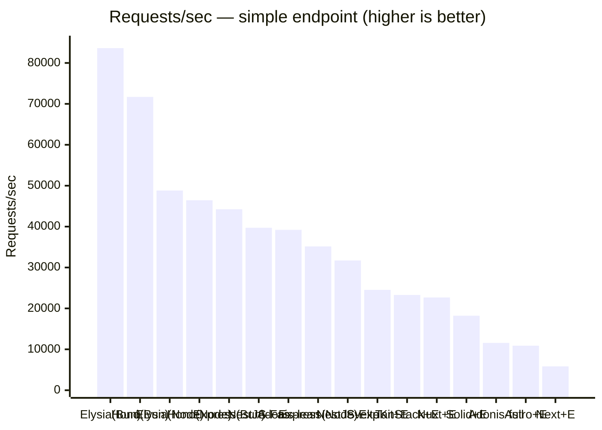
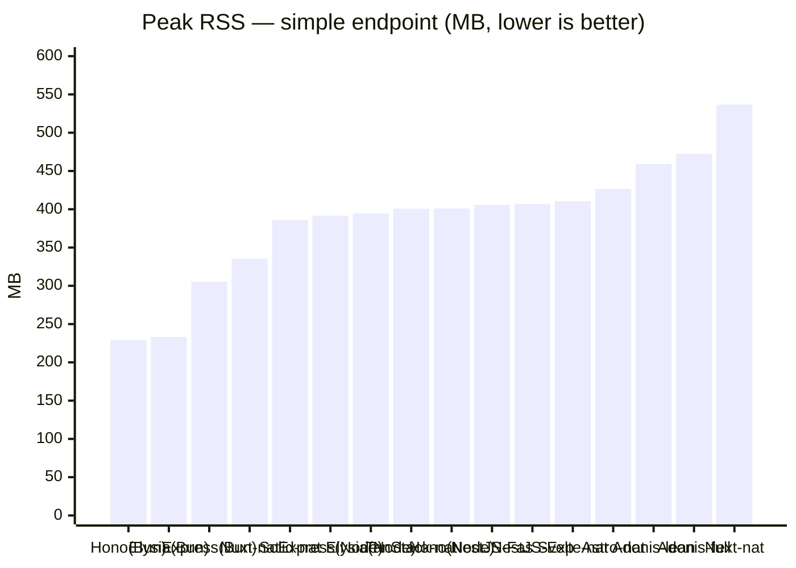

# elysia-bench

A benchmark comparing ElysiaJS request performance across **"Elysia standalone (Node / Bun)"** and **"integration with major web frameworks (Next.js / TanStack Start / Astro / SolidStart / SvelteKit / Nuxt)"**. For each framework we provide both a **plain native implementation (without Elysia)** and an **Elysia integration**, so we can measure the difference caused by mounting Elysia. We also line up **standalone Hono / Express / NestJS / AdonisJS servers** to compare raw server performance against Elysia standalone (NestJS is Node-only, with both the Express and Fastify adapters; AdonisJS is Node-only, with two modes — **full** which passes the api starter kit's default middleware, and **lean** which strips that middleware).

> 日本語版は [README.md](README.md) を参照してください。

## Goals of the comparison

We measure along three separate axes.

1. **Per-framework overhead** — Every framework runs on Node, so for fairness we also run Elysia standalone on Node via the [`@elysiajs/node`](https://elysiajs.com/integrations/node.html) adapter to eliminate runtime differences, and measure "the pure cost of mounting an API on each framework's server route".
2. **Runtime difference (Node vs Bun)** — We also run the same Elysia standalone on Bun natively to see the difference against Elysia's originally recommended environment.
3. **Elysia integration overhead** — For each framework we expose a "plain native implementation `/native`" and an "Elysia integration `/api`" on the **same server and same runtime**, isolating only the difference caused by mounting Elysia.

All endpoints are aligned as `GET` APIs returning the same JSON object ([`packages/payload`](packages/payload/index.ts)).

| Configuration | URL | Runtime | Port | Entry |
| --- | --- | --- | --- | --- |
| Elysia standalone | `GET /` | Node | 3001 | [`src/node.ts`](apps/elysia-standalone/src/node.ts) |
| Elysia standalone | `GET /` | Bun | 3002 | [`src/bun.ts`](apps/elysia-standalone/src/bun.ts) |
| Hono standalone | `GET /` | Node | 3009 | [`src/node.ts`](apps/hono-standalone/src/node.ts) |
| Hono standalone | `GET /` | Bun | 3011 | [`src/bun.ts`](apps/hono-standalone/src/bun.ts) |
| Express standalone | `GET /` | Node | 3010 | [`src/node.ts`](apps/express-standalone/src/node.ts) |
| Express standalone | `GET /` | Bun | 3012 | [`src/bun.ts`](apps/express-standalone/src/bun.ts) |
| NestJS standalone (Express adapter) | `GET /` | Node | 3013 | [`src/node.ts`](apps/nestjs-standalone/src/node.ts) |
| NestJS standalone (Fastify adapter) | `GET /` | Node | 3014 | [`src/fastify.ts`](apps/nestjs-standalone/src/fastify.ts) |
| AdonisJS standalone (full, default middleware) | `GET /` | Node | 3005 | [`routes.ts`](apps/adonis-standalone/start/routes.ts) |
| AdonisJS standalone (lean, no default middleware) | `GET /` | Node | 3015 | [`kernel.ts`](apps/adonis-standalone/start/kernel.ts) |
| Next.js native | `GET /native` | Node | 3000 | [`native/route.ts`](apps/next-elysia/app/native/route.ts) |
| Next.js + Elysia | `GET /api` | Node | 3000 | [`route.ts`](apps/next-elysia/app/api/[[...slugs]]/route.ts) |
| TanStack Start native | `GET /native` | Node | 3003 | [`native.ts`](apps/tanstack-elysia/src/routes/native.ts) |
| TanStack Start + Elysia | `GET /api` | Node | 3003 | [`api.$.ts`](apps/tanstack-elysia/src/routes/api.$.ts) |
| Astro native | `GET /native` | Node | 3004 | [`native.ts`](apps/astro-elysia/src/pages/native.ts) |
| Astro + Elysia | `GET /api` | Node | 3004 | [`[...slugs].ts`](apps/astro-elysia/src/pages/api/[...slugs].ts) |
| SolidStart native | `GET /native` | Node | 3006 | [`native.ts`](apps/solidstart-elysia/src/routes/native.ts) |
| SolidStart + Elysia | `GET /api` | Node | 3006 | [`api.ts`](apps/solidstart-elysia/src/routes/api.ts) |
| SvelteKit native | `GET /native` | Node | 3007 | [`+server.ts`](apps/sveltekit-elysia/src/routes/native/+server.ts) |
| SvelteKit + Elysia | `GET /api` | Node | 3007 | [`+server.ts`](apps/sveltekit-elysia/src/routes/api/+server.ts) |
| Nuxt native | `GET /native` | Node | 3008 | [`native.ts`](apps/nuxt-elysia/server/routes/native.ts) |
| Nuxt + Elysia | `GET /api` | Node | 3008 | [`api.ts`](apps/nuxt-elysia/server/routes/api.ts) |

The Node and Bun versions differ only in runtime; route definitions are unified in [`src/routes.ts`](apps/elysia-standalone/src/routes.ts).

### Complex workload (DB aggregation) endpoints

**In addition to** the simple static JSON above, each app provides an endpoint that represents a more production-like load: it **queries SQLite multiple times via Drizzle, then joins, aggregates, and formats the result on the application side**. The static JSON essentially only measures "routing + serialization", whereas this lets us compare under conditions closer to a real API where DB access and application-side formatting dominate.

The complex logic and the SQLite database itself are shared in [`packages/workload`](packages/workload/), and each app's endpoint simply calls [`runWorkload()`](packages/workload/index.ts) once (to avoid duplicating the implementation, so every app returns the same deterministic output). The workload queries `users / orders / order_items` (an e-commerce-like schema) three times and aggregates per-order totals, sales by country, and a product quantity ranking on the application side.

| Type | Simple (static JSON) | Complex (DB aggregation) |
| --- | --- | --- |
| standalone (Elysia / Hono / Express / NestJS / AdonisJS) | `GET /` | `GET /db` |
| full-stack native (without Elysia) | `GET /native` | `GET /native-db` |
| full-stack + Elysia | `GET /api` | `GET /api/db` |

The native SQLite driver is switched automatically per runtime (Node = `better-sqlite3` / Bun = `bun:sqlite`, both via the Drizzle adapter). The switching is contained in [`packages/workload/index.ts`](packages/workload/index.ts), so each app's route definitions are runtime-agnostic.

## Structure

```
apps/
  elysia-standalone/   Elysia standalone
    src/routes.ts      Shared route definitions (shared by Node/Bun)
    src/node.ts        Node entry (@elysiajs/node, port 3001)
    src/bun.ts         Bun entry (Bun native, port 3002)
  hono-standalone/     Hono standalone (no Elysia)
    src/app.ts         Shared app definition (shared by Node/Bun)
    src/node.ts        Node entry (@hono/node-server, port 3009)
    src/bun.ts         Bun entry (Bun.serve, port 3011)
  express-standalone/  Express standalone (Express 5, no Elysia)
    src/app.ts         Shared app definition (shared by Node/Bun)
    src/node.ts        Node entry (app.listen, port 3010)
    src/bun.ts         Bun entry (Bun's Node compat API, port 3012)
  nestjs-standalone/   NestJS standalone (Node only, no Elysia)
    src/app.controller.ts  Shared route definition (GET / and GET /db, no DI)
    src/app.module.ts      AppModule (controllers only)
    src/node.ts        Express adapter entry (@nestjs/platform-express, port 3013)
    src/fastify.ts     Fastify adapter entry (@nestjs/platform-fastify, port 3014)
  next-elysia/         Next.js App Router (port 3000)
    app/native/route.ts          Plain Route Handler (no Elysia)
    app/api/[[...slugs]]/route.ts  Mounts Elysia
  tanstack-elysia/     TanStack Start (port 3003)
    src/routes/native.ts  Plain server route (no Elysia)
    src/routes/api.$.ts   Mounts Elysia
    server/prod.mjs       Serves the production build's fetch handler via srvx
  astro-elysia/        Astro (port 3004)
    src/pages/native.ts           Plain Astro Endpoint (no Elysia)
    src/pages/api/[...slugs].ts   Mounts Elysia
    astro.config.mjs     output:server + @astrojs/node(standalone)
  adonis-standalone/   AdonisJS standalone (api starter kit, no Elysia, full=3005 / lean=3015)
    start/routes.ts      Defines simple GET / and complex GET /db (same paths as other standalone servers)
    start/kernel.ts      Defines the default middleware stack. ADONIS_BENCH_LEAN=1 switches
                         to lean (strips default middleware down to pure routing)
  solidstart-elysia/   SolidStart v1 (Vinxi/Nitro, port 3006)
    src/routes/native.ts  Plain API route (no Elysia)
    src/routes/api.ts     Mounts Elysia (passes event.request to elysia.handle())
  sveltekit-elysia/    SvelteKit (adapter-node, port 3007)
    src/routes/native/+server.ts  Plain +server endpoint (no Elysia)
    src/routes/api/+server.ts     Mounts Elysia (passes request to elysia.handle())
  nuxt-elysia/         Nuxt (Nitro, port 3008)
    server/routes/native.ts  Plain Nitro route (returns an object)
    server/routes/api.ts     Mounts Elysia (toWebRequest -> elysia.handle())
packages/
  payload/             Shared JSON payload returned by the simple endpoints
  workload/            Shared logic and the SQLite database for the complex endpoints
    index.ts           Schema + driver switching + runWorkload() (self-contained single file)
    seed.ts            Deterministically generates workload.sqlite (pnpm seed)
    workload.sqlite    Generated DB (committed)
bench/
  run.sh               Drives each app one at a time in the order:
                       "start -> wait for readiness -> validate response -> warmup -> measure -> stop".
                       Only one app is ever running, so it doesn't waste RAM. Before measuring it
                       validates that the response matches the expected payload, and after measuring
                       it confirms a 100% success rate.
```

## Setup

```bash
pnpm install
```

The SQLite database for the complex workload ([`packages/workload/workload.sqlite`](packages/workload/)) is committed, so normally there's no need to regenerate it. Regenerate only when you change the schema or the seed.

```bash
pnpm seed   # Deterministically regenerate packages/workload/workload.sqlite
```

> `better-sqlite3` is a native addon, so its build is allowed via `onlyBuiltDependencies` in `pnpm-workspace.yaml`. If the binding can't be found (e.g. right after bumping the Node version), run `pnpm rebuild better-sqlite3`.

## How to run

Build each framework for **production** (dev mode is non-representative, so you must build; the standalone Elysia / Hono / Express servers run via `tsx` and need no build). The servers are **started and stopped one app at a time automatically by `pnpm bench` (`bench/run.sh`)**, so you don't need to start them manually.

```bash
# 1) Build the frameworks for production (once)
pnpm build:next
pnpm build:tanstack
pnpm build:astro
pnpm build:adonis
pnpm build:solid
pnpm build:svelte
pnpm build:nuxt

# 2) Measure (run.sh runs start -> validate -> measure -> stop for each app in order)
pnpm bench
```

Apps you forgot to build / that fail to start are automatically `[skip]`ped, and the rest of the measurements continue. To narrow down the measurement targets, edit the `APPS` array in `bench/run.sh`.

Smoke test (optional):

```bash
curl http://localhost:3001/         # Elysia standalone (Node)
curl http://localhost:3002/         # Elysia standalone (Bun)
curl http://localhost:3009/         # Hono standalone (Node)
curl http://localhost:3011/         # Hono standalone (Bun)
curl http://localhost:3010/         # Express standalone (Node)
curl http://localhost:3012/         # Express standalone (Bun)
curl http://localhost:3013/         # NestJS standalone (Express adapter, Node)
curl http://localhost:3014/         # NestJS standalone (Fastify adapter, Node)
curl http://localhost:3005/         # AdonisJS standalone (full, Node)
curl http://localhost:3015/         # AdonisJS standalone (lean, Node)
curl http://localhost:3000/native   # Next.js native      / curl .../api    # + Elysia
curl http://localhost:3003/native   # TanStack native     / curl .../api    # + Elysia
curl http://localhost:3004/native   # Astro native        / curl .../api    # + Elysia
curl http://localhost:3006/native   # SolidStart native   / curl .../api    # + Elysia
curl http://localhost:3007/native   # SvelteKit native    / curl .../api    # + Elysia
curl http://localhost:3008/native   # Nuxt native         / curl .../api    # + Elysia

# Complex workload (DB aggregation)
curl http://localhost:3009/db        # Hono standalone (Node)   * standalone uses /db
curl http://localhost:3005/db        # AdonisJS standalone (full) / curl localhost:3015/db # lean
curl http://localhost:3000/native-db # Next.js native DB  / curl .../api/db  # + Elysia
```

### Parameters

`bench/run.sh` can be tuned via environment variables.

| Variable | Default | Description |
| --- | --- | --- |
| `DURATION` | `30s` | Measurement duration |
| `CONN` | `50` | Number of concurrent connections |
| `WARMUP` | `5s` | Warmup duration |
| `READY_TIMEOUT` | `60` | Max wait (seconds) for each server to start. Exceeding it `[skip]`s the app |
| `MEM_INTERVAL` | `0.5` | Sampling interval (seconds) for peak RSS under load |

### Memory measurement (peak RSS under load)

During measurement, `bench/run.sh` samples the RSS of the running server (the entire `pnpm` process tree) every `MEM_INTERVAL` seconds and prints the **peak** as `Peak RSS: XX.X MB` right after the oha output. Because apps are measured sequentially (only one app is ever running), this is a fair cross-framework comparison unaffected by idle servers. How to read it:

- **Total footprint (shared memory may be double-counted)**: The RSS of each process in the tree is summed directly, so multi-process frameworks (e.g. Next.js cluster workers) count shared pages more than once and may appear larger than actual memory. Treat it as a relative guideline; note that multi-process Node setups are slightly disadvantaged versus single-process Bun setups.
- **Full-stack values are cumulative peaks**: Each full-stack configuration keeps the same server running while measuring `/native → /api → /native-db → /api/db` in sequence. Memory does not shrink between measurements, so later endpoints report the "peak so far" (trending monotonically upward), not that endpoint's standalone consumption.
- **Definition of "under load" peak**: Sampling happens only during the measure phase, so it excludes the transient spike from module loading at startup. This differs from "maximum memory consumption."

```bash
DURATION=60s CONN=100 pnpm bench
```

## Results (response performance)

Measurement environment: macOS (Darwin 25.5.0, Apple Silicon) / Node 26.3.0 / Bun 1.3.14 / `CONN=50` / `DURATION=30s` / oha 1.14.0. **All 44 endpoints were measured in a single continuous run (`pnpm bench`).** Each app is started one at a time (only the target app is ever running); native and +Elysia, and simple and DB, are measured back-to-back while the same server stays up. All endpoints were validated before and after measurement to have a 100% success rate and responses matching the expected payload. Absolute values are environment-dependent, so read them as **relative comparisons**.

All benchmark targets are consolidated into one table. The **simple (static JSON)** endpoints (`GET /` · `/native` · `/api`) and **complex (DB aggregation)** endpoints (`GET /db` · `/native-db` · `/api/db`) sit side by side, sorted by simple Requests/sec descending.

| Configuration | Simple RPS | DB RPS |
| --- | --- | --- |
| Elysia standalone (Bun) | **83,625** | 1,357 |
| Hono standalone (Bun) | 71,707 | 1,396 |
| Elysia standalone (Node) | 48,817 | 1,275 |
| Hono standalone (Node) | 46,439 | 1,274 |
| Express standalone (Bun) | 44,240 | 1,376 |
| NestJS standalone Fastify (Node) | 39,717 | 1,214 |
| AdonisJS standalone (lean) | 39,205 | 1,137 |
| Nuxt native | 37,223 | 1,335 |
| Express standalone (Node) | 35,148 | 1,256 |
| NestJS standalone Express (Node) | 31,724 | 1,230 |
| SvelteKit native | 24,772 | 1,266 |
| SvelteKit + Elysia | 24,529 | 1,278 |
| TanStack Start + Elysia | 23,282 | 1,202 |
| TanStack Start native | 22,818 | 1,198 |
| Nuxt + Elysia | 22,672 | 1,300 |
| SolidStart native | 18,321 | 1,220 |
| SolidStart + Elysia | 18,219 | 1,222 |
| AdonisJS standalone (full) | 11,575 | 1,048 |
| Astro native | 11,417 | 1,088 |
| Astro + Elysia | 10,885 | 1,090 |
| Next.js native | 6,578 | 1,041 |
| Next.js + Elysia | 5,830 | 995 |

All success rates were 100% (every response was 200, with a body matching the shared payload). Latency is ~0.5–8.6ms for simple endpoints; DB aggregation queries SQLite 3 times and aggregates app-side, taking ~36–50ms/request.

Representative chart — simple-endpoint Requests/sec (full-stack shown as +Elysia, AdonisJS as lean / full):



### Discussion (response performance)

- **Simple endpoints show large framework differences**: From the fastest Elysia standalone (Bun) at 83,625 to the slowest Next.js+Elysia at 5,830 RPS — about 14x. As raw HTTP servers the ordering is **Elysia ≥ Hono > Express** on both Node and Bun (Elysia ≈ Hono on Node; Elysia pulls ~14% ahead of Hono on Bun). Bun is fastest across all configs, and the gain from switching to Bun is largest for Elysia (×1.71 > Hono ×1.54 > Express ×1.26). NestJS (Node only) has the Fastify adapter beating raw Express, so the framework layer itself adds little overhead.
- **Elysia integration overhead depends on the integration path**: Frameworks that hand the received Web `Request` straight to `elysia.handle()` — TanStack / SolidStart / SvelteKit — are within ±1–2% (noise). Astro −5% / Next.js −11%, which insert `Request`/`Response` conversion, are somewhat larger, and Nuxt −39% stands out because its native uses Nitro's fastest object-return path (cost of the bridging path, not Elysia itself). "Which framework you mount it on" dominates throughput more than "whether you use Elysia."
- **When DB work dominates, framework differences nearly vanish**: The ~14x spread on simple endpoints compresses to about 1.4x (1,396 → 995 RPS) for DB aggregation. The ~36–50ms of SQLite aggregation dominates latency, so Bun's advantage (down to ×1.06–1.10 for standalones) and Elysia integration overhead (Nuxt −39% → −2.6%) nearly disappear. Under real-API-like loads where the DB is the star, "how to make the DB and app-side logic fast" matters more than "which framework."
- **AdonisJS varies greatly with default middleware**: lean (no default middleware) at 39,205 RPS vs full (running session / shield / auth init, etc., production-like) at 11,575 RPS — about a third (×3.4). Most of AdonisJS's slowness comes from the default middleware, not its routing. For DB aggregation the gap narrows to lean 1,137 / full 1,048.

> Note: Each app is started and stopped one at a time, so measurement timing differs between apps, and cross-app comparisons include time-dependent variance (±a few %) from CPU turbo/thermal state. Native and +Elysia are measured back-to-back on the same server, so that difference is under identical conditions. Read configurations with close RPS with some margin.

## Results (memory usage)

**Peak RSS** measured under load (during the measure phase; the sum across the entire launched `pnpm` process tree). Recorded simultaneously in the same run as throughput/latency (same environment, `CONN=50` / `DURATION=30s`). Note that this is a **total footprint (which may double-count shared memory)**, so Node multi-process setups read somewhat high (see [Memory measurement](#memory-measurement-peak-rss-under-load) for how to read it). Since +Elysia differs from native by only ~±20MB (noise), full-stack apps are listed as native only. The **simple (static JSON)** and **complex (DB aggregation)** peak RSS sit side by side, sorted by simple ascending.

| Configuration | Simple Peak RSS | DB Peak RSS |
| --- | --- | --- |
| Hono standalone (Bun) | **229.1 MB** | 288.8 MB |
| Elysia standalone (Bun) | 233.3 MB | 302.8 MB |
| Express standalone (Bun) | 305.5 MB | 328.7 MB |
| Nuxt native | 335.3 MB | 372.8 MB |
| SolidStart native | 386.0 MB | 418.8 MB |
| Express standalone (Node) | 391.7 MB | 371.8 MB |
| Elysia standalone (Node) | 394.3 MB | 378.9 MB |
| TanStack Start native | 400.7 MB | 430.8 MB |
| Hono standalone (Node) | 401.0 MB | 344.5 MB |
| NestJS standalone Fastify (Node) | 405.8 MB | 417.7 MB |
| NestJS standalone Express (Node) | 407.0 MB | 377.1 MB |
| SvelteKit native | 410.4 MB | 478.7 MB |
| Astro native | 426.6 MB | 480.0 MB |
| AdonisJS standalone (lean) | 459.1 MB | 387.5 MB |
| AdonisJS standalone (full) | 472.6 MB | 461.7 MB |
| Next.js native | 536.7 MB | 535.5 MB |

The full-stack DB values are measured on the same server after the simple endpoints, so they include the **cumulative peak up to that point** (see [Memory measurement](#memory-measurement-peak-rss-under-load) for how to read it). Representative chart — simple-endpoint peak RSS:



### Discussion (memory usage)

- **Bun single-process setups are by far the most memory-efficient**: Hono/Elysia (Bun) use ~230MB on simple endpoints, just under 60% of the Node versions (~390–400MB). Node standalone setups (total footprint including the tsx loader) converge around 390–410MB.
- **Among full-stack, Next.js is the largest and Nuxt the smallest**: On simple endpoints, Next.js 536.7MB (largest) and Nuxt native 335.3MB (smallest). The trend is the same for DB aggregation (Next.js 535.5 / Bun trio 289–329MB).
- **For AdonisJS, the presence of middleware barely affects RSS**: full 472.6 / lean 459.1MB (simple) — nothing like the throughput gap (×3.4).
- **The ordering barely changes for DB aggregation**: Even after allocating buffers and the SQLite driver, the ordering by runtime/framework is the same as the simple endpoints.

## Caveats

- Always **production-build** each framework (Next.js / TanStack Start / Astro / AdonisJS / SolidStart / SvelteKit / Nuxt) before measuring (run `build:*`; `pnpm bench` handles startup automatically). Dev mode is far slower and unrepresentative. Unbuilt apps are automatically `[skip]`ped.
- **All 44 endpoints are measured in a single continuous run (`pnpm bench`).** The simple/complex endpoints of the standalone servers, full-stack, and AdonisJS are all from the same run and directly comparable. However, since each app is started and stopped one at a time, measurement timing differs, and cross-app comparisons include time-dependent variance (±a few %).
- Next.js Route Handlers disable caching with `export const dynamic = "force-dynamic"` so Elysia runs on every request (to match the standalone side).
- TanStack Start's Vite build only emits a WinterTC-style `fetch` handler, so production startup uses [`srvx`](https://github.com/h3js/srvx), which TanStack uses internally ([`server/prod.mjs`](apps/tanstack-elysia/server/prod.mjs)).
- Astro production-starts its SSR endpoints with `output: 'server'` + [`@astrojs/node`](https://docs.astro.build/en/guides/integrations-guide/node/) (standalone).
- **AdonisJS is measured as a standalone server (no Elysia integration).** Its HTTP adapter can't be swapped (always Node's standard `http`) and the official runtime is Node only, so the only meaningful "mode" for a performance comparison is the thickness of the middleware stack. So [`start/kernel.ts`](apps/adonis-standalone/start/kernel.ts) switches between two modes via `ADONIS_BENCH_LEAN`. **full** (`start:adonis`, port 3005) runs the api starter kit's default `bodyparser / session / shield / auth init / CORS / force_json` on every request (a production-like setup); **lean** (`start:adonis:lean`, port 3015) strips them to match the other standalone servers (pure routing + serialization), simply launching the same build with `PORT=3015 ADONIS_BENCH_LEAN=1`. The route definitions are mode-independent and share `GET /` (simple) and `GET /db` (complex) ([`start/routes.ts`](apps/adonis-standalone/start/routes.ts)). The gap between them is ~3.4x on simple endpoints (see [Results (response performance)](#results-response-performance)). In lean mode the auth routes (`/api/v1/*`) stop working, but the bench only hits `/` and `/db`, so it doesn't affect measurement. `build:adonis` copies `.env` into `build/` after the production build and starts in production.
- SolidStart ([`api.ts`](apps/solidstart-elysia/src/routes/api.ts)) and SvelteKit ([`+server.ts`](apps/sveltekit-elysia/src/routes/api/+server.ts)) are Web Fetch native, so you just pass the received `request` straight to `elysia.handle()`. Nuxt ([`api.ts`](apps/nuxt-elysia/server/routes/api.ts)) converts to a Web `Request` via h3's `toWebRequest()` first. In production, SolidStart runs the Nitro server emitted by Vinxi (`node .output/server/index.mjs`), and SvelteKit runs `@sveltejs/adapter-node` (`node build`).
- Hono ([`src/app.ts`](apps/hono-standalone/src/app.ts)) and Express ([`src/app.ts`](apps/express-standalone/src/app.ts)) are **standalone servers that don't embed Elysia**. Like Elysia standalone, they have Node and Bun versions, unifying the app (route) definition in `src/app.ts` and swapping only the runtime. The Node version starts directly with `tsx` (`start:hono` / `start:express`) and the Bun version with `bun` (`start:hono:bun` / `start:express:bun`), so no build is needed. Hono serves the same `app.fetch` via `@hono/node-server` on Node and `Bun.serve` on Bun. Express(5) runs `app.listen` as-is via Bun's Node-compat API. All listen on `::` (dual-stack) via `hostname` / `listen(port, '::')`.
- NestJS ([`src/app.controller.ts`](apps/nestjs-standalone/src/app.controller.ts)) is also a **standalone server that doesn't embed Elysia**. The runtime is **Node only**, with two configurations — the **Express adapter** ([`src/node.ts`](apps/nestjs-standalone/src/node.ts), port 3013) and the **Fastify adapter** ([`src/fastify.ts`](apps/nestjs-standalone/src/fastify.ts), port 3014) — to measure framework-layer overhead (vs Express standalone) and adapter differences. The route definitions (Controller / Module) are adapter-independent and shared, swapping only the bootstrap. Like the other standalone servers, it runs with `tsx` and needs no build. Since `tsx` (esbuild) doesn't emit `emitDecoratorMetadata`, it **doesn't use constructor injection (DI)** and returns `payload` / `runWorkload()` directly inside the Controller's handlers (routing decorators register metadata explicitly, so they work under tsx). It listens on `::` (dual-stack) via `app.listen(port, '::')`.
- **The listen address must include IPv6**: oha resolves `localhost` to `::1` (IPv6) and doesn't fall back to IPv4. SolidStart / SvelteKit / Nuxt / Hono / Express `start` with `HOST=::` (or `hostname: "::"`) so they're reachable via `localhost` too. Neglecting this makes a single `curl` (which falls back to IPv4 via happy-eyeballs) succeed while all requests fail under load (0% success). `bench/run.sh` validates that the response body matches the shared payload before measuring and confirms oha's success rate is 100% after, adopting only **numbers obtained while working correctly**.
- **The complex workload (`/db` family)** has every app call the shared [`runWorkload()`](packages/workload/index.ts) in [`packages/workload`](packages/workload/). The SQLite driver uses the runtime's native one (Node = `better-sqlite3` / Bun = `bun:sqlite`), switched via dynamic import. The DB connection is lazily established once on the first request, opened read-only. The seed is fixed (independent of time/randomness), so output is deterministic and byte-identical across all apps and runtimes. `bench/run.sh` validates this output against an expected value generated dynamically from `runWorkload()`. So that bundled full-stack apps can read the same DB, `run.sh` passes an absolute path via `WORKLOAD_DB_PATH`.
- Since the load tool and server run on the same machine, absolute values are environment-dependent. Read them as **relative comparisons**.
